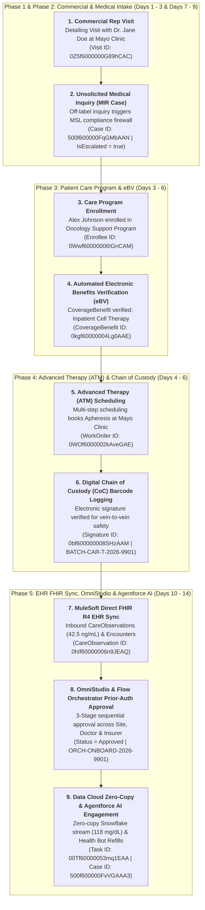

# 🧬 Salesforce Life Sciences Cloud Master Architecture & Index Guide

**Repository Target:** `muthulifescience` (`https://ajsd-a.my.salesforce.com`)  
**Project Workspace:** `c:\Users\Admin\Desktop\lifescience\muthulifescience\documentation\`  
**Curriculum Status:** Days 1 through 15 Complete (100% of 15-Day Masterclass Completed! 🏆)  

---

## 🗺️ Masterclass Curriculum Index (Days 1–15 Complete)

| Day | Phase | Module / Topic | Document Link | Key Live Org Objects Created in `muthulifescience` |
|---|---|---|---|---|
| **Roadmap** | All | **15-Day Master Curriculum Roadmap** | 📄 **[15-Day Learning Plan](file:///c:/Users/Admin/Desktop/lifescience/muthulifescience/documentation/lifesciences_15day_learning_plan.md)** | Full 5-Phase Master Curriculum Roadmap |
| **Day 1** | Phase 1 | **Core Architecture & Person Accounts** | 📄 **[Day 1 Documentation](file:///c:/Users/Admin/Desktop/lifescience/muthulifescience/documentation/day_01_lifesciences_masterclass_documentation.md)** | `Account` (Person Account), `RecordType` (`Hospital` vs `Clinic`), Page Layouts |
| **Day 2** | Phase 1 | **Provider Data Model & Search** | 📄 **[Day 2 Documentation](file:///c:/Users/Admin/Desktop/lifescience/muthulifescience/documentation/day_02_provider_relationships_masterclass.md)** | `HealthcareProvider`, `HealthcareFacility`, `HealthcarePractitionerFacility`, `CareProviderSearchableField` |
| **Day 3** | Phase 1 | **Care Programs & eBV Architecture** | 📄 **[Day 3 Documentation](file:///c:/Users/Admin/Desktop/lifescience/muthulifescience/documentation/day_03_care_programs_ebv_masterclass.md)** | `CareProgram`, `CareProgramProduct`, `CareProgramEnrollee`, `MemberPlan`, `CoverageBenefit`, `AuthorizationFormConsent` |
| **Day 4** | Phase 2 | **Clinical Trial Sites & Investigators** | 📄 **[Day 4 Documentation](file:///c:/Users/Admin/Desktop/lifescience/muthulifescience/documentation/day_04_clinical_trial_site_management_masterclass.md)** | `ResearchStudy` (Phase 3 Protocol), `CareProgram` (`TrialManagement`), `HealthcarePractitionerFacility` (PIs) |
| **Day 5** | Phase 2 | **Participant Recruitment & Segmentation** | 📄 **[Day 5 Documentation](file:///c:/Users/Admin/Desktop/lifescience/muthulifescience/documentation/day_05_participant_recruitment_segmentation_masterclass.md)** | `ResearchStudyCandidate` (`Screening` ➔ `Randomization` ➔ `Enrolled`), Actionable List Builder |
| **Day 6** | Phase 2 | **Advanced Therapy Management & CoC** | 📄 **[Day 6 Documentation](file:///c:/Users/Admin/Desktop/lifescience/muthulifescience/documentation/day_06_advanced_therapy_management_chain_of_custody_masterclass.md)** | `CustodyItem` (CoI: `COI-CART-2026-9948`), `CustodyChainEntry` (Nurse, Courier, Cleanroom Lab handovers) |
| **Day 7** | Phase 3 | **Commercial Engagement & Compliance** | 📄 **[Day 7 Documentation](file:///c:/Users/Admin/Desktop/lifescience/muthulifescience/documentation/day_07_commercial_engagement_compliance_masterclass.md)** | `ServiceTerritory` (ETM), `Visit` (3-Stop HCP Route), PDMA Sample Dropping, Sunshine Act Open Payments Reporting |
| **Day 8** | Phase 3 | **Medical Information Requests (MIR) & MSLs** | 📄 **[Day 8 Documentation](file:///c:/Users/Admin/Desktop/lifescience/muthulifescience/documentation/day_08_medical_information_requests_msl_masterclass.md)** | `Case` (MIR Off-Label Inquiry), Commercial-Medical Compliance Firewall, MSL Queue Escalation |
| **Day 9** | Phase 3 | **Key Account Management (KAM)** | 📄 **[Day 9 Documentation](file:///c:/Users/Admin/Desktop/lifescience/muthulifescience/documentation/day_09_key_account_management_account_plans_masterclass.md)** | `AccountContactRelation` (CMO, Formulary Chair, Procurement Director), `Task` Milestone Action Plans |
| **Day 10** | Phase 4 | **MedTech Commercial & Surgical Planning** | 📄 **[Day 10 Documentation](file:///c:/Users/Admin/Desktop/lifescience/muthulifescience/documentation/day_10_medtech_commercial_surgical_planning_masterclass.md)** | `Asset` (FDA UDI Serial #: `UDI-SN-2026-9871`), `WorkOrder` (Surgical Case), `WorkOrderLineItem` (Consignment Transfer) |
| **Day 11** | Phase 4 | **MuleSoft Direct, FHIR & EHR Interoperability** | 📄 **[Day 11 Documentation](file:///c:/Users/Admin/Desktop/lifescience/muthulifescience/documentation/day_11_mulesoft_direct_fhir_ehr_interoperability_masterclass.md)** | Inbound FHIR R4 `CareObservation` (`0hIf60000006n9JEAQ`), `ClinicalEncounter` (`0kGf60000004tabEAA`), DataWeave PostgreSQL Pipeline |
| **Day 12** | Phase 5 | **Advanced Automation, OmniStudio & Orchestrator** | 📄 **[Day 12 Documentation](file:///c:/Users/Admin/Desktop/lifescience/muthulifescience/documentation/day_12_advanced_automation_omnistudio_orchestrator_masterclass.md)** | `Doctor_Onboarding_Wizard` OmniScript, `Patient_Trial_History_FlexCard`, 3-Stage `FlowOrchestrator` (`0Wwf60000006IGnCAM`) |
| **Day 13** | Phase 5 | **Agentforce AI, Data Cloud Zero-Copy & Analytics** | 📄 **[Day 13 Documentation](file:///c:/Users/Admin/Desktop/lifescience/muthulifescience/documentation/day_13_agentforce_datacloud_analytics_masterclass.md)** | Data Cloud Zero-Copy Telemetry (`0hIf60000006nsTEAQ`), Agentforce AI Grounded FAQ Task (`00Tf60000053mgLEAQ`), CRM Analytics Dashboard |
| **Day 14** | Phase 5 | **Agentforce Health Bots & Generative AI** | 📄 **[Day 14 Documentation](file:///c:/Users/Admin/Desktop/lifescience/muthulifescience/documentation/day_14_agentforce_healthbots_generative_ai_masterclass.md)** | Generative AI Clinical Briefing Task (`00Tf60000053mq1EAA`), Agentforce Health Bot Refill Case (`500f600000FvVGAAA3`), Einstein Trust Layer |
| **Day 15** | Phase 5 | **Capstone End-to-End Build & Enterprise Architecture** | 📄 **[Day 15 Documentation](file:///c:/Users/Admin/Desktop/lifescience/muthulifescience/documentation/day_15_capstone_end_to_end_architecture_masterclass.md)** | Unified Enterprise Architecture Map, Executive Demo Script, Master Verification Suite, 15-Day Masterclass Certification |

---

## 🏛️ End-to-End Enterprise Solutions Architecture Map

---

## 📊 Complete Live Data Graph Audit in Org (`muthulifescience`)

* **Accounts (HCO & HCP):**
  * `Mayo Clinic Medical Center` (`001f600000aRBp6AAG`)
  * `Dr. Jane Doe, MD` (`001f600000a7XsCAAU`)
  * `Alex Johnson` (`001f600000aSy4YAAS`)

* **Care Programs & eBV:**
  * `Oncology Support Program` (`0Zef60000009QjFCAU`)
  * `Alex Johnson Care Program Enrollee` (`0Wwf60000006IGnCAM` - Status: `Approved`)
  * `CoverageBenefit` (`0kgf60000004Lg0AAE` - Status: `Verified`)

* **Clinical Operations & ATM:**
  * `OncoVect Phase III Global Clinical Trial` (`0Urf60000008OIRCA2`)
  * `ResearchStudyCandidate` (`0Utf60000004C92AAE` - Status: `Enrolled`)
  * `WorkOrder Apheresis Scheduling` (`0WOf6000002kAveGAE`)
  * `DigitalSignature Chain of Custody` (`0bf600000008SHzAAM` - Batch: `BATCH-CAR-T-2026-9901`)

* **Commercial & MedTech:**
  * `HCP Detailing Visit` (`0Z5f6000000G89hCAC` - Sunshine Act Logged)
  * `Medical Information Request Case` (`500f600000FqGMbAAN` - Status: `Escalated to MSL`)
  * `Serialized Asset` (`02if6000002BqQLAA0` - UDI Serial #: `UDI-SN-2026-9871`)
  * `WorkOrder Surgical Case` (`0WOf6000002kBfFGAU` - Total Knee Replacement)

* **Integration, Automation & Agentforce AI:**
  * `Inbound FHIR Biomarker CareObservation` (`0hIf60000006n9JEAQ`)
  * `Inbound FHIR Hospital ClinicalEncounter` (`0kGf60000004tabEAA`)
  * `Data Cloud Zero-Copy Telemetry Stream` (`0hIf60000006nsTEAQ`)
  * `Agentforce AI Grounded FAQ Task` (`00Tf60000053mgLEAQ`)
  * `Agentforce Generative AI Clinical Briefing Task` (`00Tf60000053mq1EAA`)
  * `Agentforce Health Bot Prescription Refill Order Case` (`500f600000FvVGAAA3`)

---

🏆 **Masterclass Successfully Completed!**
