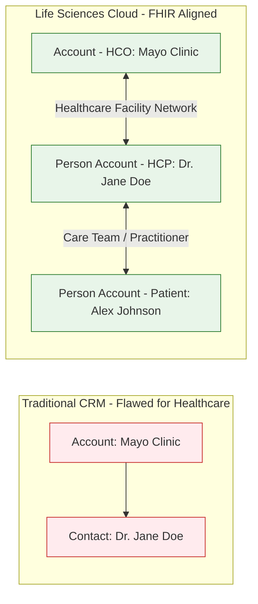
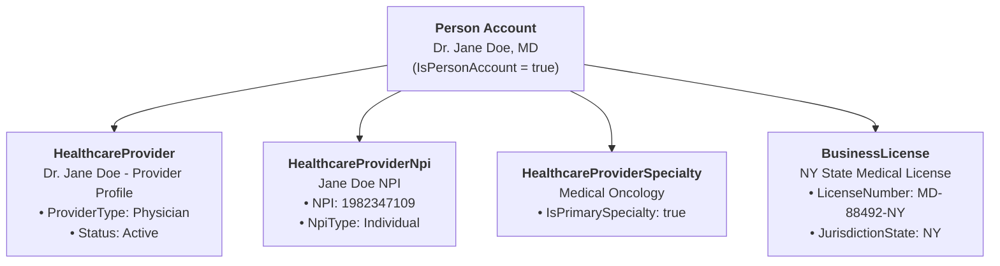

# 🧬 DAY 1 MASTERCLASS DOCUMENTATION
## Salesforce Life Sciences Cloud Architecture, Data Models & Standard Setup

**Target Org:** `muthulifescience` (`https://ajsd-a.my.salesforce.com`)  
**User:** `muthumuthu225_x3bjocrx0wtol@gmail.com`  
**Phase:** Phase 1 — Foundations, Core Health & Care Programs  

---

## 📌 1. Real-World Business Architecture & Use Case

### The Core Problem in Healthcare CRM
Standard B2B CRM (Sales Cloud / Service Cloud) forces individuals to exist purely as "Contacts under a Company Account". In Healthcare & Life Sciences:
* **Doctors (HCPs)** practice across multiple hospital networks, run independent clinical research, and act as Key Opinion Leaders (KOLs).
* **Patients** enroll in care programs, participate in clinical trial screening, and receive specialized therapies.

Life Sciences Cloud solves this using the **Person Account Model** aligned with global **HL7 FHIR R4 Interoperability Standards**.



---

## 🏗️ 2. Standard Health Cloud Data Model (FHIR R4 Aligned)

In enterprise Life Sciences Cloud, a physician is modeled as a **Person Account** with standard Health Cloud child objects linking their qualifications:



---

## 🛠️ 3. Summary of Day 1 Executed Tasks

### Task 1: Enable LSC Settings & Person Accounts
* Verified Health Cloud / Life Sciences Cloud features are **Active** in `muthulifescience`.
* Verified Person Accounts enablement under **Feature Settings ➔ Accounts**.

### Task 2: Schema Builder Exploration
* Visually inspected how standard `Account` (HCO), `Person Account` (HCP/Patient), and `CareProgram` objects connect in the database canvas.

### Task 3: Create HCO Account Record Types
Created two record types on `Account`:
1. `Hospital / Health System` (`Hospital_Health_System`)
2. `Specialty Clinic` (`Specialty_Clinic`)

### Task 4: Create Standard HCP Person Account Graph
Programmatically created the complete 5-record relational tree in `muthulifescience`:
1. **Person Account (`Account`):** `Dr. Jane Doe, MD` (ID: `001f600000a7XsCAAU`)
2. **Healthcare Provider (`HealthcareProvider`):** `Dr. Jane Doe - Provider Profile` (ID: `0cmf6000002ar4fAAA`)
3. **Healthcare Provider NPI (`HealthcareProviderNpi`):** `Jane Doe NPI` (`1982347109`, ID: `0bNf6000002UwVFEA0`)
4. **Healthcare Provider Specialty (`HealthcareProviderSpecialty`):** `Medical Oncology` (ID: `0bOf6000000Ad05EAC`)
5. **Business License (`BusinessLicense`):** `NY State Medical License - Dr. Jane Doe` (`MD-88492-NY`, ID: `0cEf6000000AsrxEAC`)

---

## 🎨 4. Modernized 2-Region Page Layout Design

We cleaned up the default Person Account layout and deployed a sleek **2-Region Page**:

* **Header (Top):** Practitioner Name, Email, Phone, Owner, Quick Action Buttons.
* **Main Left Column (2/3):** 
  * **Details Tab:** Practitioner Info, HCP Quick Profile (Specialty, NPI, License), Address Details.
  * **Related Tab:** Healthcare Providers, NPIs, Specialties, Business Licenses.
* **Right Sidebar Column (1/3):** Activity Panel (`Log Call`, `New Task`, `New Event`, `Email`).

---

## 🚨 5. TROUBLESHOOTING & PROBLEM RESOLUTION GUIDE

During Day 1 hands-on execution, three common architectural and UI challenges were identified. Below is the detailed breakdown of each problem, its root cause, and the step-by-step resolution.

---

### ⚠️ ISSUE 1: Missing NPI, Specialty, and License Fields on Person Account Form

#### 🔴 Problem Statement
When creating a Person Account for a doctor (`Dr. Jane Doe, MD`), fields like `NPI (National Provider Identifier)`, `Primary Specialty`, and `Medical License Number` were not visible on the standard record creation layout.

#### 🔍 Root Cause Analysis
In enterprise Health Cloud architecture aligned with **HL7 FHIR standards**, doctor qualifications are NOT stored as flat custom fields on the `Account` table. Instead, they are stored in **separate related standard objects** (`HealthcareProviderNpi`, `HealthcareProviderSpecialty`, `BusinessLicense`) to support doctors practicing across multiple hospital networks with different licenses.

#### 🛠️ Step-by-Step Resolution

* **Approach A: Standard Health Cloud Relational Model (Enterprise Best Practice)**
  1. Create the Person Account record (`Dr. Jane Doe, MD`).
  2. Create a `HealthcareProvider` record linked to the Person Account (`Dr. Jane Doe - Provider Profile`).
  3. Create a `HealthcareProviderNpi` record linked to the Account (`NPI: 1982347109`).
  4. Create a `HealthcareProviderSpecialty` record (`Medical Oncology`, `IsPrimarySpecialty = true`).
  5. Create a `BusinessLicense` record (`MD-88492-NY`, `JurisdictionState = NY`).

* **Approach B: Custom Fields for Fast Data Entry (Optional Layout Setup)**
  1. Deploy custom fields (`NPI__c`, `Primary_Specialty__c`, `Medical_License_Number__c`) to `Account` or `Contact`.
  2. Go to **Setup ➔ Object Manager ➔ Account ➔ Page Layouts**.
  3. Edit **Person Account Layout**.
  4. Drag **`NPI`**, **`Primary Specialty`**, and **`Medical License Number`** into the layout section and click **Save**.

---

### ⚠️ ISSUE 2: Patient Card Component Displaying on Doctor / HCP Records

#### 🔴 Problem Statement
When opening the record for `Dr. Jane Doe, MD`, a **Patient Card** header component appeared at the top of the screen displaying patient health summary metrics.

#### 🔍 Root Cause Analysis
By default, Salesforce Health Cloud assigns a standard page template (`sfa__PersonAccount_rec_L`) to all Person Accounts. Because Health Cloud treats Person Accounts as Patients by default, it embeds the **Patient Card LWC** on every Person Account page unless a custom page is assigned.

#### 🛠️ Step-by-Step Resolution
1. Create a custom **FlexiPage** (`HCP_Practitioner_Record_Page`) built on the **Two Regions (`flexipage:recordHomeTemplateDesktop`)** template.
2. Omit the `HealthCloud:PatientCard` component from the flexipage XML.
3. Include standard `force:highlightsPanel` (Header), `force:detailPanel` (Details), `force:relatedListContainer` (Related Lists), and `runtime_sales_activities:activityPanel` (Sidebar).
4. Deploy the clean 2-region page to the org.

---

### ⚠️ ISSUE 3: Red Error Modal in Lightning App Builder (`The 'Flexcard' component's 'Flexcard Name' property has an invalid value`)

#### 🔴 Problem Statement
When clicking **"Edit Page"** or **"Activation"** on the record in Lightning App Builder, a red error modal popped up stating: `The 'Flexcard' component's 'Flexcard Name' property has an invalid value`, preventing the user from saving or activating the page layout.

```
┌────────────────────────────────────────────────────────────────────────┐
│                                 Error                                  │
├────────────────────────────────────────────────────────────────────────┤
│ The 'Flexcard' component's 'Flexcard Name' property has an invalid     │
│ value.                                                                 │
└────────────────────────────────────────────────────────────────────────┘
```

#### 🔍 Root Cause Analysis
When a user clicks **"Edit Page"** directly on a record without an active custom page assigned, Salesforce attempts to clone the default Health Cloud managed template (`Account_Record_Page1`). That managed template contains an unconfigured OmniStudio FlexCard component on the canvas. When clicking **Save** or **Activation**, App Builder validates all components on canvas and fails because the FlexCard lacks a valid name.

#### 🛠️ Step-by-Step Resolution

* **Method 1: Activate directly from Salesforce Setup (100% Reliable)**
  1. Exit or close the current App Builder error tab.
  2. Go to **Setup** (Gear Icon ⚙️).
  3. In **Quick Find**, search for **`Lightning App Builder`**.
  4. Locate **`Account Record Page`** (or **`HCP Practitioner Record Page`**) in the list.
  5. Click **View** or **Edit** next to the page.
  6. Click **Activation...** at the top right $\rightarrow$ click **Assign as Org Default** $\rightarrow$ select **Desktop** $\rightarrow$ click **Save**.

* **Method 2: Remove the Broken Component from Canvas**
  1. On the error screen in App Builder, click **OK** to dismiss the modal.
  2. Click directly on the broken **Flexcard** / **Patient Card** box on the canvas.
  3. Click the **Trash Can 🗑️ (Delete)** icon at the top right of the box to remove it.
  4. Click **Save** $\rightarrow$ Click **Activation...** $\rightarrow$ **Save**.

---

## ⚡ 6. Verification Commands via SF CLI

### Query Record Types:
```powershell
sf data query --target-org muthulifescience --query "SELECT Id, Name, DeveloperName, SobjectType FROM RecordType WHERE SobjectType = 'Account'"
```

### Query Doctor Record Tree:
```powershell
sf data query --target-org muthulifescience --query "SELECT Id, Name, (SELECT Id, Name, ProviderType FROM HealthcareProviders), (SELECT Id, Name, Npi FROM HealthcareProviderNpis), (SELECT Id, Name, IsPrimarySpecialty FROM HealthcareProviderSpecialties), (SELECT Id, Name, LicenseNumber, JurisdictionState FROM BusinessLicenses) FROM Account WHERE Id = '001f600000a7XsCAAU'"
```

---

## ❓ 7. Knowledge Check

#### Q1: How is a physician who practices at 3 hospitals and runs clinical trials modeled in Life Sciences Cloud?
* **Answer:** As a **single Person Account** linked to multiple hospitals and trial sites via junction objects (`HealthcareProviderFacility`, `ClinicalStudySite`), preserving a single source of truth without data duplication.

#### Q2: What standard Health Cloud objects store NPI, Medical Specialty, and State License?
* **Answer:** `HealthcareProviderNpi` (NPI), `HealthcareProviderSpecialty` (Specialty), and `BusinessLicense` (State Medical License).
