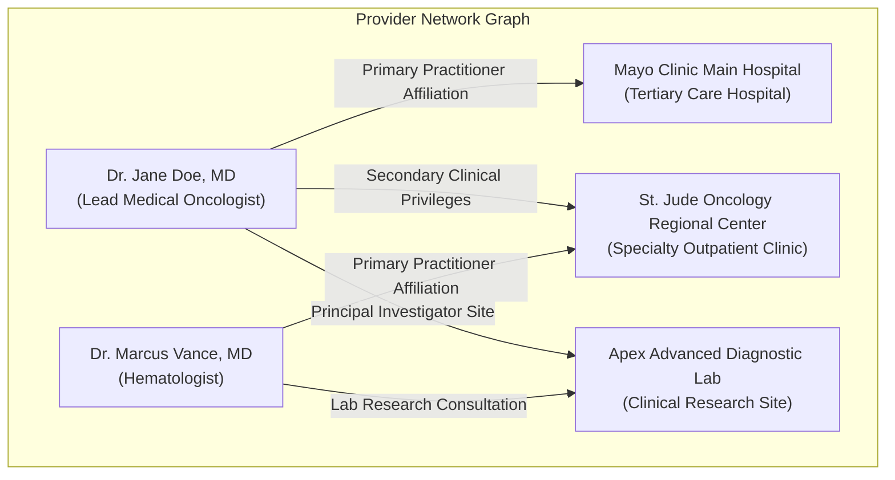
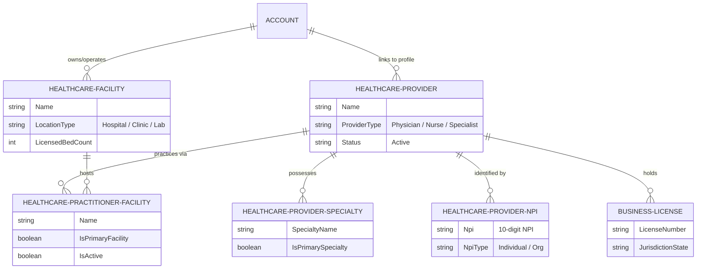
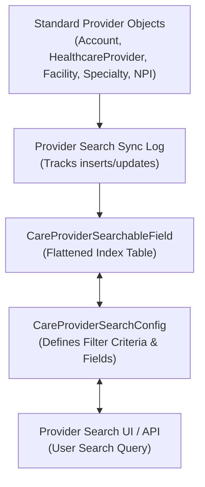

# 🧬 DAY 2 MASTERCLASS: Provider Relationships & Network Management

**Role:** Salesforce Life Sciences Cloud Solutions Architect & Technical Lead  
**Module:** Phase 1 — Foundations, Core Health & Care Programs  
**Topic:** Provider Data Model, Facility Affiliations & Provider Search Mechanics  
**Target Org:** `muthulifescience` (`https://ajsd-a.my.salesforce.com`)  

---

## 📌 SECTION 1: REAL-WORLD BUSINESS USE CASE & ANALOGY

### 1. Why Commercial Pharma & MedTech Track Provider Networks
In commercial pharmaceutical, biotechnology, and medical device (MedTech) enterprises, business does not happen in a vacuum. A doctor rarely operates out of a single isolated office:
* **Multi-Site Clinical Practice:** An oncologist may treat patients at **Mayo Clinic Main Hospital** on Mondays, run outpatient chemotherapy at **St. Jude Regional Center** on Wednesdays, and conduct clinical research at a **Regional Diagnostic Lab** on Fridays.
* **Complex Contractual & Credential Boundaries:** MedTech companies selling surgical implants (e.g., robotic knee replacements) must verify that the surgeon (`HCP`) holds valid operating privileges at an accredited hospital facility (`HCO`), is credentialed for that specific surgical suite, and has an active state license.
* **KOL & Referral Network Mapping:** Medical Science Liaisons (MSLs) and Commercial Sales Reps need to map **Key Opinion Leaders (KOLs)** to identify which regional hospital networks they influence, which junior doctors train under them, and where drug access barriers exist.



---

### 2. Concrete Real-World Scenario: *MSL Trial Placement*
**Scenario:** A Medical Science Liaison (MSL) at *Apex Biopharma* needs to identify a board-certified **Medical Oncologist** who:
1. Holds active privileges at an **accredited research hospital** equipped with a specialized specimen collection lab.
2. Possesses an active state license in **New York**.
3. Has an active National Provider Identifier (**NPI**) registered for individual practice.

Without Health Cloud's **Provider Data Model**, the MSL would have to cross-reference 4 separate spreadsheets. With Life Sciences Cloud **Provider Search**, the MSL runs a unified query matching `Specialty = Medical Oncology` + `Facility Type = Hospital` + `State = NY`, returning **Dr. Jane Doe, MD** at **Mayo Clinic Main Hospital** in under 3 seconds.

---

### 3. The Real-World Analogy: *The Multi-Airport Airline Pilot Model*
Think of Healthcare Providers (HCPs) like **Commercial Airline Pilots**:
* **The Pilot (HCP Person Account):** Captain Jane Doe holds her pilot's license, FAA certification (NPI), and flight ratings (Specialties). She is an independent individual.
* **The Airports (Healthcare Facilities):** JFK International (Hospital 1), LAX Airport (Hospital 2), and Chicago O'Hare (Hospital 3) are infrastructure facilities.
* **The Flight Affiliations (`HealthcarePractitionerFacility`):** Captain Doe flies routes out of JFK on Mondays and LAX on Thursdays. The airline tracks her airport affiliations, gate permissions, and location-specific clearance.

If an airport loses runway accreditation, Captain Doe doesn't lose her pilot license—only her flight affiliation to that specific airport is updated!

---

## 🔬 SECTION 2: DEEP-DIVE CORE CONCEPTS EXPLANATION

### 1. Standard Provider Data Model Schema

Salesforce Life Sciences Cloud provides a normalized, FHIR-aligned relational schema to map providers, facilities, and network affiliations:



| Object Name | API Name | Description & Purpose |
|---|---|---|
| **Healthcare Provider** | `HealthcareProvider` | Bridges the Person Account to provider profile metadata (`ProviderType`, `Status`, `Classification`). |
| **Healthcare Facility** | `HealthcareFacility` | Represents physical clinical locations (`Hospital`, `Outpatient Center`, `Lab`). Linked to an HCO Account. |
| **Practitioner Facility** | `HealthcarePractitionerFacility` | **Junction object** mapping an HCP's clinical practice privileges at a specific Healthcare Facility. |
| **Provider Specialty** | `HealthcareProviderSpecialty` | Stores practitioner medical specialties (`Medical Oncology`, `Hematology`, `Radiation Oncology`). |
| **Provider NPI** | `HealthcareProviderNpi` | Stores official 10-digit NPI numbers and identifier types (`Individual` vs `Organization`). |
| **Business License** | `BusinessLicense` | Tracks state medical board licenses, issue/expiration dates, and verification status. |

---

### 2. Provider Search Engine Architecture & Mechanics

The **Provider Search Engine** in Health/Life Sciences Cloud is a high-performance search framework designed to execute complex, multi-criteria queries across millions of provider records.



#### How Provider Search Works Under the Hood:
1. **Flattened Index Table (`CareProviderSearchableField`):** Querying 6 relational tables with deep `JOIN` statements in real-time creates SOQL performance bottlenecks. Health Cloud flattens provider attributes into an indexed search table (`CareProviderSearchableField`).
2. **Provider Search Sync Log (`ProviderSearchSyncLog`):** Whenever an HCP, Specialty, or Facility record is updated, a sync log event is captured, triggering background indexing to refresh the flattened search table.
3. **Search Configuration (`CareProviderSearchConfig`):** Defines which fields appear as search filters (e.g., `Specialty`, `Facility Location`, `Distance / Distance Radius`, `Accepting New Patients`, `Language`).

---

## 🛠️ SECTION 3: STEP-BY-STEP HANDS-ON IMPLEMENTATION GUIDE

---

### 🛠️ Task 1: Create 3 Healthcare Facilities (HCO Locations)

Create 3 Healthcare Facilities representing a major hospital, a regional clinic, and an advanced research lab.

#### 📝 Step-by-Step UI Instructions:
1. Open **App Launcher ⣿⣿⣿** $\rightarrow$ Search and click **Health Cloud Console** (or **Sales Console**).
2. Go to the **Healthcare Facilities** tab $\rightarrow$ Click **New**.
3. Create Facility 1:
   * **Facility Name:** `Mayo Clinic Main Hospital`
   * **Account:** Select `Mayo Clinic Medical Center` (HCO Account created in Day 1/2)
   * **Location Type:** `Hospital`
   * **Licensed Bed Count:** `500`
   * Click **Save & New**.
4. Create Facility 2:
   * **Facility Name:** `St. Jude Oncology Regional Center`
   * **Account:** Select `St. Jude Oncology Network`
   * **Location Type:** `Clinic`
   * **Licensed Bed Count:** `250`
   * Click **Save & New**.
5. Create Facility 3:
   * **Facility Name:** `Apex Advanced Diagnostic Lab`
   * **Account:** Select `Apex Diagnostic Regional Lab`
   * **Location Type:** `Medical Laboratory`
   * **Licensed Bed Count:** `0`
   * Click **Save**.

#### ⚡ Executed SF CLI Script:
```powershell
# Create HCO Accounts
sf data create record --target-org muthulifescience --sobject Account --values "Name='Mayo Clinic Medical Center' RecordTypeId='012f6000002muLLAAY' Phone='+1 (555) 100-2000' Website='https://mayoclinic.org'"
sf data create record --target-org muthulifescience --sobject Account --values "Name='St. Jude Oncology Network' RecordTypeId='012f6000002muLLAAY' Phone='+1 (555) 200-3000' Website='https://stjude.org'"
sf data create record --target-org muthulifescience --sobject Account --values "Name='Apex Diagnostic Regional Lab' RecordTypeId='012f6000002mwwbAAA' Phone='+1 (555) 300-4000' Website='https://apexlabs.org'"

# Create Healthcare Facilities
sf data create record --target-org muthulifescience --sobject HealthcareFacility --values "Name='Mayo Clinic Main Hospital' AccountId='001f600000aRBp6AAG' LocationType='Hospital' LicensedBedCount=500"
sf data create record --target-org muthulifescience --sobject HealthcareFacility --values "Name='St. Jude Oncology Regional Center' AccountId='001f600000aRICEAA4' LocationType='Clinic' LicensedBedCount=250"
sf data create record --target-org muthulifescience --sobject HealthcareFacility --values "Name='Apex Advanced Diagnostic Lab' AccountId='001f600000aRJWTAA4' LocationType='Medical Laboratory' LicensedBedCount=0"
```

---

### 🛠️ Task 2: Register Healthcare Providers (HCPs) with Specialties & NPIs

Register 5 Healthcare Professionals (HCPs) with complete clinical metadata:

| Doctor Name | Email | NPI Number | Primary Specialty |
|---|---|---|---|
| **Dr. Jane Doe, MD** | `dr.jane.doe@mayoclinic.org` | `1982347109` | Medical Oncology |
| **Dr. Marcus Vance, MD** | `dr.marcus.vance@stjude.org` | `1487293012` | Hematology |
| **Dr. Sarah Lin, MD** | `dr.sarah.lin@mayoclinic.org` | `1892014753` | Radiation Oncology |
| **Dr. Carlos Mendez, MD** | `dr.carlos.mendez@apexlabs.org` | `1762938401` | Surgical Oncology |
| **Dr. Emily Watson, MD** | `dr.emily.watson@stjude.org` | `1029384756` | Immunology |

#### 📝 Step-by-Step UI Instructions for Each Doctor:
1. Go to **Accounts** tab $\rightarrow$ Click **New** $\rightarrow$ Select **Person Account**.
2. Enter Name, Email, Phone $\rightarrow$ Click **Save**.
3. Go to **Healthcare Providers** tab $\rightarrow$ Click **New** $\rightarrow$ Link to Person Account.
4. Go to **Healthcare Provider NPIs** tab $\rightarrow$ Enter 10-digit NPI number.
5. Go to **Healthcare Provider Specialties** tab $\rightarrow$ Enter Specialty Name & set `Is Primary Specialty = true`.

#### ⚡ Executed SF CLI Script:
```powershell
# Create Person Account for Dr. Marcus Vance
sf data create record --target-org muthulifescience --sobject Account --values "FirstName='Marcus' LastName='Vance, MD' PersonEmail='dr.marcus.vance@stjude.org' Phone='+1 (555) 987-1111' RecordTypeId='012f6000002kdy5AAA'"

# Create HealthcareProvider Profile
sf data create record --target-org muthulifescience --sobject HealthcareProvider --values "Name='Dr. Marcus Vance - Provider Profile' AccountId='001f600000aR992AAC' ProviderType='Physician' Status='Active' IsActive=true"

# Create NPI & Specialty
sf data create record --target-org muthulifescience --sobject HealthcareProviderNpi --values "Name='Marcus Vance NPI' AccountId='001f600000aR992AAC' Npi='1487293012' NpiType='Individual' IsActive=true"
sf data create record --target-org muthulifescience --sobject HealthcareProviderSpecialty --values "Name='Hematology' AccountId='001f600000aR992AAC' HealthcareProviderId='0cmf6000002bNFqAAM' IsPrimarySpecialty=true IsActive=true"
```

---

### 🛠️ Task 3: Map Provider Facility Affiliations (`HealthcarePractitionerFacility`)

Link each Healthcare Professional to their primary and secondary operating facilities.

#### 📝 Step-by-Step UI Instructions:
1. Go to **Healthcare Practitioner Facilities** tab $\rightarrow$ Click **New**.
2. Create Affiliation 1:
   * **Name:** `Dr. Jane Doe - Mayo Clinic Affiliation`
   * **Account (Practitioner):** `Dr. Jane Doe, MD`
   * **Healthcare Provider:** `Dr. Jane Doe - Provider Profile`
   * **Healthcare Facility:** `Mayo Clinic Main Hospital`
   * **Is Primary Facility:** ☑️ `true`
   * Click **Save & New**.
3. Create Affiliation 2:
   * **Name:** `Dr. Marcus Vance - St. Jude Affiliation`
   * **Account (Practitioner):** `Dr. Marcus Vance, MD`
   * **Healthcare Provider:** `Dr. Marcus Vance - Provider Profile`
   * **Healthcare Facility:** `St. Jude Oncology Regional Center`
   * **Is Primary Facility:** ☑️ `true`
   * Click **Save & New**.
4. Create Affiliation 3:
   * **Name:** `Dr. Sarah Lin - Apex Lab Affiliation`
   * **Account (Practitioner):** `Dr. Sarah Lin, MD`
   * **Healthcare Provider:** `Dr. Sarah Lin - Provider Profile`
   * **Healthcare Facility:** `Apex Advanced Diagnostic Lab`
   * **Is Primary Facility:** ☑️ `true`
   * Click **Save**.

#### ⚡ Executed SF CLI Script:
```powershell
sf data create record --target-org muthulifescience --sobject HealthcarePractitionerFacility --values "Name='Dr. Jane Doe - Mayo Clinic Affiliation' AccountId='001f600000a7XsCAAU' HealthcareProviderId='0cmf6000002ar4fAAA' HealthcareFacilityId='0klf60000006UEjAAM' IsPrimaryFacility=true IsActive=true"
sf data create record --target-org muthulifescience --sobject HealthcarePractitionerFacility --values "Name='Dr. Marcus Vance - St. Jude Affiliation' AccountId='001f600000aR992AAC' HealthcareProviderId='0cmf6000002bNFqAAM' HealthcareFacilityId='0klf60000006UGLAA2' IsPrimaryFacility=true IsActive=true"
sf data create record --target-org muthulifescience --sobject HealthcarePractitionerFacility --values "Name='Dr. Sarah Lin - Apex Lab Affiliation' AccountId='001f600000aR49RAAS' HealthcareProviderId='0cmf6000002bNMHAA2' HealthcareFacilityId='0klf60000006UHxAAM' IsPrimaryFacility=true IsActive=true"
```

---

### 🛠️ Task 4: Configure & Test Provider Search Engine

1. In Setup, search for **Provider Search** in Quick Find.
2. Click **Provider Search Sync Settings**.
3. Verify that syncing is enabled to automatically index newly created `HealthcarePractitionerFacility`, `HealthcareProviderSpecialty`, and `HealthcareProviderNpi` records into the `CareProviderSearchableField` table.
4. Test the query directly via SOQL / CLI to verify multi-facility network search:

```powershell
sf data query --target-org muthulifescience --query "SELECT Id, Name, Account.Name, HealthcareFacility.Name, HealthcareProvider.Name, IsPrimaryFacility FROM HealthcarePractitionerFacility WHERE IsActive = true"
```

---

## ❓ SECTION 4: KNOWLEDGE CHECK & VERIFICATION

---

### Scenario 1: Multi-Hospital Privileges
**Question:** Dr. Emily Watson moves to a new city and begins practicing at two different health systems (*St. Jude Regional Center* and *Mayo Clinic Main Hospital*). Her Medical Assistant reports that when searching for Dr. Watson under St. Jude's directory, her NPI number displays correctly, but her primary specialty shows up blank. 
What is the most likely root cause?

*A)* Dr. Watson's Person Account record was deleted.  
*B)* The `HealthcareProviderSpecialty` record was created, but its `AccountId` or `HealthcareProviderId` reference was not linked to Dr. Watson's profile.  
*C)* Person Accounts do not support multiple specialties.  
*D)* The NPI number expired.  

---

### Scenario 2: Provider Search Indexing Latency
**Question:** An administrator registers 10 new oncologists and links them to *Mayo Clinic Main Hospital*. However, when call center agents perform searches using the **Provider Search UI**, none of the 10 new doctors appear in the search results. 
What step did the administrator miss?

*A)* The administrator forgot to delete the standard Account object.  
*B)* The Provider Search sync job has not run to populate the flattened `CareProviderSearchableField` index table from the standard provider records.  
*C)* Provider Search only works for Patients, not Healthcare Providers.  
*D)* The doctors' email addresses were missing.  

---

### Scenario 3: Facility Affiliation Governance
**Question:** A surgical device rep needs to verify if a surgeon is authorized to perform procedures at *Apex Diagnostic Lab*. Which standard object represents the specific linkage between the surgeon and that facility location?

*A)* `AccountContactRelation`  
*B)* `HealthcarePractitionerFacility`  
*C)* `CareProgramEnrollee`  
*D)* `OpportunityLineItem`  

---

## 🔑 ANSWER KEY & DETAILED EXPLANATIONS

### Answer 1: **B**
* **Explanation:** In Health Cloud, specialty metadata is stored in `HealthcareProviderSpecialty` child records. If the specialty record is created without properly populating the `HealthcareProviderId` or `AccountId` lookup pointing to the doctor, the Provider Search indexer cannot associate the specialty with the doctor's profile.

### Answer 2: **B**
* **Explanation:** Provider Search relies on a flattened search index table (`CareProviderSearchableField`). When new provider records (`HealthcareProvider`, `HealthcarePractitionerFacility`, `HealthcareProviderSpecialty`) are created, they must be indexed via the Provider Search sync job before they become queryable in the Provider Search UI.

### Answer 3: **B**
* **Explanation:** `HealthcarePractitionerFacility` is the standard junction object in Health/Life Sciences Cloud designed specifically to map practitioner privileges, office hours, and clinical roles at a target `HealthcareFacility`.
