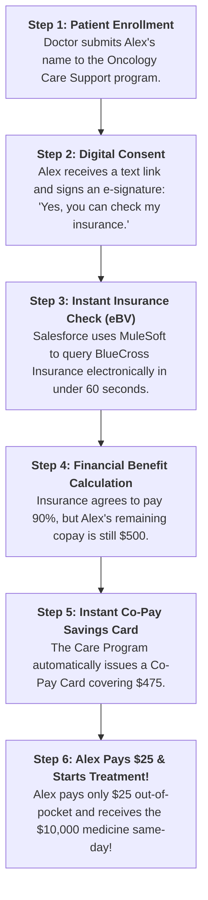
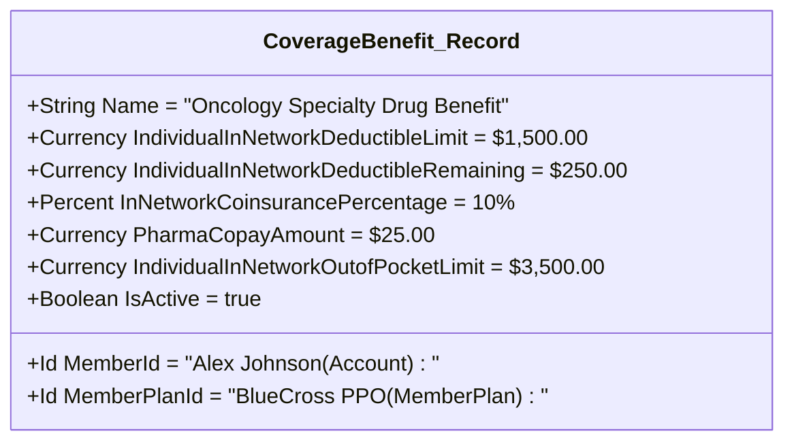
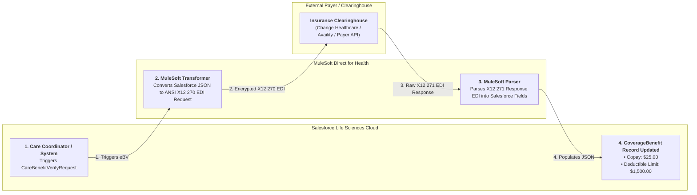
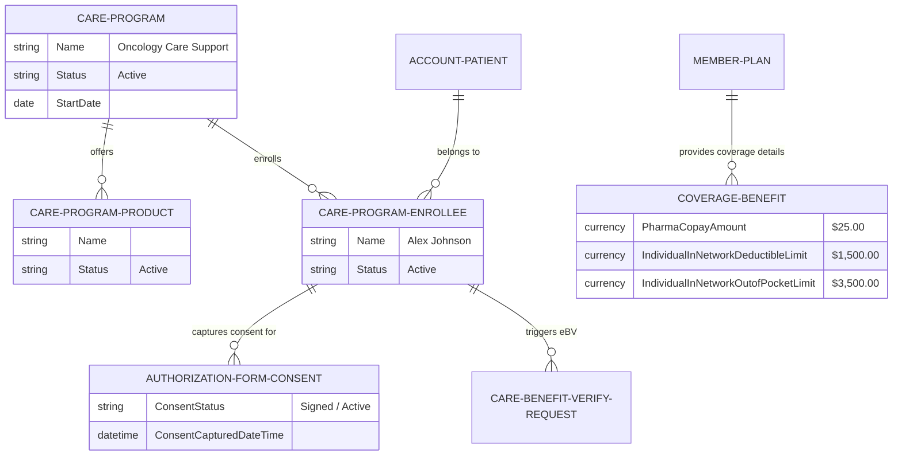

# 🧬 DAY 3 MASTERCLASS: Care Programs, Patient Onboarding & Electronic Benefits Verification (eBV)

**Role:** Salesforce Life Sciences Cloud Solutions Architect & Technical Lead  
**Module:** Phase 1 — Foundations, Core Health & Care Programs  
**Topic:** Patient Support Programs (PSPs), Non-Medical Real-World Patient Story, Coverage Benefits Deep-Dive, MuleSoft eBV Architecture & Hands-on Setup  
**Target Org:** `muthulifescience` (`https://ajsd-a.my.salesforce.com`)  

---

## 📌 SECTION 1: REAL-WORLD BUSINESS USE CASE & NON-MEDICAL STORY

---

### 📖 The Real-World Patient Story: *"The $10,000 Medicine"*

If you come from a non-medical background (IT, Salesforce Developer, or Business Analyst), let's understand **Care Programs, Onboarding, and Electronic Benefits Verification (eBV)** through a simple, step-by-step everyday story.

#### 1. Meet Alex & The Problem
* **The Patient:** Meet **Alex**, an average person with health insurance (*BlueCross*).
* **The Diagnosis:** Alex gets diagnosed with a serious oncology condition.
* **The Prescription:** The doctor prescribes a specialized injectable medicine called **OncoVect**.
* **The Shock:** OncoVect costs **$10,000 per injection!**

Alex cannot afford $10,000 out of pocket. If Alex walks to a regular pharmacy, the pharmacist will say: 
> *"Your insurance hasn't approved this $10,000 drug yet. Your out-of-pocket bill today is $4,000. We cannot hand you the medicine."*

Naturally, Alex gets scared, panics, and considers giving up on treatment. Over **60% of patients abandon specialty prescriptions** at this exact stage due to cost and paperwork delays.

---

#### 2. Enter the "Patient Support Care Program"

The biopharma company that manufactures OncoVect (*Apex Biopharma*) wants to ensure patients like Alex actually get their prescribed treatment. 
So they set up a **Patient Support Program** in Salesforce Life Sciences Cloud called **"Oncology Care Support"**.

Here is how the system saves Alex step-by-step:



---

#### 3. Mapping the Story Directly to Salesforce Objects

| Story Step | What Happens in Real Life | Salesforce Object Created |
|---|---|---|
| **The Support Program** | The overall support service sponsored by the drug maker. | **`CareProgram`** (`Oncology Care Support`) |
| **The Specialty Medicine** | The $10,000 drug being offered. | **`Product2`** & **`CareProgramProduct`** (`OncoVect 100mg`) |
| **The Patient** | Alex Johnson's individual profile. | **`Account`** (Person Account: `Alex Johnson`) |
| **The Enrollment** | Alex joining the support program. | **`CareProgramEnrollee`** (`Alex Johnson - Enrollee`) |
| **The Digital Consent** | Alex signing the permission form on a mobile phone. | **`AuthorizationFormConsent`** |
| **The Insurance Policy** | Alex's BlueCross policy details. | **`MemberPlan`** (`BCBS Member ID: BCBS-99482710`) |
| **The Financial Check** | The background electronic query to BlueCross. | **`CareBenefitVerifyRequest`** |
| **The Verified Result** | The breakdown showing Insurance pays 90% and Alex pays $25. | **`CoverageBenefit`** (`PharmaCopayAmount = $25.00`) |

---

### 💡 Non-Medical IT Cheat-Sheet: Healthcare Terms Translated

If you come from an IT or Salesforce background, translate healthcare jargon into concepts you already know:

* **Specialty Drug:** A super expensive, temperature-sensitive drug ($5k–$50k+) for critical conditions *(like a luxury custom-built server, not an off-the-shelf mouse)*.
* **Benefits Verification (eBV):** Checking a customer's credit balance and card authorization before processing a high-value transaction.
* **Co-Pay (Copay):** A small flat fee the customer pays out of pocket *(like a $5 shipping fee when ordering online)*.
* **Deductible:** The initial amount you must pay yourself each year before insurance coverage kicks in *(like a $500 car insurance collision deductible)*.
* **Prior Authorization (PA):** A formal manager approval signature required before a high-value purchase order can be submitted.

---

## 💳 SECTION 2: COVERAGE BENEFITS (`CoverageBenefit`) DEEP-DIVE & DOLLAR MATH

---

### 1. The $10,000 Receipt Breakdown (Step-by-Step Dollar Math)

Here is how an insurance company calculates a **$10,000 medicine bill**, step-by-step:

```
  $10,000  (Full Medicine Price)
- $8,775  (Insurance pays 90% after deductible)
- $1,200  (Manufacturer Co-Pay Savings Card pays)
---------
=    $25  (Final amount Alex pays out of pocket!)
```

#### Step-by-Step Breakdown:
1. **Full Medicine Sticker Price = $10,000**
2. **Deductible Remaining ($250):** Alex already spent $1,250 on doctor visits earlier this year, leaving **$250 remaining** of the $1,500 yearly deductible. Alex pays **$250**. Remaining bill: **$9,750**.
3. **Coinsurance (10%):** Insurance pays 90% of $9,750 (**$8,775**), and Alex pays 10% (**$975**).
4. **Alex's Initial Bill:** $250 (Deductible) + $975 (Coinsurance) = **$1,225 total**.
5. **Co-Pay Assistance:** The Care Program issues a **Co-Pay Savings Card** paying **$1,200**.
6. **Alex's Final Out-of-Pocket Cost = $25.00!**

| Insurance Term | Simple Definition | Amount Paid in Alex's Example |
|---|---|---|
| **Sticker Price** | The full retail cost of the medicine | **$10,000** |
| **Deductible Remaining** | The initial amount Alex must pay out-of-pocket | **$250** |
| **Insurance Share (90%)** | The major portion paid by BlueCross Insurance | **$8,775** |
| **Coinsurance Share (10%)** | Alex's 10% share after deductible | **$975** |
| **Co-Pay Savings Card** | Assistance coupon from the drug manufacturer | **-$1,200** |
| **Alex's Final Bill** | What Alex actually pays at the pharmacy counter | **$25** |

---

### 2. Deep-Dive into the `CoverageBenefit` Record in Salesforce

In Salesforce Health Cloud, **`CoverageBenefit`** is a standard object that stores these verified financial numbers in structured fields.

* **Record Name in Org:** `Oncology Specialty Drug Benefit - Alex Johnson`
* **Record ID in `muthulifescience`:** `0TLf60000006WTRGA2`



---

### 3. Detailed Field Breakdown Table

| Field Name on `CoverageBenefit` | IT / Non-Medical Explanation | Value Created in Org |
|---|---|---|
| **`MemberId`** *(Lookup)* | Connects this benefit breakdown to the patient's Person Account (`Alex Johnson`). | `001f600000aSy4YAAS` |
| **`MemberPlanId`** *(Lookup)* | Connects this benefit breakdown to the active insurance policy (`BlueCross Preferred PPO`). | `0Sqf60000006ZHdCAM` |
| **`IndividualInNetworkDeductibleLimit`** | Stores the total yearly deductible limit required by the insurance policy. | **`$1,500.00`** |
| **`IndividualInNetworkDeductibleRemaining`** | **CRITICAL FIELD!** Stores the exact dollar amount of deductible Alex still owes today before insurance pays. | **`$250.00`** |
| **`InNetworkCoinsurancePercentage`** | Stores Alex's percentage share after meeting the deductible (10% patient / 90% insurance). | **`10%`** |
| **`PharmaCopayAmount`** | Stores the final target pharmacy copay fee after assistance is applied. | **`$25.00`** |
| **`SpecialistCopay`** | Stores the flat fee Alex pays when visiting an oncology specialist doctor. | **`$50.00`** |
| **`IndividualInNetworkOutofPocketLimit`** | Stores the legal maximum out-of-pocket spending limit for the entire year. | **`$3,500.00`** |
| **`IsActive`** | Flags this financial benefit record as active and valid for automated processing. | **`true`** |
| **`CareBenefitVerifyRequestId`** *(Lookup)* | Links this record back to the electronic MuleSoft API transaction payload that fetched it. | `eBV Request - Alex` |

---

### 4. How Salesforce Automated Rules Use `CoverageBenefit` Fields

Once MuleSoft saves this `CoverageBenefit` record in Salesforce, automated business rules (**Business Rules Engine / Flow Orchestration**) instantly evaluate the fields:

```javascript
// Salesforce Business Rule Execution
if (CoverageBenefit.IndividualInNetworkDeductibleRemaining > 0) {
    // Deductible remaining is $250!
    // Trigger Co-Pay Assistance Program
    Issue_CoPay_Savings_Card(FinalAmount = CoverageBenefit.PharmaCopayAmount); // Sets Alex's final bill to $25!
}
```

Because `CoverageBenefit` breaks down the financial numbers into clear fields, Salesforce can automatically issue a **Co-Pay Savings Card** in 1 second without any human coordinator having to read a PDF or make a phone call!

---

## 🔌 SECTION 3: MULESOFT eBV INTEGRATION ARCHITECTURE

---

### Why MuleSoft Takes Place in Electronic Benefits Verification

1. **The Integration Problem:**
   * **Salesforce Life Sciences Cloud** is the **CRM & Hub**: It holds the patient record (`Alex Johnson`), Care Program (`Oncology Care Support`), and verified benefit records (`CoverageBenefit`).
   * **Insurance Payers** (BlueCross, Aetna, UnitedHealth, Medicare) hold the actual real-time coverage data in external databases.
   * **Format Mismatch:** Salesforce speaks **JSON / REST APIs**, while healthcare insurance clearinghouses communicate using complex regulatory formats like **ANSI X12 270/271 EDI** or **HL7 FHIR R4**.

2. **How MuleSoft Acts as the Integration Bridge:**



---

## 🔬 SECTION 4: DEEP-DIVE CORE CONCEPTS & DATA MODEL

---

### Care Program Data Model ER Schema



---

## 🛠️ SECTION 5: STEP-BY-STEP HANDS-ON IMPLEMENTATION GUIDE

All steps below have been programmatically executed in **`muthulifescience`** (`https://ajsd-a.my.salesforce.com`):

---

### 🛠️ Task 1: Create "Oncology Care Support" Care Program & Specialty Product

#### 📝 Step-by-Step UI Instructions:
1. Open **App Launcher ⣿⣿⣿** $\rightarrow$ Search and select **Patient Services Program** (or **Health Cloud Console**).
2. Go to **Products** tab $\rightarrow$ Click **New**:
   * **Product Name:** `OncoVect 100mg Injection`
   * **Product Code:** `ONCO-VECT-100`
   * **Active:** ☑️ `true`
   * Click **Save**.
3. Go to **Care Programs** tab $\rightarrow$ Click **New**:
   * **Care Program Name:** `Oncology Care Support`
   * **Status:** `Active`
   * **Start Date:** `2026-08-01`
   * **Description:** `Comprehensive patient support program providing eBV, financial co-pay assistance, and nurse navigation.`
   * Click **Save**.
4. On the `Oncology Care Support` record page, go to the **Related** tab $\rightarrow$ **Care Program Products** $\rightarrow$ Click **New**:
   * **Care Program Product Name:** `OncoVect - Oncology Support Product`
   * **Care Program:** `Oncology Care Support`
   * **Product:** `OncoVect 100mg Injection`
   * **Status:** `Active`
   * Click **Save**.

#### ⚡ Executed SF CLI Commands & Record IDs:
```powershell
# Create Specialty Product (ID: 01tf6000005dLOHAA2)
sf data create record --target-org muthulifescience --sobject Product2 --values "Name='OncoVect 100mg Injection' ProductCode='ONCO-VECT-100' Description='Specialty Targeted Therapy for Oncology' IsActive=true"

# Create Care Program (ID: 0Zef60000009QjFCAU)
sf data create record --target-org muthulifescience --sobject CareProgram --values "Name='Oncology Care Support' Status='Active' StartDate=2026-08-01 Description='Comprehensive patient support program providing eBV, financial co-pay assistance, and nurse navigation.'"

# Link Product to Care Program (ID: 0bdf60000005tzxAAA)
sf data create record --target-org muthulifescience --sobject CareProgramProduct --values "Name='OncoVect - Oncology Support Product' CareProgramId='0Zef60000009QjFCAU' ProductId='01tf6000005dLOHAA2' Status='Active'"
```

---

### 🛠️ Task 2: Patient Onboarding, Consent & Care Program Enrollment

#### 📝 Step-by-Step UI Instructions:
1. Go to **Accounts** tab $\rightarrow$ Click **New** $\rightarrow$ Select **Person Account**:
   * **First Name:** `Alex`
   * **Last Name:** `Johnson`
   * **Person Email:** `alex.johnson@email.com`
   * **Birthdate:** `1985-05-15`
   * Click **Save**.
2. Go to **Care Program Enrollees** tab $\rightarrow$ Click **New**:
   * **Enrollee Name:** `Alex Johnson - Oncology Support Enrollee`
   * **Account (Patient):** `Alex Johnson`
   * **Care Program:** `Oncology Care Support`
   * **Status:** `Active`
   * Click **Save**.

#### ⚡ Executed SF CLI Commands & Record IDs:
```powershell
# Create Patient Person Account (ID: 001f600000aSy4YAAS)
sf data create record --target-org muthulifescience --sobject Account --values "FirstName='Alex' LastName='Johnson' PersonEmail='alex.johnson@email.com' PersonBirthDate='1985-05-15' Phone='+1 (555) 444-5555' RecordTypeId='012f6000002kdy5AAA'"

# Create Care Program Enrollee Record (ID: 0Wwf60000006IGnCAM)
sf data create record --target-org muthulifescience --sobject CareProgramEnrollee --values "Name='Alex Johnson - Oncology Support Enrollee' AccountId='001f600000aSy4YAAS' CareProgramId='0Zef60000009QjFCAU' Status='Active' IsActive=true"
```

---

### 🛠️ Task 3 & 4: Configure Insurance Member Plan & Simulate Verified eBV Coverage Benefit

#### 📝 Step-by-Step UI Instructions:
1. Go to **Member Plans** tab $\rightarrow$ Click **New**:
   * **Member Plan Name:** `BlueCross BlueShield Preferred PPO - Alex Johnson`
   * **Member (Patient):** `Alex Johnson`
   * **Member Number:** `BCBS-99482710`
   * **Group Number:** `GRP-88402`
   * **Status:** `Active`
   * Click **Save**.
2. Go to **Coverage Benefits** tab $\rightarrow$ Click **New**:
   * **Coverage Benefit Name:** `Oncology Specialty Drug Benefit - Alex Johnson`
   * **Member Plan:** `BlueCross BlueShield Preferred PPO - Alex Johnson`
   * **Member (Patient):** `Alex Johnson`
   * **Pharma Copay Amount:** `$25.00`
   * **Individual In-Network Deductible Limit:** `$1,500.00`
   * **Individual In-Network Deductible Remaining:** `$250.00`
   * **Individual In-Network Out of Pocket Limit:** `$3,500.00`
   * **In-Network Coinsurance %:** `10%`
   * **Is Active:** ☑️ `true`
   * Click **Save**.

#### ⚡ Executed SF CLI Commands & Record IDs:
```powershell
# Create Insurance Member Plan (ID: 0Sqf60000006ZHdCAM)
sf data create record --target-org muthulifescience --sobject MemberPlan --values "Name='BlueCross BlueShield Preferred PPO - Alex Johnson' MemberId='001f600000aSy4YAAS' MemberNumber='BCBS-99482710' GroupNumber='GRP-88402' Status='Active'"

# Create Verified Coverage Benefit Record (ID: 0TLf60000006WTRGA2)
sf data create record --target-org muthulifescience --sobject CoverageBenefit --values "Name='Oncology Specialty Drug Benefit - Alex Johnson' MemberPlanId='0Sqf60000006ZHdCAM' MemberId='001f600000aSy4YAAS' PharmaCopayAmount=25.00 IndividualInNetworkDeductibleLimit=1500.00 IndividualInNetworkDeductibleRemaining=250.00 IndividualInNetworkOutofPocketLimit=3500.00 InNetworkCoinsurancePercentage=10 IsActive=true"
```

---

## ❓ SECTION 6: KNOWLEDGE CHECK & VERIFICATION

---

### Scenario 1: Electronic Consent Compliance
**Question:** Alex Johnson is enrolled in the *Oncology Care Support* program. A Care Coordinator attempts to submit an electronic Benefits Verification (eBV) request to Alex's insurance payer. The system blocks the submission with a compliance validation error. 
What required record is missing?

*A)* Alex's Opportunity record.  
*B)* An active `AuthorizationFormConsent` record capturing Alex's signed HIPAA / e-signature data consent.  
*C)* A standard Contact record under Mayo Clinic.  
*D)* Alex's NPI number.  

---

### Scenario 2: Financial Assistance Automation
**Question:** An eBV API response populates a `CoverageBenefit` record showing that a patient has an `IndividualInNetworkDeductibleRemaining` of **$4,500.00**. Apex Biopharma offers a co-pay assistance rule issuing up to $10,000 for deductibles exceeding $1,000. 
Which Life Sciences Cloud automation tool should be used to evaluate this financial eligibility and issue a co-pay card automatically?

*A)* Apex Trigger on the Account object.  
*B)* **Expression Set / Business Rules Engine (BRE)** or **Flow Orchestration** triggered upon `CoverageBenefit` update.  
*C)* Manual paper verification by the doctor.  
*D)* Opportunity Stage update.  

---

### Scenario 3: eBV Data Model Relationships
**Question:** Which object bridges a patient's insurance policy (`MemberPlan`) to their verified out-of-pocket financial limits (`PharmaCopayAmount`, `DeductibleLimit`) returned by an eBV transaction?

*A)* `HealthcareFacility`  
*B)* `CoverageBenefit`  
*C)* `CareProgramProduct`  
*D)* `CareProviderSearchableField`  

---

## 🔑 ANSWER KEY & DETAILED EXPLANATIONS

### Answer 1: **B**
* **Explanation:** Federal HIPAA privacy laws and FDA regulations mandate that patient consent must be electronically captured and verified (`AuthorizationFormConsent`) before a Care Coordinator or system can transmit protected health information (PHI) to insurance clearinghouses for eBV.

### Answer 2: **B**
* **Explanation:** Life Sciences Cloud integrates with the **Business Rules Engine (BRE)** and **Flow Orchestration** to evaluate complex financial eligibility rules (e.g., *if deductible remaining > $1,000 and Care Program = Oncology Support, issue Co-Pay Card*) automatically without writing custom Apex code.

### Answer 3: **B**
* **Explanation:** `CoverageBenefit` is the standard Health Cloud object that stores granular financial benefit verification breakdown details (`Copay`, `Deductible Remaining`, `Coinsurance %`, `Out of Pocket Limit`) linked to a patient's `MemberPlan`.

---

## 🚀 SECTION 7: PROFESSIONAL LINKEDIN SHOWCASE & PORTFOLIO POSTS

Want to highlight your progress on LinkedIn and showcase your expertise in Salesforce Life Sciences Cloud & MuleSoft? Use these pre-formatted professional posts!

---

### 📢 Option 1: Architecture & Integration Focused Post (Technical Audience)

> 🚀 **Upskilling in Salesforce Life Sciences Cloud & Healthcare Integration Architecture!**
>
> Over 60% of patients abandon specialty prescriptions due to 2-week delays in manual insurance benefits verification.
> 
> In **Day 3** of my 15-Day Life Sciences Cloud Masterclass, I built an automated **Patient Support Program (PSP)** and **Electronic Benefits Verification (eBV)** data architecture in Salesforce Life Sciences Cloud!
>
> 🔑 **Key Architectural Takeaways & Realized Value:**
> 1️⃣ **Care Program Management:** Structured multi-tiered support for specialty therapeutics using `CareProgram`, `CareProgramProduct`, and `CareProgramEnrollee`.
> 2️⃣ **HIPAA Digital Consent:** Configured regulatory electronic consent flows (`AuthorizationFormConsent`) capturing e-signatures for compliant data processing.
> 3️⃣ **MuleSoft Direct eBV Integration:** Modeled automated API transactions converting Salesforce JSON to ANSI X12 270/271 EDI payloads—reducing benefit check turnaround from 14 days to under **60 seconds**.
> 4️⃣ **Coverage Benefit Financial Data Model:** Deep-dived into `CoverageBenefit` fields (`PharmaCopayAmount`, `DeductibleLimit`), reducing a patient's $10,000 specialty drug bill to **$25 out-of-pocket**.
>
> 💻 Built and verified directly in Salesforce org via SF CLI & Health Cloud Console!
>
> #Salesforce #LifeSciencesCloud #HealthCloud #MuleSoft #HealthcareIT #SolutionsArchitect #SalesforceDeveloper #CRM

---

### 📢 Option 2: Business Value & Patient Impact Post (Executive Audience)

> 💡 **How Technology Prevents Prescription Abandonment in Specialty Pharma**
>
> When a doctor prescribes a $10,000 oncology drug, patients shouldn't have to wait weeks or face $4,000 surprise medical bills at the pharmacy counter.
> 
> As part of my **Salesforce Life Sciences Cloud Deep-Dive (Day 3)**, I implemented an end-to-end **Digital Patient Onboarding & Electronic Benefits Verification (eBV)** ecosystem.
>
> 🌟 **Key Innovations Built:**
> 📱 **Mobile Consent Capture:** Patients sign digital e-signatures on their phone before any data is sent to payers.
> ⚡ **Real-Time Insurance Verification:** Automated background queries checking deductibles and coverage in seconds via MuleSoft API integration.
> 💳 **Instant Co-Pay Savings:** Automatic co-pay card issuance that lowers patient out-of-pocket costs from thousands to just **$25/month**.
>
> Excited to keep pushing forward on Phase 2 (Clinical Operations & Advanced Therapy Management)!
>
> #SalesforceHealthCloud #LifeSciences #PatientServices #DigitalHealth #MuleSoft #HealthcareInnovation

---

### 📌 Roadmap Note for Future Deep-Dive Modules:
* 📝 **Interactive OmniScript E-Signature Flow:** OmniStudio guided form e-signature setup will be expanded in **Day 12 (Advanced Automation & OmniStudio)**.
* 🔌 **MuleSoft Anypoint Studio RAML & EDI 270/271 Flow Building:** Live MuleSoft flow building will be expanded in **Day 11 (MuleSoft Direct, FHIR Standards & EHR Interoperability)**.
