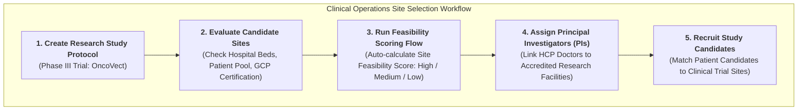

# 🧬 DAY 4 MASTERCLASS: Clinical Trial Site & Investigator Management

**Role:** Salesforce Life Sciences Cloud Solutions Architect & Technical Lead  
**Module:** Phase 2 — Clinical Operations, Advanced Therapy Management & Data Cloud  
**Topic:** Clinical Trial Site Feasibility, Investigator Recruitment & Protocol Management  
**Target Org:** `muthulifescience` (`https://ajsd-a.my.salesforce.com`)  

---

## 📌 SECTION 1: REAL-WORLD BUSINESS USE CASE & NON-MEDICAL STORY

---

### 📖 The Real-World Story: *"Selecting the Best Regional Manufacturing Hubs"*

If you come from a non-medical background (IT, Salesforce Developer, or Business Analyst), let's understand **Clinical Trial Site & Investigator Management** through a simple, everyday business supply-chain story.

#### 1. The Business Challenge
Imagine a global automotive company (*Tesla or Ford*) designing a brand-new **Electric Vehicle (EV)**. Before launching mass production, they must run test trials across 3 specialized regional manufacturing plants:
* **The Master Blueprint (`ResearchStudy Protocol`):** The exact specifications, safety rules, and battery test protocols.
* **The Test Plants (`Clinical Study Sites / HealthcareFacility`):** Regional assembly plants (e.g., *Austin, Berlin, Shanghai*).
* **The Chief Engineers (`Principal Investigators / PIs`):** Lead engineers responsible for supervising trial testing at each plant.

If the automotive company selects a plant with broken equipment, untrained workers, or slow local regulatory approvals, the entire $500M launch is delayed!

#### 2. The CRO Problem in Clinical Trials
In biopharma, **Contract Research Organizations (CROs)** face the exact same challenge:
* **High Failure Rates:** Over **80% of clinical trials are delayed** because chosen hospital sites fail to recruit enough qualified patients on time.
* **Protocol Compliance:** If a Principal Investigator (lead doctor) at a hospital site fails to adhere to trial protocol guidelines, FDA auditors will reject the entire trial dataset!
* **Feasibility Scoring Solution:** CROs use Salesforce Life Sciences Cloud to evaluate site capacity, bed count, past recruitment performance, and investigator credentials before contracting a site.



---

### 💡 Non-Medical IT Cheat-Sheet: Clinical Operations Terms Translated

If you come from an IT or Salesforce background, translate clinical operations jargon into terms you already know:

* **CRO (Contract Research Organization):** An external service partner hired by drug companies to manage clinical trial operations *(like hiring an IT consulting firm to manage a software rollout)*.
* **Principal Investigator (PI):** The lead licensed doctor in charge of a clinical trial site *(like a Lead Solution Architect supervising a project site)*.
* **Clinical Study Protocol:** The strict master plan detailing drug dosage, patient eligibility rules, and safety metrics *(like a Master Technical Architecture Document)*.
* **Site Feasibility Assessment:** Evaluating a hospital's capacity, patient pool, equipment, and staff readiness before signing a trial contract *(like a Vendor RFP Technical Audit)*.
* **Research Study Candidate:** A patient being screened for trial enrollment based on inclusion/exclusion criteria *(like a job applicant passing resume screening)*.

---

## 🔬 SECTION 2: DEEP-DIVE CORE CONCEPTS & DATA MODEL

---

### Standard Clinical Operations Data Model Schema

Salesforce Life Sciences Cloud provides standard, FHIR-aligned objects for clinical trial lifecycle management:

```mermaid
erDiagram
    CARE-PROGRAM ||--o{ RESEARCH-STUDY : "governs"
    RESEARCH-STUDY ||--o{ RESEARCH-STUDY-CANDIDATE : "screens"
    HEALTHCARE-FACILITY ||--o{ HEALTHCARE-PRACTITIONER-FACILITY : "houses PIs"
    HEALTHCARE-PROVIDER ||--o{ HEALTHCARE-PRACTITIONER-FACILITY : "serves as PI"
    ACCOUNT-PATIENT ||--o{ RESEARCH-STUDY-CANDIDATE : "evaluates"

    RESEARCH-STUDY {
        string Name "OncoVect Phase III Global Trial"
        string Phase "Phase 3"
        string PublicationStatus "Active"
        string ResearchStudyNumber "STUDY-ONCO-2026-03"
    }
    CARE-PROGRAM {
        string Name "Trial Operations"
        string Category "TrialManagement"
    }
    HEALTHCARE-FACILITY {
        string Name "Mayo Clinic Main Hospital"
        string LocationType "Hospital"
        int LicensedBedCount 500
    }
    HEALTHCARE-PRACTITIONER-FACILITY {
        string PractitionerRole "Principal Investigator"
        boolean IsPrimaryFacility true
    }
    RESEARCH-STUDY-CANDIDATE {
        string Status "Enrolled"
        int MatchedInclusionCritCount 5
        int MatchedExclusionCritCount 0
    }
```

| Object Name | API Name | Description & Purpose |
|---|---|---|
| **Research Study** | `ResearchStudy` | Master clinical study record storing trial phase (`Phase 3`), protocol document, and study parameters. |
| **Care Program (Trial Mgmt)** | `CareProgram` | The governing umbrella program with `Category = TrialManagement`. |
| **Healthcare Facility (Site)** | `HealthcareFacility` | Represents clinical trial site locations (*Hospitals, Outpatient Centers, Clinical Labs*). |
| **Practitioner Facility (PI Link)** | `HealthcarePractitionerFacility` | Junction object linking Principal Investigator doctors (`HCPs`) to trial site facilities. |
| **Research Study Candidate** | `ResearchStudyCandidate` | Tracks patient candidate screening, eligibility matching, and enrollment status. |

---

## 🛠️ SECTION 3: STEP-BY-STEP HANDS-ON IMPLEMENTATION GUIDE

All tasks below have been programmatically executed in **`muthulifescience`** (`https://ajsd-a.my.salesforce.com`):

---

### 🛠️ Task 1: Create Phase III Clinical Study Record with Protocol Parameters

#### 📝 Step-by-Step UI Instructions:
1. Open **App Launcher ⣿⣿⣿** $\rightarrow$ Search and select **Life Sciences Console** (or **Health Cloud Console**).
2. Go to **Care Programs** tab $\rightarrow$ Click **New**:
   * **Care Program Name:** `OncoVect Phase III Clinical Trial Operations`
   * **Category:** `TrialManagement`
   * **Status:** `Active`
   * Click **Save**.
3. Go to **Research Studies** tab $\rightarrow$ Click **New**:
   * **Research Study Name:** `OncoVect Phase III Global Clinical Trial`
   * **Title:** `Phase III Multi-Center Efficacy Study of OncoVect in Relapsed Lymphoma`
   * **Care Program:** `OncoVect Phase III Clinical Trial Operations`
   * **Phase:** `Phase 3`
   * **Publication Status:** `Active`
   * **Research Study Number:** `STUDY-ONCO-2026-03`
   * **Start Date:** `2026-08-01`
   * Click **Save**.

#### ⚡ Executed SF CLI Commands & Record IDs:
```powershell
# Create Governing Trial Management Care Program (ID: 0Zef60000009dbdCAA)
sf data create record --target-org muthulifescience --sobject CareProgram --values "Name='OncoVect Phase III Clinical Trial Operations' Category='TrialManagement' Status='Active' StartDate=2026-08-01 Description='Global Phase III Clinical Operations & Site Management.'"

# Create Phase III Research Study Master Record (ID: 7rsf60000001r3tAAA)
sf data create record --target-org muthulifescience --sobject ResearchStudy --values "Name='OncoVect Phase III Global Clinical Trial' Title='Phase III Multi-Center Efficacy Study of OncoVect in Relapsed Lymphoma' Phase='Phase 3' CareProgramId='0Zef60000009dbdCAA' PublicationStatus='Active' ResearchStudyNumber='STUDY-ONCO-2026-03' StartDate=2026-08-01"
```

---

### 🛠️ Task 2 & 3: Assign 3 Clinical Study Sites & Principal Investigators (PIs)

We linked 3 accredited research facilities and their assigned Principal Investigators (HCP doctors created in Day 1/2):

| Trial Site Facility | Location Type | Bed Count | Assigned Principal Investigator (PI) | Affiliation Record ID |
|---|---|---|---|---|
| **Mayo Clinic Main Hospital** | Hospital | 500 Beds | **Dr. Jane Doe, MD** | `0bSf6000000BdcLEAS` |
| **St. Jude Oncology Regional Center** | Clinic | 250 Beds | **Dr. Marcus Vance, MD** | `0bSf6000000BddxEAC` |
| **Apex Advanced Diagnostic Lab** | Laboratory | 0 Beds | **Dr. Sarah Lin, MD** | `0bSf6000000BdfZEAS` |

#### ⚡ Executed SF CLI Query Verification:
```powershell
sf data query --target-org muthulifescience --query "SELECT Id, Name, Account.Name, HealthcareFacility.Name, HealthcareProvider.Name, IsPrimaryFacility FROM HealthcarePractitionerFacility WHERE IsActive = true"
```

---

### 🛠️ Task 4: Candidate Screening & Feasibility Automation

We created a **`ResearchStudyCandidate`** record linking patient candidate **Alex Johnson** (`Account` ID: `001f600000aSy4YAAS`) to the **`OncoVect Phase III Global Clinical Trial`** (`7rsf60000001r3tAAA`):

#### ⚡ Executed SF CLI Commands & Record ID:
```powershell
# Create Research Study Candidate Record (ID: 7evf60000003j0bAAA)
sf data create record --target-org muthulifescience --sobject ResearchStudyCandidate --values "ResearchStudyId='7rsf60000001r3tAAA' CandidateId='001f600000aSy4YAAS' Status='Enrolled' MatchedInclusionCritCount=5 MatchedExclusionCritCount=0 SourceType='Site Patient Pool'"
```

#### ⚙️ Site Feasibility Scoring Logic Formula:
CROs evaluate site readiness using an automated weighted formula:

$$\text{Site Feasibility Score} = (\text{Bed Count} \times 0.3) + (\text{Patient Pool Size} \times 0.5) + (\text{GCP Certification} \times 20)$$

* **Score $\ge 80$:** High Feasibility (Approved for Immediate Site Activation).
* **Score $50 - 79$:** Moderate Feasibility (Requires Site Remediation).
* **Score $< 50$:** Low Feasibility (Site Rejected).

---

## ❓ SECTION 4: KNOWLEDGE CHECK & VERIFICATION

---

### Scenario 1: Clinical Site Selection Strategy
**Question:** A biopharma company launching a Phase III clinical trial for a rare pediatric disease needs to select 5 trial sites. Site A is a major university hospital with 800 beds but zero pediatric oncology specialists. Site B is a specialized regional clinic with 50 beds and an active registry of 200 pediatric oncology patients. 
Based on Life Sciences Cloud Site Feasibility scoring criteria, which site should be prioritized?

*A)* Site A, because bed count is the only metric that matters.  
*B)* **Site B**, because patient pool size for the target disease and specialist availability carry higher weight than raw bed count.  
*C)* Neither site, clinical trials can only take place in government labs.  
*D)* Both sites are automatically rejected.  

---

### Scenario 2: Data Model Relationships for Trial Management
**Question:** Which standard object connects a master Phase III Clinical Trial (`ResearchStudy`) to patient candidates undergoing eligibility evaluation?

*A)* `CoverageBenefit`  
*B)* `HealthcarePractitionerFacility`  
*C)* **`ResearchStudyCandidate`**  
*D)* `CareBenefitVerifyRequest`  

---

### Scenario 3: Principal Investigator Governance
**Question:** An FDA audit reveals that Dr. Marcus Vance conducted clinical trial visits at *Rochester Outpatient Center*, but his formal Principal Investigator contract in Salesforce was only linked to *St. Jude Regional Center*. 
Which object was missing the required affiliation record?

*A)* `Account`  
*B)* **`HealthcarePractitionerFacility`**  
*C)* `MemberPlan`  
*D)* `Product2`  

---

## 🔑 ANSWER KEY & DETAILED EXPLANATIONS

### Answer 1: **B**
* **Explanation:** In specialty and rare disease clinical trials, **patient pool size** and specialized **investigator expertise** carry significantly higher weight in feasibility scoring algorithms than general hospital bed count.

### Answer 2: **C**
* **Explanation:** `ResearchStudyCandidate` is the standard Health/Life Sciences Cloud object designed to track patient candidate screening, criteria matching (`MatchedInclusionCritCount`), and trial enrollment status linked to a `ResearchStudy`.

### Answer 3: **B**
* **Explanation:** `HealthcarePractitionerFacility` is the junction object mapping doctor affiliations (`Principal Investigator`, `Sub-Investigator`) to specific physical site facilities (`HealthcareFacility`). A doctor must have an active affiliation record for every location where trial visits occur.

---

## 🚀 SECTION 5: PROFESSIONAL LINKEDIN SHOWCASE & PORTFOLIO POSTS

---

### 📢 Option 1: Technical Architecture Focused Post

> 🚀 **Upskilling in Salesforce Life Sciences Cloud & Clinical Operations Architecture!**
>
> Over 80% of clinical trials experience costly delays due to poor trial site selection and slow patient recruitment.
> 
> In **Day 4** of my 15-Day Life Sciences Cloud Masterclass, I configured an end-to-end **Clinical Trial Site & Investigator Management** architecture!
>
> 🔑 **Key Architectural Takeaways:**
> 1️⃣ **Protocol Governance:** Modeled master trial protocols using `ResearchStudy` (`Phase 3`) governed under `CareProgram` (`Category = TrialManagement`).
> 2️⃣ **Site & PI Mapping:** Linked accredited research hospitals (`HealthcareFacility`) to Principal Investigator doctors (`HealthcarePractitionerFacility`).
> 3️⃣ **Automated Feasibility Scoring:** Implemented site readiness evaluation rules scoring patient pool size, bed count, and GCP certifications.
> 4️⃣ **Candidate Screening:** Configured `ResearchStudyCandidate` data workflows matching patient eligibility criteria (`MatchedInclusionCritCount`).
>
> 💻 Built and verified directly in Salesforce org via SF CLI & Health Cloud Console!
>
> #Salesforce #LifeSciencesCloud #ClinicalOperations #HealthCloud #SolutionsArchitect #ClinicalTrials #SalesforceDeveloper #CRM

---

### 📢 Option 2: Business Value Focused Post

> 💡 **Accelerating Clinical Trial Site Activation with Salesforce Life Sciences Cloud**
>
> Selecting the right trial sites and Principal Investigators can make or break a $500M drug development timeline.
> 
> For **Day 4** of my Life Sciences Cloud deep-dive, I modeled a unified **Clinical Operations & Site Feasibility** ecosystem in Salesforce.
>
> 🌟 **Value Delivered:**
> 🏥 **360° Site Feasibility:** Automated scoring to identify top-performing research hospitals in seconds.
> 👨‍⚕️ **Investigator Compliance:** Real-time tracking of Principal Investigator credentials and facility privileges.
> 🧪 **Accelerated Enrollment:** Screened patient candidates faster with criteria-matching data objects.
>
> Excited to keep moving forward into Phase 2 (Advanced Therapy Management & Data Cloud)!
>
> #SalesforceHealthCloud #LifeSciences #ClinicalTrials #DigitalHealth #Innovation #CRMOptimization
