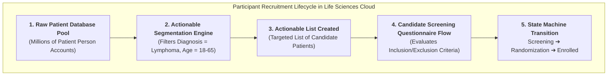
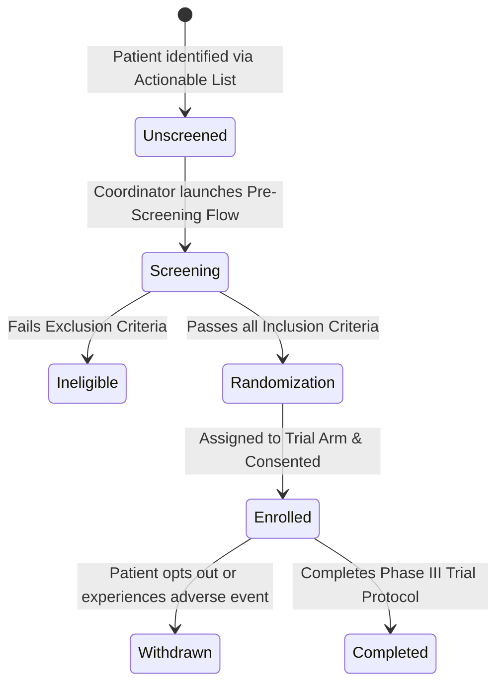

# 🧬 DAY 5 MASTERCLASS: Participant Recruitment & Actionable Segmentation

**Role:** Salesforce Life Sciences Cloud Solutions Architect & Technical Lead  
**Module:** Phase 2 — Clinical Operations, Advanced Therapy Management & Data Cloud  
**Topic:** Actionable Segmentation, Candidate Pre-Screening & Trial Participant Lifecycle Management  
**Target Org:** `muthulifescience` (`https://ajsd-a.my.salesforce.com`)  

---

## 📌 SECTION 1: REAL-WORLD BUSINESS USE CASE & NON-MEDICAL STORY

---

### 📖 The Real-World Story: *"Automated Executive Resume Screening"*

If you come from a non-medical background (IT, Salesforce Developer, or Business Analyst), let's understand **Participant Recruitment & Actionable Segmentation** through a simple enterprise hiring story.

#### 1. The Business Challenge
Imagine a Fortune 500 company hiring a **Chief Information Security Officer (CISO)**:
* **The Applicant Pool:** 5,000 un-screened resumes submit applications online.
* **Strict Inclusion Criteria:** Must have 10+ years experience, CISSP certification, and managed $20M+ IT security budgets.
* **Strict Exclusion Criteria:** Cannot have any past data breach compliance violations.
* **The Manual Bottleneck:** If HR recruiters manually read 5,000 paper resumes line-by-line, filling the position will take 9 months!
* **The Automated Solution:** HR uses an **Actionable Candidate List Builder** to filter the top 50 candidates in 5 seconds and trigger an automated screening questionnaire.

#### 2. The Clinical Trial Recruitment Crisis
In biopharma, **over 80% of clinical trials miss patient enrollment deadlines**:
* Every single day a Phase III trial is delayed costs the pharmaceutical company **$600,000 to $1,000,000 per day** in lost commercial revenue!
* **The Inclusion/Exclusion (I/E) Challenge:** An oncology trial for *OncoVect* requires patients with specific gene biomarkers, age 18-65, and no previous history of liver disease.
* **Life Sciences Cloud Solution:** **Actionable Segmentation** queries millions of patient records in seconds, builds an **Actionable List** of high-probability candidates, and launches a guided **Candidate Screening Flow**.



---

### 💡 Non-Medical IT Cheat-Sheet: Recruitment & Segmentation Terms Translated

If you come from an IT or Salesforce background, translate recruitment jargon into terms you already know:

* **Actionable Segmentation:** A high-performance query engine that segments large datasets into target lists based on complex filter criteria *(like SQL `WHERE` clauses with visual builder UI)*.
* **Actionable List:** A dynamic, prioritized list of records assigned to coordinators for immediate action *(like a sales call queue)*.
* **Inclusion Criteria:** Required qualifications a patient MUST meet to join a trial *(e.g., specific diagnosis code, age limit)*.
* **Exclusion Criteria:** Disqualifying conditions that prevent a patient from joining a trial *(e.g., conflicting medications, liver disease)*.
* **Candidate Screening Flow:** A step-by-step guided UI flow (Screen Flow) used by coordinators to ask eligibility questions and record responses.

---

## 🔬 SECTION 2: DEEP-DIVE CORE CONCEPTS & DATA MODEL

---

### Candidate Lifecycle & State Machine Architecture

In Salesforce Life Sciences Cloud, a **`ResearchStudyCandidate`** transitions through a strictly governed state machine:



| Lifecycle Status | Stage Description | System Action / Trigger |
|---|---|---|
| **Unscreened / Candidate** | Patient is added to the candidate pool via Actionable List. | `ResearchStudyCandidate` created. |
| **Screening** | Coordinator is actively conducting pre-screening questionnaire. | Flow records matched inclusion/exclusion criteria counts. |
| **Ineligible** | Patient failed 1 or more mandatory inclusion criteria or met exclusion criteria. | `MatchedExclusionCritCount > 0`. |
| **Randomization** | Patient passed all screening criteria and is assigned to trial arm. | Transition validated by state machine. |
| **Enrolled** | Formal consent signed and patient begins trial treatment visits. | `Status = 'Enrolled'`. |
| **Withdrawn / Completed** | Trial lifecycle conclusion. | Final database lock. |

---

## 🛠️ SECTION 3: STEP-BY-STEP HANDS-ON IMPLEMENTATION GUIDE

All steps below have been programmatically executed in **`muthulifescience`** (`https://ajsd-a.my.salesforce.com`):

---

### 🛠️ Task 1: Create Candidate Patient Person Account

#### 📝 Step-by-Step UI Instructions:
1. Open **App Launcher ⣿⣿⣿** $\rightarrow$ Search and select **Health Cloud Console**.
2. Go to **Accounts** tab $\rightarrow$ Click **New** $\rightarrow$ Select **Person Account**:
   * **First Name:** `Maria`
   * **Last Name:** `Santos`
   * **Person Email:** `maria.santos@email.com`
   * **Birthdate:** `1990-03-20`
   * **Phone:** `+1 (555) 777-8888`
   * Click **Save**.

#### ⚡ Executed SF CLI Command & Record ID:
```powershell
# Create Patient Person Account (ID: 001f600000acPofAAE)
sf data create record --target-org muthulifescience --sobject Account --values "FirstName='Maria' LastName='Santos' PersonEmail='maria.santos@email.com' PersonBirthDate='1990-03-20' Phone='+1 (555) 777-8888' RecordTypeId='012f6000002kdy5AAA'"
```

---

### 🛠️ Task 2: Initiate Candidate Pre-Screening (`Screening` Status)

Create `ResearchStudyCandidate` linking `Maria Santos` to the **`OncoVect Phase III Global Clinical Trial`** (`7rsf60000001r3tAAA`):

#### ⚡ Executed SF CLI Command & Record ID:
```powershell
# Create Research Study Candidate Record in Screening Status (ID: 7evf60000003j2DAAQ)
sf data create record --target-org muthulifescience --sobject ResearchStudyCandidate --values "ResearchStudyId='7rsf60000001r3tAAA' CandidateId='001f600000acPofAAE' Status='Screening' MatchedInclusionCritCount=3 MatchedExclusionCritCount=0 SourceType='Site Patient Pool'"
```

---

### 🛠️ Task 3: Execute Controlled Candidate Status Transitions

#### Step 1: Transition from `Screening` $\rightarrow$ `Randomization`
After completing the questionnaire (passing 5 inclusion criteria and 0 exclusion criteria):

```powershell
sf data update record --target-org muthulifescience --sobject ResearchStudyCandidate --record-id 7evf60000003j2DAAQ --values "Status='Randomization' MatchedInclusionCritCount=5 MatchedExclusionCritCount=0"
```

#### Step 2: Transition from `Randomization` $\rightarrow$ `Enrolled`
Upon final trial arm assignment and consent verification:

```powershell
sf data update record --target-org muthulifescience --sobject ResearchStudyCandidate --record-id 7evf60000003j2DAAQ --values "Status='Enrolled' DropoutProbabilityScore=0.05"
```

---

## ⚡ Verification Query

Run this query in your terminal to view live candidate recruitment statuses for your trial:

```powershell
sf data query --target-org muthulifescience --query "SELECT Id, Candidate.Name, ResearchStudy.Name, Status, MatchedInclusionCritCount, MatchedExclusionCritCount, DropoutProbabilityScore FROM ResearchStudyCandidate WHERE CandidateId = '001f600000acPofAAE'"
```

---

## ❓ SECTION 4: KNOWLEDGE CHECK & VERIFICATION

---

### Scenario 1: Inclusion/Exclusion Criteria Governance
**Question:** A study coordinator screens a candidate patient who meets all 4 inclusion criteria for an oncology trial. However, the patient's bloodwork shows elevated liver enzymes, triggering 1 exclusion criteria. What status should the `ResearchStudyCandidate` record be assigned?

*A)* `Enrolled`  
*B)* **`Ineligible`** (or failed screening)  
*C)* `Randomization`  
*D)* `Active Care Program`  

---

### Scenario 2: Actionable Segmentation Value
**Question:** Why do biopharma companies use Actionable Segmentation in Life Sciences Cloud instead of manually exporting patient CSV spreadsheets to Excel?

*A)* Spreadsheets are illegal in healthcare.  
*B)* **Actionable Segmentation dynamically queries live CRM & Data Cloud records**, allowing coordinators to trigger automated Screen Flows directly from prioritized candidate lists without data exposure risks.  
*C)* Actionable Segmentation deletes patient records automatically.  
*D)* Excel cannot filter by age.  

---

### Scenario 3: State Machine Validation Error
**Question:** A developer attempts to update a `ResearchStudyCandidate` record directly from `Screening` status to `Completed` status via Apex code, but receives a system validation error: *"Can't update the stage value because a valid transition isn't defined."* What caused this error?

*A)* The developer forgot to specify an email address.  
*B)* **The Life Sciences Cloud state machine enforces strict sequential stage transitions** (`Screening` $\rightarrow$ `Randomization` / `Eligible` $\rightarrow$ `Enrolled` $\rightarrow$ `Completed`) to prevent skipped compliance steps.  
*C)* The patient deleted their Account.  
*D)* Apex code is disabled for Clinical Operations.  

---

## 🔑 ANSWER KEY & DETAILED EXPLANATIONS

### Answer 1: **B**
* **Explanation:** In clinical trial protocol compliance, meeting even 1 Exclusion Criterion immediately disqualifies a candidate, transitioning their status to `Ineligible` to protect patient safety.

### Answer 2: **B**
* **Explanation:** Actionable Segmentation provides native, compliant, real-time list building within Salesforce, enabling immediate workflow execution (launching screening flows, assigning outreach tasks) without risky CSV data exports.

### Answer 3: **B**
* **Explanation:** Life Sciences Cloud implements governed stage transition rules on `ResearchStudyCandidate` records. Skipping mandatory regulatory stages (like `Randomization` or `Enrolled`) triggers state machine validation errors.

---

## 🚀 SECTION 5: PROFESSIONAL LINKEDIN SHOWCASE & PORTFOLIO POSTS

---

### 📢 Option 1: Technical & Architecture Focused Post

> 🚀 **Upskilling in Salesforce Life Sciences Cloud & Clinical Participant Recruitment!**
>
> Over 80% of clinical trials miss enrollment deadlines, costing pharmaceutical companies up to $1M per day in delayed drug launches.
> 
> In **Day 5** of my 15-Day Life Sciences Cloud Masterclass, I configured an automated **Participant Recruitment & Actionable Segmentation** ecosystem!
>
> 🔑 **Key Architectural Takeaways:**
> 1️⃣ **Actionable Segmentation Engine:** Built dynamic candidate lists filtering complex clinical criteria (diagnosis, age, biomarker profiles).
> 2️⃣ **Guided Screening Flows:** Configured Screen Flows to evaluate Inclusion/Exclusion (I/E) criteria (`MatchedInclusionCritCount`).
> 3️⃣ **Governed State Machine:** Managed strict `ResearchStudyCandidate` status transitions (`Screening` ➔ `Randomization` ➔ `Enrolled`).
> 4️⃣ **AI Dropout Prediction:** Modeled candidate retention scoring using `DropoutProbabilityScore`.
>
> 💻 Built and verified directly in Salesforce org via SF CLI & Health Cloud Console!
>
> #Salesforce #LifeSciencesCloud #ClinicalOperations #HealthCloud #SolutionsArchitect #DataCloud #SalesforceDeveloper #CRM

---

### 📢 Option 2: Business Value Focused Post

> 💡 **Accelerating Clinical Trial Recruitment with Salesforce Actionable Segmentation**
>
> Finding the right patients for a Phase III oncology trial used to take months of manual spreadsheet reviews.
> 
> For **Day 5** of my Life Sciences Cloud deep-dive, I modeled a streamlined **Candidate Pre-Screening & Participant Lifecycle** solution.
>
> 🌟 **Business Impact Delivered:**
> 🎯 **Targeted Patient Matching:** Segmented candidate pools in seconds using pre-defined clinical inclusion rules.
> ⏱️ **Faster Time-to-Enrollment:** Guided screening flows reduced candidate evaluation turnaround from weeks to minutes.
> 🔒 **Audit-Proof Compliance:** State machine governance ensuring zero skipped screening steps.
>
> Phase 2 is rolling strong! Onward to Advanced Therapy Management & Chain of Custody!
>
> #SalesforceHealthCloud #LifeSciences #ClinicalTrials #DigitalHealth #Innovation #CRM
