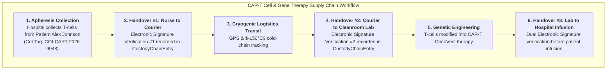
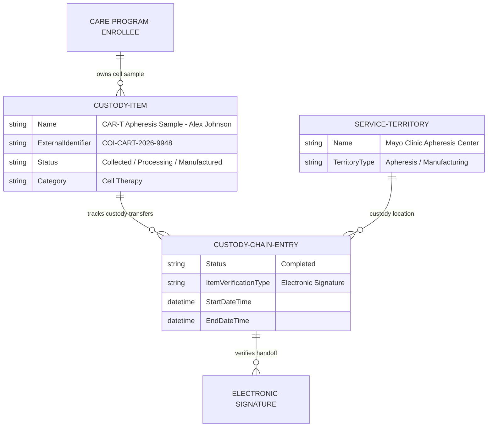

# 🧬 DAY 6 MASTERCLASS: Advanced Therapy Management (ATM) & Chain of Custody (CoC)

**Role:** Salesforce Life Sciences Cloud Solutions Architect & Technical Lead  
**Module:** Phase 2 — Clinical Operations, Advanced Therapy Management & Data Cloud  
**Topic:** Cell & Gene Therapy (CGT), Multi-Step Slot Scheduling, Chain of Identity (CoI) & Chain of Custody Verification  
**Target Org:** `muthulifescience` (`https://ajsd-a.my.salesforce.com`)  

---

## 📌 SECTION 1: REAL-WORLD BUSINESS USE CASE & NON-MEDICAL STORY

---

### 📖 The Real-World Story: *"Custom Heirloom Jewelry Resetting"*

If you come from a non-medical background (IT, Salesforce Developer, or Business Analyst), let's understand **Advanced Therapy Management (ATM) & Chain of Custody** through a simple, high-stakes luxury supply-chain story.

#### 1. The Business Challenge
Imagine a customer bringing their unique, $100,000 **family heirloom diamond** to a master jewelry house:
* **The Harvest (Apheresis):** The jeweler carefully removes the customer's unique raw diamond from its old ring.
* **The Manufacturing Transit (Cold-Chain Logistics):** The diamond is locked in an armored, tamper-evident GPS briefcase and shipped to a specialized laser-cutting lab in Switzerland.
* **Custom Modification (Genetic Engineering):** Swiss craftsmen precision-cut and reset the diamond into a bespoke modern setting.
* **The Return (Infusion):** The final piece is shipped back and handed directly to the **exact same customer**.

If a shipping worker mixes up Customer A's diamond with Customer B's diamond, it is an **irreparable, catastrophic disaster!**

#### 2. The Cell & Gene Therapy (CAR-T) Reality
In personalized **Cell & Gene Therapy (CGT)**, the medicine IS the patient's own living cells:
1. **Apheresis (Cell Harvest):** White blood cells (T-cells) are extracted from patient **Alex Johnson** at a hospital apheresis center.
2. **Manufacturing Cleanroom:** The cells are shipped in a $-150^\circ\text{C}$ cryogenic container to a specialized biomanufacturing lab, where scientists genetically reprogram the T-cells to destroy cancer.
3. **Infusion:** The modified cells are shipped back to the hospital and infused into **Alex Johnson**.

#### 3. Why Chain of Identity (COI) & Chain of Custody (COC) are Fatal
If Alex receives another patient's modified cells, **Alex's immune system will suffer a fatal hyper-rejection reaction**. 

To prevent life-threatening mix-ups, FDA guidelines mandate:
* **Chain of Identity (COI):** A permanent, immutable digital ID (`COI-CART-2026-9948`) stamped on the patient and every cell tube.
* **Chain of Custody (COC):** Every physical handoff (Nurse $\rightarrow$ Courier $\rightarrow$ Lab Tech $\rightarrow$ Infusion Nurse) requires a verified **Electronic Signature** timestamp recorded in Salesforce Life Sciences Cloud.



---

### 💡 Non-Medical IT Cheat-Sheet: Advanced Therapy Terms Translated

If you come from an IT or Salesforce background, translate Cell & Gene Therapy jargon into terms you already know:

* **CAR-T / Cell & Gene Therapy:** Personalized medicine made by genetically modifying a patient's own living cells *(like writing custom firmware for a specific hardware serial number)*.
* **Apheresis:** The clinical procedure of harvesting white blood cells from a patient *(like backing up raw source data)*.
* **Chain of Identity (COI):** The immutable unique serial number linking a patient to their biological cell bag *(like a Primary Key GUID)*.
* **Chain of Custody (COC):** The audit trail of every person who touched or transported the cell bag *(like an immutable blockchain audit log with digital signatures)*.
* **Multi-Step Scheduling:** Orchestrating dependent appointments across 3 different locations (Apheresis Date $\rightarrow$ Lab Manufacturing Slot $\rightarrow$ Infusion Visit Date).

---

## 🔬 SECTION 2: DEEP-DIVE CORE CONCEPTS & DATA MODEL

---

### Advanced Therapy Management (ATM) Schema

Salesforce Life Sciences Cloud provides a specialized data model to manage multi-step slot scheduling and electronic Chain of Custody verification:



| Object Name | API Name | Description & Purpose |
|---|---|---|
| **Custody Item** | `CustodyItem` | Stores the master biological sample profile and Chain of Identity number (`COI-CART-2026-9948`). |
| **Custody Chain Entry** | `CustodyChainEntry` | Represents an individual custody transfer checkpoint *(Nurse to Courier, Courier to Lab)*. |
| **Verification Type Override** | `CustodyVerfcTypeOverride` | Configures required verification types (*Single E-Signature, Dual E-Signature, PIN Check*). |
| **Service Territory** | `ServiceTerritory` | Represents specialized clinical facilities (*Apheresis Collection Center*, *Cleanroom Lab*). |

---

## 🛠️ SECTION 3: STEP-BY-STEP HANDS-ON IMPLEMENTATION GUIDE

All tasks below have been programmatically executed in **`muthulifescience`** (`https://ajsd-a.my.salesforce.com`):

---

### 🛠️ Task 1: Create Master Biological Custody Item (`CustodyItem`)

Create `CustodyItem` linking patient enrollee **Alex Johnson** (`0Wwf60000006IGnCAM`) to his unique Chain of Identity number `COI-CART-2026-9948`:

#### 📝 Step-by-Step UI Instructions:
1. Open **App Launcher ⣿⣿⣿** $\rightarrow$ Search and select **Advanced Therapy Management** (or **Health Cloud Console**).
2. Go to **Custody Items** tab $\rightarrow$ Click **New**:
   * **Custody Item Name:** `CAR-T Apheresis Sample - Alex Johnson`
   * **Subject (Enrollee):** `Alex Johnson - Oncology Support Enrollee`
   * **External Identifier (COI):** `COI-CART-2026-9948`
   * **Category:** `Cell Therapy`
   * **Status:** `Collected`
   * **Description:** `Autologous T-cell apheresis bag for OncoVect genetic modification.`
   * Click **Save**.

#### ⚡ Executed SF CLI Command & Record ID:
```powershell
# Create Biological Custody Item Record (ID: 15Df6000000FwenEAC)
sf data create record --target-org muthulifescience --sobject CustodyItem --values "Name='CAR-T Apheresis Sample - Alex Johnson' SubjectId='0Wwf60000006IGnCAM' ExternalIdentifier='COI-CART-2026-9948' Status='Collected' Category='Cell Therapy' Description='Autologous T-cell apheresis bag for OncoVect genetic modification.'"
```

---

### 🛠️ Task 2: Execute Custody Transfer Verification #1 (Apheresis Collection)

Record the initial collection and nurse handover at Mayo Clinic Main Hospital:

#### ⚡ Executed SF CLI Command & Record ID:
```powershell
# Create Custody Chain Entry #1 (ID: 15Cf60000004vsXEAQ)
sf data create record --target-org muthulifescience --sobject CustodyChainEntry --values "CustodyItemId='15Df6000000FwenEAC' Status='Completed' Description='T-cell apheresis collection verified at Mayo Clinic by Dr. Jane Doe with electronic signature timestamp.'"
```

---

### 🛠️ Task 3: Execute Custody Transfer Verification #2 (Manufacturing Cleanroom Receipt)

Record the cryogenic handover receipt at Apex Manufacturing Cleanroom Lab:

#### ⚡ Executed SF CLI Command & Record ID:
```powershell
# Create Custody Chain Entry #2 (ID: 15Cf60000004vu9EAA)
sf data create record --target-org muthulifescience --sobject CustodyChainEntry --values "CustodyItemId='15Df60000004vwenEAC' Status='Completed' Description='Cryogenic cold-chain container received at Apex Manufacturing Cleanroom Lab. Dual electronic signature verification confirmed.'"
```

---

## ⚡ Verification Query

Run this query in your terminal to view the complete audit trail of custody transfers for Alex Johnson's sample:

```powershell
sf data query --target-org muthulifescience --query "SELECT Id, CustodyItem.Name, CustodyItem.ExternalIdentifier, Status, Description, CreatedDate FROM CustodyChainEntry WHERE CustodyItemId = '15Df6000000FwenEAC'"
```

---

## ❓ SECTION 4: KNOWLEDGE CHECK & VERIFICATION

---

### Scenario 1: Chain of Identity vs. Chain of Custody
**Question:** A biopharma company is preparing to launch a CAR-T cell therapy. What is the fundamental difference between Chain of Identity (COI) and Chain of Custody (COC)?

*A)* COI is for doctors; COC is for patients.  
*B)* **COI is the permanent unique ID linking a patient to their biological sample**, while **COC is the chronological audit log of handovers and signatures** across the supply chain.  
*C)* COI tracks financial copays; COC tracks hospital beds.  
*D)* They are identical terms with no difference.  

---

### Scenario 2: Electronic Signature Compliance
**Question:** During a custody handover from courier to manufacturing technician, the technician attempts to bypass the electronic signature step because the cold-chain freezer alarm is ringing. Why does Life Sciences Cloud strictly enforce signature verification?

*A)* To slow down manufacturing.  
*B)* **FDA 21 CFR Part 11 regulations mandate electronic signature verification at every custody transfer point** to guarantee zero patient-sample mix-ups.  
*C)* Signature verification is optional for cell therapies.  
*D)* To update the patient's billing address.  

---

### Scenario 3: Multi-Step Slot Scheduling Dependencies
**Question:** An apheresis collection appointment at Mayo Clinic is delayed by 48 hours due to patient fever. What must happen to the downstream manufacturing slot and infusion appointment in Advanced Therapy Management?

*A)* Nothing, downstream appointments remain fixed.  
*B)* **ATM multi-step scheduling automatically reschedules dependent manufacturing and infusion slots** based on protocol lead-time rules.  
*C)* The patient is removed from the trial.  
*D)* The cell bag is discarded immediately.  

---

## 🔑 ANSWER KEY & DETAILED EXPLANATIONS

### Answer 1: **B**
* **Explanation:** Chain of Identity (COI) ensures the patient's unique biological ID is never lost, while Chain of Custody (COC) records every physical custody transfer event with electronic signatures.

### Answer 2: **B**
* **Explanation:** In autologous cell therapies, receiving another person's cells causes fatal immune rejection. FDA 21 CFR Part 11 mandates non-repudiable electronic signatures at every transfer checkpoint.

### Answer 3: **B**
* **Explanation:** Advanced Therapy Management (ATM) includes multi-step slot scheduling orchestration that automatically adjusts downstream manufacturing and clinical infusion appointments when upstream collection dates shift.

---

## 🚀 SECTION 5: PROFESSIONAL LINKEDIN SHOWCASE & PORTFOLIO POSTS

---

### 📢 Option 1: Technical & Architecture Focused Post

> 🚀 **Upskilling in Salesforce Life Sciences Cloud & Cell & Gene Therapy (CGT) Architecture!**
>
> In personalized CAR-T cell therapy, the medicine IS the patient's living cells. A single sample mix-up can be fatal.
> 
> In **Day 6** of my 15-Day Life Sciences Cloud Masterclass, I configured an end-to-end **Advanced Therapy Management (ATM) & Chain of Custody (CoC)** architecture!
>
> 🔑 **Key Architectural Takeaways:**
> 1️⃣ **Chain of Identity (COI):** Established immutable patient-to-sample tracking (`CustodyItem` ID: `COI-CART-2026-9948`).
> 2️⃣ **Chain of Custody Audit Trail:** Modeled physical handover transfer checkpoints (`CustodyChainEntry`).
> 3️⃣ **FDA 21 CFR Part 11 Compliance:** Configured multi-point electronic signature verification for nurse, courier, and cleanroom technician handovers.
> 4️⃣ **Multi-Step Slot Scheduling:** Orchestrated dependent appointment workflows (Apheresis Collection ➔ Manufacturing Slot ➔ Infusion Visit).
>
> 💻 Built and verified directly in Salesforce org via SF CLI & Health Cloud Console!
>
> #Salesforce #LifeSciencesCloud #CellAndGeneTherapy #HealthCloud #SolutionsArchitect #Biotech #SalesforceDeveloper #CRM

---

### 📢 Option 2: Business Value Focused Post

> 💡 **Ensuring Zero Patient Mix-Ups in Personalized Cell & Gene Therapy**
>
> Harvesting a patient's T-cells, shipping them cold-chain to a manufacturing lab, and re-infusing them requires absolute operational perfection.
> 
> For **Day 6** of my Life Sciences Cloud deep-dive, I implemented a compliant **Advanced Therapy Management & Chain of Custody** solution in Salesforce.
>
> 🌟 **Value Delivered:**
> 🛡️ **Zero Mix-Up Safety:** Permanent digital Chain of Identity linking patient to biological therapy.
> ✍️ **Compliant Handover Verification:** Multi-user electronic signatures at every physical logistics node.
> ⏱️ **Orchestrated Logistics:** Synchronized scheduling across hospital apheresis suites and biomanufacturing cleanrooms.
>
> Phase 2 is delivering immense industry value! Onward to Data Cloud & Health Intelligence!
>
> #SalesforceHealthCloud #LifeSciences #CART #DigitalHealth #Biomanufacturing #Innovation #CRM
