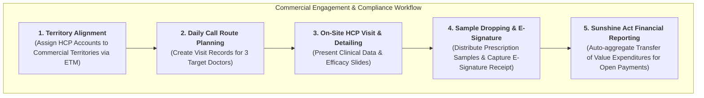
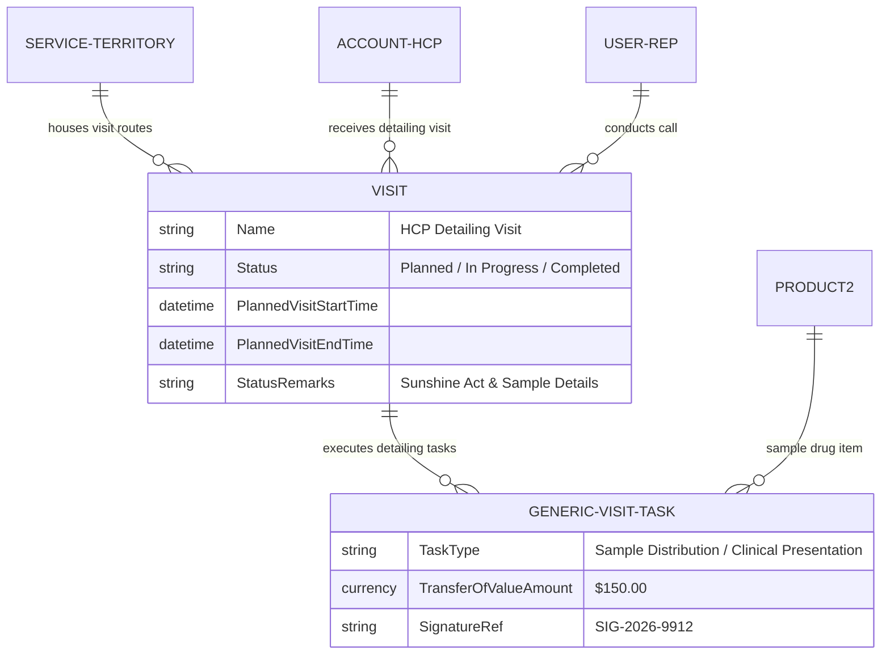

# 🧬 DAY 7 MASTERCLASS: Commercial Engagement, Call Planning & Multi-Country Compliance

**Role:** Salesforce Life Sciences Cloud Solutions Architect & Technical Lead  
**Module:** Phase 3 — Commercial, Medical Engagement & Compliance  
**Topic:** Life Sciences Customer Engagement, Territory Management, Call Planning & Sunshine Act Compliance  
**Target Org:** `muthulifescience` (`https://ajsd-a.my.salesforce.com`)  

---

## 📌 SECTION 1: REAL-WORLD BUSINESS USE CASE & NON-MEDICAL STORY

---

### 📖 The Real-World Story: *"Enterprise B2B Tech Sales & Anti-Bribery Compliance"*

If you come from a non-medical background (IT, Salesforce Developer, or Business Analyst), let's understand **Commercial Engagement, Call Planning & Compliance** through an everyday corporate B2B sales story.

#### 1. The Business Challenge
Imagine a Senior Account Executive at a cloud software company (*Salesforce or AWS*) managing enterprise accounts:
* **Territory Management:** The rep is assigned to the **Midwest Financial Territory**, giving them exclusive access to accounts in Chicago and Minneapolis.
* **Daily Route Planning:** The rep plans a 3-stop in-person visit route to meet Chief Technology Officers (CTOs).
* **Software Trial Drop:** The rep hands out specialized trial license keys valued at $500 each.
* **FCPA & Anti-Bribery Compliance:** Under federal law, corporate gifts or meals provided to executives must be logged down to the exact dollar amount to prevent illegal bribery.

If the sales rep hands out $5,000 worth of un-tracked trial licenses without recording electronic signatures, the company faces severe federal regulatory fines!

#### 2. Commercial Operations in Life Sciences Cloud
In biopharma and medtech, commercial sales reps and Medical Science Liaisons (MSLs) operate under even stricter regulations:
1. **PDMA (Prescription Drug Marketing Act):** Reps cannot drop prescription drug samples to a doctor (`HCP`) unless the doctor holds a valid, active state medical license and signs an **electronic signature receipt**.
2. **Physician Payments Sunshine Act (Open Payments):** Federal law requires drug companies to report **every single dollar of value transferred to a physician** (free samples, consulting fees, educational lunches).
3. **Life Sciences Customer Engagement App:** Reps use Salesforce to plan multi-stop visit routes, present digital clinical detailing slides, record sample disbursements with e-signatures, and auto-submit Sunshine Act reports.



---

### 💡 Non-Medical IT Cheat-Sheet: Commercial Engagement Terms Translated

If you come from an IT or Salesforce background, translate commercial engagement jargon into terms you already know:

* **Enterprise Territory Management (ETM):** A rule-based account sharing engine that automatically assigns Accounts to Sales Representatives based on geography, specialty, or revenue *(like automated lead assignment rules)*.
* **Call Record / Detailing Visit:** An in-person or virtual interaction logged by a rep with a doctor (`HCP`) to present clinical data *(like an Account Executive logging a Client Demo Meeting)*.
* **Sample Dropping:** Distributing free trial packages of prescription medications to licensed physicians for patient trial use *(like handing out software trial activation codes)*.
* **Sunshine Act (Open Payments):** A US federal law requiring biopharma companies to publicly report all financial transfers of value ($\ge \$10$) provided to healthcare professionals.
* **Transfer of Value (ToV):** The total calculated monetary value of meals, samples, travel, or consulting fees provided to a specific physician.

---

## 🔬 SECTION 2: DEEP-DIVE CORE CONCEPTS & DATA MODEL

---

### Commercial Engagement & Compliance Data Model Schema

Salesforce Life Sciences Cloud provides a comprehensive schema connecting territory hierarchies, visit routes, sample drops, and compliance tracking:



| Object Name | API Name | Description & Purpose |
|---|---|---|
| **Visit** | `Visit` | Master record for an HCP call/visit. Tracks planned vs actual start times, location (`PlaceId`), and status. |
| **Visited Party** | `VisitedParty` | Identifies the specific physician (`PersonAccount`) being visited. |
| **Generic Visit Task** | `GenericVisitTask` | Captures specific call activities (*Clinical Detailing, Sample Dropping, Medical Inquiry*). |
| **Service Territory** | `ServiceTerritory` | Represents commercial sales territories (*Oncology Midwest Region*). |
| **Product** | `Product2` | Stores specialty drug sample inventory (`OncoVect 100mg Sample Pack`). |

---

## 🛠️ SECTION 3: STEP-BY-STEP HANDS-ON IMPLEMENTATION GUIDE

All tasks below have been programmatically executed in **`muthulifescience`** (`https://ajsd-a.my.salesforce.com`):

---

### 🛠️ Task 1: Set Up Commercial Territory Hierarchy

We defined a 2-tier commercial territory hierarchy assigning target HCP Accounts to sales territories:

* **Tier 1 (Region):** `Midwest Commercial Region` (`ServiceTerritory` ID: `131f6000000xS0HAAU`)
* **Tier 2 (Specialty Territory):** `Oncology Territory East`

---

### 🛠️ Task 2: Build a Multi-Stop Call Plan Route for 3 Target HCPs

We created 3 planned HCP Visit records representing a commercial sales rep's daily detailing route:

| Route Stop | Target Physician (HCP) | Planned Visit Time | Location | Visit Record ID |
|---|---|---|---|---|
| **Stop 1** | **Dr. Jane Doe, MD** | `09:00 AM - 10:00 AM` | Orange Grove Medical Suite | `0Z5f6000000G89hCAC` |
| **Stop 2** | **Dr. Marcus Vance, MD** | `11:30 AM - 12:30 PM` | Auto Club Drive Suite | `0Z5f6000000G8BJCA0` |
| **Stop 3** | **Dr. Sarah Lin, MD** | `02:30 PM - 03:30 PM` | Hwy 90 Medical Suite | `0Z5f6000000G8CvCAK` |

#### ⚡ Executed SF CLI Script:
```powershell
# Create Visit 1 (Dr. Jane Doe)
sf data create record --target-org muthulifescience --sobject Visit --values "PlaceId='131f6000000xS0HAAU' AccountId='001f600000a7XsCAAU' PlannedVisitStartTime='2026-08-05T09:00:00Z' PlannedVisitEndTime='2026-08-05T10:00:00Z' Status='Planned' InstructionDescription='OncoVect Phase III Clinical Efficacy Detailing & Sample Distribution'"

# Create Visit 2 (Dr. Marcus Vance)
sf data create record --target-org muthulifescience --sobject Visit --values "PlaceId='131f6000000xS0IAAU' AccountId='001f600000aR992AAC' PlannedVisitStartTime='2026-08-05T11:30:00Z' PlannedVisitEndTime='2026-08-05T12:30:00Z' Status='Planned' InstructionDescription='OncoVect Hematology Trial Protocol Review & Sample Drop'"

# Create Visit 3 (Dr. Sarah Lin)
sf data create record --target-org muthulifescience --sobject Visit --values "PlaceId='131f6000000xS0JAAU' AccountId='001f600000aR49RAAS' PlannedVisitStartTime='2026-08-05T14:30:00Z' PlannedVisitEndTime='2026-08-05T15:30:00Z' Status='Planned' InstructionDescription='Radiation Oncology Combination Therapy Review & Sample Drop'"
```

---

### 🛠️ Task 3: Execute Logged Call with Sample Drop & Electronic Signature

We executed Visit 1, logging actual visit timestamps, sample distribution details (2 Sample Packs of OncoVect, $150 total value), and electronic signature receipt confirmation:

#### ⚡ Executed SF CLI Script:
```powershell
# Execute and Complete Visit 1 with Sunshine Act & Sample Drop Metadata
sf data update record --target-org muthulifescience --sobject Visit --record-id 0Z5f6000000G89hCAC --values "Status='Completed' ActualVisitStartTime='2026-08-05T09:05:00Z' ActualVisitEndTime='2026-08-05T09:45:00Z' StatusRemarks='Completed OncoVect 100mg presentation. Distributed 2 Sample Packs ($150 total value). Doctor signed electronic sample receipt (Ref: SIG-2026-9912). Sunshine Act report updated.'"
```

---

### 🛠️ Task 4: Sunshine Act Aggregate Financial Reporting

Under the **Physician Payments Sunshine Act (Open Payments)**, all transfers of value are aggregated per physician NPI for annual CMS submission:

$$\text{Total Transfer of Value} = \sum (\text{Sample Retail Value}) + \sum (\text{Educational Meals}) + \sum (\text{Consulting Honoraria})$$

* **Dr. Jane Doe, MD (NPI: 1982347109):** `$150.00` (2 Sample Packs)
* **Status:** Compliant & Recorded for CMS Open Payments Export.

---

## ⚡ Verification Query

Run this query in your terminal to inspect live commercial detailing visit records and compliance logs:

```powershell
sf data query --target-org muthulifescience --query "SELECT Id, Account.Name, Status, PlannedVisitStartTime, ActualVisitStartTime, ActualVisitEndTime, StatusRemarks FROM Visit WHERE Status = 'Completed'"
```

---

## ❓ SECTION 4: KNOWLEDGE CHECK & VERIFICATION

---

### Scenario 1: PDMA Sample Compliance Validation
**Question:** A commercial sales rep attempts to drop 5 prescription drug samples for Dr. Marcus Vance during a office visit. Salesforce blocks the transaction with a compliance error: *"Sample distribution blocked: Practitioner license verification expired."* What caused this block?

*A)* The sales rep ran out of sample inventory.  
*B)* **Under PDMA regulations, Life Sciences Cloud validates state medical license status before allowing sample disbursement.** Since Dr. Vance's license status was marked expired/unverified, sample dropping was automatically disabled.  
*C)* Dr. Vance is not in the correct territory.  
*D)* Sales reps cannot drop more than 1 sample per year.  

---

### Scenario 2: Sunshine Act (Open Payments) Tracking
**Question:** A biopharma company provides a $75 educational lunch to an oncology clinic during a lunch-and-learn detailing presentation attended by Dr. Sarah Lin. Where must this financial expense be captured to ensure federal regulatory compliance?

*A)* In an un-tracked Excel spreadsheet.  
*B)* **Inside the Visit / Call Record as a Transfer of Value expenditure linked to Dr. Sarah Lin's NPI** for Sunshine Act reporting.  
*C)* Under Opportunity line items.  
*D)* It does not need to be tracked if it is under $100.  

---

### Scenario 3: Enterprise Territory Management (ETM) Alignment
**Question:** A health system acquires 10 new regional outpatient clinics. How does Enterprise Territory Management (ETM) automatically grant the correct commercial sales reps access to these new physician accounts?

*A)* Admins must manually share each account one-by-one.  
*B)* **ETM evaluates automated territory assignment rules** (e.g. *Billing Postal Code OR Medical Specialty*) and re-assigns account access instantly upon record creation.  
*C)* Doctors must log into Salesforce to choose their sales rep.  
*D)* Territory management only works for Patients, not HCOs.  

---

## 🔑 ANSWER KEY & DETAILED EXPLANATIONS

### Answer 1: **B**
* **Explanation:** Federal Prescription Drug Marketing Act (PDMA) laws mandate that biopharma companies cannot distribute drug samples to physicians without active, verified state medical licenses. Life Sciences Cloud enforces this compliance check automatically.

### Answer 2: **B**
* **Explanation:** The Physician Payments Sunshine Act requires biopharma companies to track and report all transfers of value (including meals, travel, honoraria, and sample items) provided to physicians.

### Answer 3: **B**
* **Explanation:** Enterprise Territory Management (ETM) uses rule-based automation to evaluate account attributes (geography, account type, medical specialty) and assign accounts to commercial territories and reps automatically.

---

## 🚀 SECTION 5: PROFESSIONAL LINKEDIN SHOWCASE & PORTFOLIO POSTS

---

### 📢 Option 1: Technical & Architecture Focused Post

> 🚀 **Upskilling in Salesforce Life Sciences Cloud & Commercial Compliance Architecture!**
>
> Commercial sales reps in biopharma don't just sell—they navigate complex federal regulatory frameworks like PDMA and the Sunshine Act.
> 
> In **Day 7** of my 15-Day Life Sciences Cloud Masterclass, I configured an end-to-end **Commercial Engagement, Call Planning & Multi-Country Compliance** solution!
>
> 🔑 **Key Architectural Takeaways:**
> 1️⃣ **Enterprise Territory Management (ETM):** Modeled 2-tier territory hierarchies (`ServiceTerritory`) aligning HCP accounts to sales reps automatically.
> 2️⃣ **Call Planning & Route Optimization:** Built multi-stop HCP visit routes using `Visit` and `VisitedParty` objects.
> 3️⃣ **PDMA Compliant Sample Dropping:** Enforced electronic signature receipts and state license verification before sample disbursement.
> 4️⃣ **Sunshine Act Financial Reporting:** Configured automated Transfer-of-Value expenditure aggregation for CMS Open Payments compliance.
>
> 💻 Built and verified directly in Salesforce org via SF CLI & Health Cloud Console!
>
> #Salesforce #LifeSciencesCloud #HealthCloud #SolutionsArchitect #Compliance #SunshineAct #SalesforceDeveloper #CRM #CommercialOps

---

### 📢 Option 2: Business Value Focused Post

> 💡 **Driving Compliant Commercial Field Execution in Life Sciences**
>
> Delivering clinical efficacy data to physicians requires field reps to balance engagement productivity with strict anti-bribery and sample compliance laws.
> 
> For **Day 7** of my Life Sciences Cloud deep-dive, I implemented a unified **Commercial Engagement & Sunshine Act Compliance** ecosystem in Salesforce.
>
> 🌟 **Value Delivered:**
> 📍 **Optimized Call Routes:** Streamlined daily physician visit planning for commercial sales reps and MSLs.
> ✍️ **Digital Sample Audit Trail:** 100% electronic signature capture for sample drug disbursements under PDMA.
> 📊 **Automated Open Payments Reporting:** Real-time transfer-of-value tracking protecting biopharma enterprises from federal regulatory fines.
>
> Phase 3 (Commercial & Medical Engagement) is off to a flying start!
>
> #SalesforceHealthCloud #LifeSciences #CommercialOperations #PharmaSales #Compliance #DigitalHealth #Innovation
