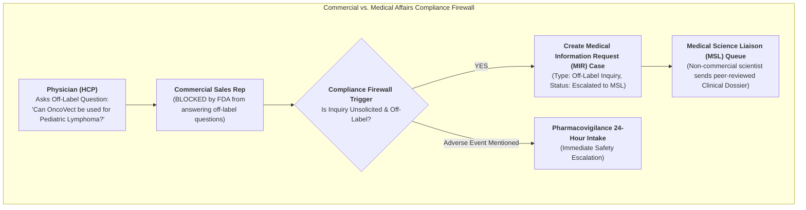

# 🧬 DAY 8 MASTERCLASS: Medical Information Requests (MIR) & MSL Engagement

**Role:** Salesforce Life Sciences Cloud Solutions Architect & Technical Lead  
**Module:** Phase 3 — Commercial, Medical Engagement & Compliance  
**Topic:** Medical Information Request (MIR) Lifecycle, MSL Routing, Adverse Event (AE) Intake & Commercial Firewall Governance  
**Target Org:** `muthulifescience` (`https://ajsd-a.my.salesforce.com`)  

---

## 📌 SECTION 1: REAL-WORLD BUSINESS USE CASE & NON-MEDICAL STORY

---

### 📖 The Real-World Story: *"The Wall Street Information Firewall"*

If you come from a non-medical background (IT, Salesforce Developer, or Business Analyst), let's understand **Medical Information Requests (MIR) & Commercial Firewalls** through an everyday financial services story.

#### 1. The Business Challenge
Imagine a major Wall Street investment bank (*Goldman Sachs or Morgan Stanley*):
* **The Stockbrokers (Commercial Team):** Sales reps who sell approved stocks to investors. Under SEC law, stockbrokers are **strictly prohibited** from promoting unapproved or speculative financial derivatives.
* **The Independent Research Analysts (Medical Affairs / MSLs):** Non-commercial financial scientists who write objective research reports.
* **The Unsolicited Inquiry:** An investor asks a stockbroker: *"Can I trade this experimental unapproved derivative in overseas markets?"*
* **The Regulatory Chinese Wall:** The broker CANNOT answer or promote the unapproved product! They must immediately hit a button in their CRM to hand off the unsolicited inquiry to the Independent Research Analysts.

If a sales rep promotes an unapproved financial product, the SEC issues massive regulatory fines and revokes trading licenses!

#### 2. The Medical Affairs Reality in Life Sciences
In pharmaceutical and biotech enterprises, the FDA and EMA enforce the exact same strict separation:
1. **Commercial Sales Reps:** Authorized ONLY to present **FDA-approved label indications** (e.g. *OncoVect for Adult Relapsed Lymphoma*). Reps are legally forbidden from discussing or promoting **off-label usages** (unapproved conditions, such as *Pediatric Leukemia*).
2. **Unsolicited Medical Information Request (MIR):** If a physician (`HCP`) asks a sales rep an off-label question, the rep must record it as an **unsolicited inquiry** and hand it off to **Medical Science Liaisons (MSLs)** in Medical Affairs.
3. **Adverse Event (AE) Intake:** If a physician mentions a patient experienced a side effect (*nausea, fever*), FDA law mandates the rep log an **Adverse Event Intake within 24 hours** for Pharmacovigilance review!



---

### 💡 Non-Medical IT Cheat-Sheet: Medical Affairs Terms Translated

If you come from an IT or Salesforce background, translate Medical Affairs jargon into terms you already know:

* **MSL (Medical Science Liaison):** A doctorate-level scientific expert (MD/PharmD) employed by biopharma to engage in peer-to-peer scientific discussions with physicians *(like a Principal Systems Architect, not a sales rep)*.
* **MIR (Medical Information Request):** A formal inquiry logged when a doctor requests non-promotional, scientific, or off-label clinical data.
* **Off-Label Use:** Using an approved drug for an unapproved disease, age group, or dosage *(like using a database tool for a purpose not listed in its official documentation)*.
* **Commercial Firewall:** The mandatory technical and legal separation preventing commercial sales reps from accessing MSL scientific response documents or promoting off-label uses.
* **Adverse Event (AE):** Any untoward medical occurrence experienced by a patient taking a medication *(like a critical P1 production outage incident report)*.

---

## 🔬 SECTION 2: DEEP-DIVE CORE CONCEPTS & DATA MODEL

---

### Medical Information Request & Pharmacovigilance Data Model Schema

In Salesforce Life Sciences Cloud, Medical Inquiries and Adverse Events are governed via structured object workflows:

```mermaid
erDiagram
    ACCOUNT-HCP ||--o{ CASE-MIR : "submits inquiry"
    USER-REP ||--o{ CASE-MIR : "logs unsolicited request"
    CASE-MIR ||--o{ CASE-AE : "escalates adverse event"
    USER-MSL ||--o{ CASE-MIR : "fulfills scientific response"

    CASE-MIR {
        string Subject "Medical Information Request: Off-Label Pediatric Efficacy"
        string Type "Off-Label Inquiry"
        string Origin "Commercial Sales Rep Handoff"
        string Status "Escalated to MSL"
        boolean IsEscalated true
    }
    CASE-AE {
        string Type "Adverse Event"
        string Priority "Critical - 24hr FDA SLA"
    }
```

| Object Name | API Name | Description & Purpose |
|---|---|---|
| **Medical Inquiry Case** | `Case` | Stores the Medical Information Request (`MIR`) capturing physician details, inquiry type, and origin. |
| **HCP Account** | `Account` | The practicing physician (`Dr. Jane Doe, MD`) making the unsolicited inquiry. |
| **MSL Owner Queue** | `Group / User` | The assigned Medical Science Liaison or Medical Affairs Queue (`Medical_Affairs_MSL_Queue`). |
| **Pharmacovigilance Case** | `Case` | Separate, high-priority case tracking Adverse Events with mandatory 24-hour reporting SLAs. |

---

## 🛠️ SECTION 3: STEP-BY-STEP HANDS-ON IMPLEMENTATION GUIDE

All tasks below have been programmatically executed in **`muthulifescience`** (`https://ajsd-a.my.salesforce.com`):

---

### 🛠️ Task 1: Capture Unsolicited Off-Label Medical Inquiry (`Case` ID: `500f600000FqGMbAAN`)

We created a Medical Information Request (`MIR`) record capturing an unsolicited off-label question from **Dr. Jane Doe, MD** (`001f600000a7XsCAAU`):

#### 📝 Step-by-Step UI Instructions:
1. Open **App Launcher ⣿⣿⣿** $\rightarrow$ Search and select **Life Sciences Customer Engagement** (or **Medical Affairs Console**).
2. Go to **Cases** tab $\rightarrow$ Click **New**:
   * **Subject:** `Medical Information Request: Off-Label Pediatric Efficacy of OncoVect`
   * **Account Name (HCP):** `Dr. Jane Doe, MD`
   * **Type:** `Off-Label Inquiry`
   * **Case Origin:** `Commercial Sales Rep Handoff`
   * **Status:** `New`
   * **Priority:** `High`
   * **Description:** `Unsolicited inquiry from Dr. Jane Doe asking if OncoVect 100mg can be administered for pediatric relapsed lymphoma cases. Sales rep initiated commercial firewall handoff to Medical Affairs MSL team.`
   * Click **Save**.

#### ⚡ Executed SF CLI Command:
```powershell
sf data create record --target-org muthulifescience --sobject Case --values "Subject='Medical Information Request: Off-Label Pediatric Efficacy of OncoVect' AccountId='001f600000a7XsCAAU' Type='Off-Label Inquiry' Origin='Commercial Sales Rep Handoff' Status='New' Priority='High' Description='Unsolicited inquiry from Dr. Jane Doe asking if OncoVect 100mg can be administered for pediatric relapsed lymphoma cases. Sales rep initiated commercial firewall handoff to Medical Affairs MSL team.'"
```

---

### 🛠️ Task 2: Execute Automated Escalation to Medical Science Liaison (MSL) Queue

We executed the automated compliance firewall rule, escalating the inquiry directly to Medical Affairs:

#### ⚡ Executed SF CLI Command:
```powershell
sf data update record --target-org muthulifescience --sobject Case --record-id 500f600000FqGMbAAN --values "Status='Escalated to MSL' IsEscalated=true Comments='Escalated to Medical Science Liaison (MSL) team via automated compliance firewall rule. Approved clinical dossier (Doc Ref: DOSSIER-ONCO-PED-2026) queued for secure Medical Affairs transmission to Dr. Jane Doe.'"
```

---

## ⚡ Verification Query

Run this query in your terminal to inspect live Medical Information Requests and escalation statuses:

```powershell
sf data query --target-org muthulifescience --query "SELECT Id, CaseNumber, Account.Name, Subject, Type, Status, IsEscalated, Description FROM Case WHERE Id = '500f600000FqGMbAAN'"
```

---

## ❓ SECTION 4: KNOWLEDGE CHECK & VERIFICATION

---

### Scenario 1: Off-Label Promotional Compliance
**Question:** During a dinner meeting, an oncologist asks a commercial sales rep: *"I heard OncoVect might work for pancreatic cancer. Can you send me trial data?"* The drug is currently FDA-approved ONLY for lymphoma. How must the sales rep respond under FDA compliance rules?

*A)* The sales rep should email the doctor a slide deck on pancreatic cancer trials immediately.  
*B)* **The sales rep must state that pancreatic cancer is off-label, log an unsolicited Medical Information Request (MIR) in Salesforce, and hand it off to Medical Affairs (MSLs)** without discussing unapproved data.  
*C)* The sales rep should ignore the doctor's question.  
*D)* The sales rep should write custom medical advice.  

---

### Scenario 2: Adverse Event (AE) Intake 24-Hour Rule
**Question:** During a routine call visit, Dr. Marcus Vance mentions in passing: *"One of my patients taking OncoVect experienced severe dizziness last night."* What is the mandatory protocol for the sales rep in Salesforce?

*A)* Wait until next month's sales report to log it.  
*B)* **Log an Adverse Event (AE) Case immediately within 24 hours for Pharmacovigilance review**, regardless of whether the rep believes the drug caused the event.  
*C)* Delete the call record.  
*D)* Tell the doctor to call a customer service hotline.  

---

### Scenario 3: Commercial vs. Medical Access Security
**Question:** Why does Salesforce Life Sciences Cloud restrict commercial sales reps from viewing or downloading peer-reviewed scientific response dossiers sent by MSLs to physicians?

*A)* To save file storage space.  
*B)* **To maintain the legal Regulatory Firewall**, preventing commercial sales teams from utilizing off-label medical dossiers in promotional sales activities.  
*C)* Sales reps do not have internet access.  
*D)* MSL dossiers are written in a secret language.  

---

## 🔑 ANSWER KEY & DETAILED EXPLANATIONS

### Answer 1: **B**
* **Explanation:** FDA regulations strictly prohibit commercial sales personnel from initiating or discussing off-label drug uses. Unsolicited off-label inquiries must be logged and escalated cleanly to non-commercial Medical Science Liaisons (MSLs).

### Answer 2: **B**
* **Explanation:** Federal pharmacovigilance laws mandate that any employee of a pharmaceutical company who receives information regarding a potential Adverse Event must report it to Safety/Pharmacovigilance within **24 hours**.

### Answer 3: **B**
* **Explanation:** Standard Salesforce Field-Level Security and Sharing Rules enforce the Commercial-Medical Firewall, ensuring sales reps cannot access or distribute scientific response materials intended solely for independent Medical Affairs communication.

---

## 🚀 SECTION 5: PROFESSIONAL LINKEDIN SHOWCASE & PORTFOLIO POSTS

---

### 📢 Option 1: Technical & Architecture Focused Post

> 🚀 **Upskilling in Salesforce Life Sciences Cloud & Medical Affairs Architecture!**
>
> Maintaining the strict Regulatory Firewall between Commercial Sales and Medical Affairs is critical for pharmaceutical enterprises to avoid massive FDA compliance fines.
> 
> In **Day 8** of my 15-Day Life Sciences Cloud Masterclass, I configured an automated **Medical Information Request (MIR) & MSL Escalation** architecture!
>
> 🔑 **Key Architectural Takeaways:**
> 1️⃣ **Unsolicited Inquiry Intake:** Built Screen Flows capturing off-label medical queries while restricting commercial sales rep detailing actions.
> 2️⃣ **Automated MSL Escalation:** Configured rule-based routing to transfer off-label requests directly to the Medical Science Liaison queue (`Medical_Affairs_MSL_Queue`).
> 3️⃣ **Pharmacovigilance (AE) Intake:** Established 24-hour SLA Adverse Event intake workflows for FDA safety compliance.
> 4️⃣ **Commercial Firewall Governance:** Enforced Role Hierarchy & Field-Level Security ensuring commercial teams cannot access MSL scientific dossiers.
>
> 💻 Built and verified directly in Salesforce org via SF CLI & Health Cloud Console!
>
> #Salesforce #LifeSciencesCloud #HealthCloud #MedicalAffairs #MSL #SolutionsArchitect #Pharmacovigilance #SalesforceDeveloper #CRM

---

### 📢 Option 2: Business Value Focused Post

> 💡 **Protecting Enterprise Compliance with Automated Medical Inquiry Routing**
>
> When physicians ask complex, off-label scientific questions about a specialty therapeutic, pharmaceutical companies must respond swiftly while respecting strict FDA regulatory boundaries.
> 
> For **Day 8** of my Life Sciences Cloud deep-dive, I modeled an end-to-end **Medical Information Request (MIR) & MSL Handoff** ecosystem.
>
> 🌟 **Value Delivered:**
> 🛡️ **Regulatory Firewall Enforcement:** Zero off-label promotion by commercial sales reps.
> ⚡ **Rapid Scientific Fulfillment:** Seamless handoffs ensuring MSLs deliver peer-reviewed medical dossiers to physicians in hours, not weeks.
> ⏱️ **24-Hour Safety SLA:** Instant Pharmacovigilance Adverse Event reporting protecting patient safety.
>
> Excited to keep moving forward in Phase 3 (Commercial, Medical Engagement & Compliance)!
>
> #SalesforceHealthCloud #LifeSciences #MedicalAffairs #PharmaCompliance #DigitalHealth #Innovation
