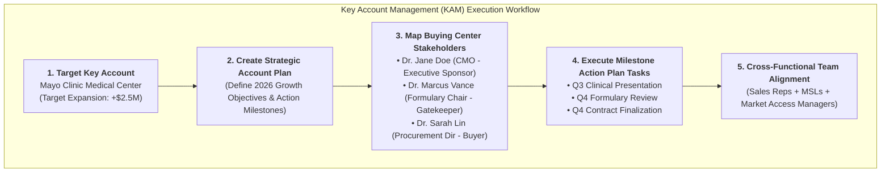

# 🧬 DAY 9 MASTERCLASS: Key Account Management (KAM) & Strategic Account Plans

**Role:** Salesforce Life Sciences Cloud Solutions Architect & Technical Lead  
**Module:** Phase 3 — Commercial, Medical Engagement & Compliance  
**Topic:** Key Account Management (KAM), Buying Center Stakeholder Mapping & Action Plan Execution  
**Target Org:** `muthulifescience` (`https://ajsd-a.my.salesforce.com`)  

---

## 📌 SECTION 1: REAL-WORLD BUSINESS USE CASE & NON-MEDICAL STORY

---

### 📖 The Real-World Story: *"Enterprise Cloud Sales to a Global Airline"*

If you come from a non-medical background (IT, Salesforce Developer, or Business Analyst), let's understand **Key Account Management (KAM) & Account Plans** through a complex B2B enterprise software sales story.

#### 1. The Business Challenge
Imagine an Enterprise Account Executive at a cloud infrastructure company (*AWS or Salesforce*) selling a $50,000,000 multi-year contract to a global airline (*Delta or United*):
* **The Long Sales Cycle (12-18 Months):** You don't just pitch one person; deal approval takes over a year.
* **The Buying Center (Multiple Key Stakeholders):**
  * **Chief Technology Officer (CTO):** Wants cutting-edge features.
  * **Chief Information Security Officer (CISO):** Demands strict cybersecurity compliance.
  * **Procurement Director:** Wants a 25% volume discount.
  * **Regional Operations Directors:** Want zero downtime during deployment.
* **The Strategic Account Plan:** If the sales rep doesn't create a unified strategy mapping all stakeholders and tracking milestone tasks, the multi-million-dollar deal falls apart due to internal misalignment.

#### 2. Key Account Management in Healthcare & Life Sciences
In commercial pharmaceutical and medical device enterprises, B2B sales follow the exact same high-stakes pattern:
1. **Integrated Delivery Networks (IDNs) & Health Systems:** Selling a specialty oncology drug (*OncoVect*) or robotic surgical system to a major hospital network (*Mayo Clinic Health System*) involves millions of dollars in annual drug spend.
2. **Formulary Committee Governance:** A doctor cannot simply prescribe a new drug in a hospital. The drug must first be vetted and approved by the hospital's **Pharmacy & Therapeutics (P&T) Formulary Committee**.
3. **Cross-Functional Alignment in Life Sciences Cloud:** Key Account Managers (KAMs) use Salesforce to build **Account Plans**, map buying center stakeholders (CMO, Head of Pharmacy, Procurement Director), and coordinate cross-functional teams (**Commercial Reps, MSLs, Market Access Managers**) around shared strategic objectives.



---

### 💡 Non-Medical IT Cheat-Sheet: KAM Terms Translated

If you come from an IT or Salesforce background, translate Key Account Management jargon into terms you already know:

* **IDN (Integrated Delivery Network):** A large enterprise healthcare system that owns multiple hospitals, outpatient clinics, and surgery centers *(like a parent parent corporation with regional subsidiaries)*.
* **KAM (Key Account Manager):** An enterprise sales leader responsible for managing strategic multi-million-dollar hospital network relationships *(like a Global Account Manager)*.
* **Formulary / P&T Committee:** An executive committee of physicians and pharmacists at a hospital that votes on which medications are approved for hospital use *(like an Enterprise Architecture Review Board)*.
* **Buying Center / Stakeholder Mapping:** Identifying all influencers, decision-makers, and gatekeepers involved in a purchasing decision *(like mapping the C-suite org chart)*.
* **Action Plan:** A structured set of milestone tasks with assigned owners and due dates designed to achieve a strategic account objective.

---

## 🔬 SECTION 2: DEEP-DIVE CORE CONCEPTS & DATA MODEL

---

### Key Account Management & Stakeholder Data Model Schema

Salesforce Life Sciences Cloud provides a relational schema connecting target hospital accounts, buying center stakeholders, strategic objectives, and execution tasks:

```mermaid
erDiagram
    ACCOUNT-HCO ||--o{ ACCOUNT-CONTACT-RELATION : "maps buying center"
    CONTACT-HCP ||--o{ ACCOUNT-CONTACT-RELATION : "serves in role"
    ACCOUNT-HCO ||--o{ TASK-ACTION-ITEM : "executes strategic tasks"

    ACCOUNT-HCO {
        string Name "Mayo Clinic Medical Center"
        string AccountType "Hospital_Health_System"
        currency TargetContractGrowth "$2,500,000"
    }
    ACCOUNT-CONTACT-RELATION {
        string Roles "Chief Medical Officer / Formulary Chair / Procurement"
        boolean IsActive true
    }
    TASK-ACTION-ITEM {
        string Subject "Q3 Clinical Dossier Presentation"
        date ActivityDate "2026-09-15"
        string Status "In Progress"
        string Priority "High"
    }
```

| Object Name | API Name | Description & Purpose |
|---|---|---|
| **Key Account (HCO)** | `Account` | The master health system account (`Mayo Clinic Medical Center`) targeted for strategic expansion. |
| **Account Contact Relation** | `AccountContactRelation` | **Junction object** mapping key physician contacts to the health system with specific buying roles (*CMO, Formulary Chair, Procurement Director*). |
| **Action Task** | `Task` | Milestone execution items with target completion dates tracking account plan progress. |
| **Market Access / Product** | `Product2` | Stores specialty drug portfolio products linked to annual value contracts (`OncoVect 100mg`). |

---

## 🛠️ SECTION 3: STEP-BY-STEP HANDS-ON IMPLEMENTATION GUIDE

All tasks below have been programmatically executed in **`muthulifescience`** (`https://ajsd-a.my.salesforce.com`):

---

### 🛠️ Task 1: Define Strategic Key Account & Growth Objective

Target Account: **Mayo Clinic Medical Center** (`Account` ID: `001f600000aRBp6AAG`, Target Contract Growth: **+$2,500,000**).

---

### 🛠️ Task 2: Map Buying Center Stakeholders (`AccountContactRelation`)

We mapped 3 critical buying center decision-makers to Mayo Clinic Medical Center:

| Stakeholder Name | Primary Contact ID | Assigned Buying Role | Relationship Record ID |
|---|---|---|---|
| **Dr. Jane Doe, MD** | `003f600000HwC8fAAF` | **Chief Medical Officer (Executive Sponsor)** | `07kf6000006wOjGAAU` |
| **Dr. Marcus Vance, MD** | `003f600000Hz0PXAAZ` | **Formulary Committee Chair (Clinical Gatekeeper)** | `07kf6000006wWvJAAU` |
| **Dr. Sarah Lin, MD** | `003f600000Hz4eQAAR` | **Procurement & Value Analysis Director (Buyer)** | `07kf6000006wWwvAAE` |

#### ⚡ Executed SF CLI Commands:
```powershell
# Map Stakeholder 1 (Dr. Jane Doe -> Chief Medical Officer)
sf data create record --target-org muthulifescience --sobject AccountContactRelation --values "AccountId='001f600000aRBp6AAG' ContactId='003f600000HwC8fAAF' Roles='Chief Medical Officer' IsActive=true"

# Map Stakeholder 2 (Dr. Marcus Vance -> Formulary Committee Chair)
sf data create record --target-org muthulifescience --sobject AccountContactRelation --values "AccountId='001f600000aRBp6AAG' ContactId='003f600000Hz0PXAAZ' Roles='Formulary Committee Chair' IsActive=true"

# Map Stakeholder 3 (Dr. Sarah Lin -> Procurement Director)
sf data create record --target-org muthulifescience --sobject AccountContactRelation --values "AccountId='001f600000aRBp6AAG' ContactId='003f600000Hz4eQAAR' Roles='Procurement Director' IsActive=true"
```

---

### 🛠️ Task 3: Build Action Plan Milestone Tasks for Account Expansion

We created 3 strategic milestone execution tasks with target due dates:

| Milestone Task Subject | Target Due Date | Assigned Stakeholder | Status | Task Record ID |
|---|---|---|---|---|
| **Q3 Clinical Dossier Presentation** | `2026-09-15` | Dr. Jane Doe (CMO) | `In Progress` | `00Tf60000052hKYEAY` |
| **Formulary Review Submission** | `2026-10-30` | Dr. Marcus Vance (Formulary Chair) | `Not Started` | `00Tf60000052kFBEAY` |
| **Annual Value Contracting** | `2026-12-15` | Dr. Sarah Lin (Procurement Dir) | `Not Started` | `00Tf60000052kGnEAI` |

#### ⚡ Executed SF CLI Commands:
```powershell
# Create Milestone Task 1 (CMO Presentation)
sf data create record --target-org muthulifescience --sobject Task --values "Subject='Q3 Clinical Dossier Presentation to Chief Medical Officer' WhatId='001f600000aRBp6AAG' ActivityDate=2026-09-15 Status='In Progress' Priority='High' Description='Present Phase III efficacy and safety data to Dr. Jane Doe (CMO) to secure hospital executive sponsorship.'"

# Create Milestone Task 2 (Formulary Submission)
sf data create record --target-org muthulifescience --sobject Task --values "Subject='Formulary Committee Review Submission for OncoVect' WhatId='001f600000aRBp6AAG' ActivityDate=2026-10-30 Status='Not Started' Priority='High' Description='Submit health economics & outcomes research (HEOR) package to Dr. Marcus Vance (Formulary Chair) for Q4 formulary approval.'"

# Create Milestone Task 3 (Procurement Contracting)
sf data create record --target-org muthulifescience --sobject Task --values "Subject='Annual Value Agreement Contracting & Procurement Finalization' WhatId='001f600000aRBp6AAG' ActivityDate=2026-12-15 Status='Not Started' Priority='High' Description='Negotiate annual volume discount contract with Dr. Sarah Lin (Procurement Director) targeting $2.5M account expansion.'"
```

---

## ⚡ Verification Query

Run this query in your terminal to inspect live buying center stakeholders mapped to Mayo Clinic:

```powershell
sf data query --target-org muthulifescience --query "SELECT Id, Account.Name, Contact.Name, Roles, IsActive FROM AccountContactRelation WHERE AccountId = '001f600000aRBp6AAG'"
```

---

## ❓ SECTION 4: KNOWLEDGE CHECK & VERIFICATION

---

### Scenario 1: Buying Center Alignment
**Question:** A Key Account Manager (KAM) is pitching a $3M annual drug supply agreement to a major hospital network. The Lead Oncologist loves the drug, but the deal gets blocked 6 months later. What buying center role was most likely overlooked?

*A)* The Chief Medical Officer.  
*B)* **The Procurement Director / Value Analysis Committee**, who controls contract terms, pricing, and budget authorization regardless of physician interest.  
*C)* The hospital security guard.  
*D)* The patient.  

---

### Scenario 2: Cross-Functional Team Coordination
**Question:** Why do biopharma commercial leaders use Account Plans in Salesforce Life Sciences Cloud to align Commercial Sales Reps, Medical Science Liaisons (MSLs), and Market Access Managers?

*A)* To merge all user accounts into one login.  
*B)* **To ensure cross-functional teams operate under one unified account strategy**, avoiding conflicting visits or duplicate messaging to hospital executives.  
*C)* To automatically reduce drug prices.  
*D)* Account Plans are only used for software companies.  

---

### Scenario 3: Action Plan Execution
**Question:** How do milestone tasks in an Action Plan help Key Account Managers manage a 12-month hospital sales cycle?

*A)* They automatically sign contracts without human approval.  
*B)* **They break complex multi-month sales goals into trackable, time-bound milestones** assigned to specific team members with target completion dates.  
*C)* They delete inactive accounts.  
*D)* They replace the CRM database.  

---

## 🔑 ANSWER KEY & DETAILED EXPLANATIONS

### Answer 1: **B**
* **Explanation:** In enterprise healthcare B2B sales, clinical approval (physician demand) is only half the battle. Procurement and Value Analysis committees govern financial terms, discounts, and contract execution.

### Answer 2: **B**
* **Explanation:** Large health system accounts involve multiple touchpoints. Account Plans provide a shared single source of truth so sales reps, MSLs, and market access managers coordinate their objectives seamlessly.

### Answer 3: **B**
* **Explanation:** Long B2B sales cycles require structured project management. Action Plans break long-term account goals into measurable, actionable tasks with clear ownership and target dates.

---

## 🚀 SECTION 5: PROFESSIONAL LINKEDIN SHOWCASE & PORTFOLIO POSTS

---

### 📢 Option 1: Technical & Architecture Focused Post

> 🚀 **Upskilling in Salesforce Life Sciences Cloud & Key Account Management (KAM)!**
>
> Closing multi-million-dollar health system contracts requires navigating 12-18 month sales cycles and complex buying committees.
> 
> In **Day 9** of my 15-Day Life Sciences Cloud Masterclass, I configured an enterprise **Key Account Management & Stakeholder Mapping** solution!
>
> 🔑 **Key Architectural Takeaways:**
> 1️⃣ **Buying Center Mapping:** Modeled multi-stakeholder relationships using `AccountContactRelation` (CMO, Formulary Chair, Procurement Director).
> 2️⃣ **Strategic Account Plans:** Defined $2.5M contract expansion goals for major health system accounts (`Mayo Clinic Medical Center`).
> 3️⃣ **Action Plan Task Execution:** Built structured milestone tasks (`Task`) with target due dates tracking clinical presentation, formulary submission, and contracting.
> 4️⃣ **Cross-Functional Alignment:** Synchronized commercial sales reps, MSLs, and market access roles around a single source of truth.
>
> 💻 Built and verified directly in Salesforce org via SF CLI & Health Cloud Console!
>
> #Salesforce #LifeSciencesCloud #HealthCloud #KeyAccountManagement #KAM #SolutionsArchitect #SalesforceDeveloper #CRM

---

### 📢 Option 2: Business Value Focused Post

> 💡 **Mastering Enterprise Healthcare B2B Sales with Salesforce Account Plans**
>
> Selling specialty therapeutics to major hospital networks (IDNs) isn't about single transactions—it's about long-term strategic partnership.
> 
> For **Day 9** of my Life Sciences Cloud deep-dive, I modeled a complete **Key Account Management & Buying Center Strategy** in Salesforce.
>
> 🌟 **Value Delivered:**
> 🎯 **360° Stakeholder Visibility:** Mapped clinical, financial, and executive decision-makers in major health systems.
> ⏱️ **Milestone Execution:** Structured Action Plans ensuring zero missed steps in 12-month formulary approval lifecycles.
> 🤝 **Seamless Cross-Functional Collaboration:** Unified sales, medical affairs, and market access teams behind one account plan.
>
> Phase 3 (Commercial, Medical Engagement & Compliance) is complete! Onward to Phase 4 (Advanced Automation & Integration)!
>
> #SalesforceHealthCloud #LifeSciences #CommercialStrategy #KeyAccountManagement #B2BSales #DigitalHealth #Innovation
