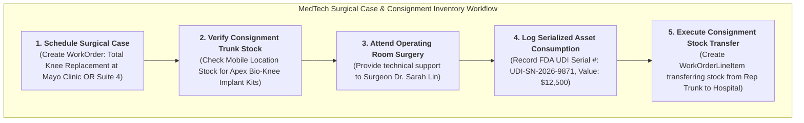

# 🧬 DAY 10 MASTERCLASS: MedTech Commercial & Surgical Planning

**Role:** Salesforce Life Sciences Cloud Solutions Architect & Technical Lead  
**Module:** Phase 4 — MedTech, Interoperability & Integration Architecture  
**Topic:** Serialized Device Tracking, Consignment Inventory Management, Operating Room (OR) Surgical Cases & FDA UDI Compliance  
**Target Org:** `muthulifescience` (`https://ajsd-a.my.salesforce.com`)  

---

## 📌 SECTION 1: REAL-WORLD BUSINESS USE CASE & NON-MEDICAL STORY

---

### 📖 The Real-World Story: *"Formula 1 Pit Crew & Mobile Spare Parts Logistics"*

If you come from a non-medical background (IT, Salesforce Developer, or Business Analyst), let's understand **MedTech Commercial & Surgical Planning** through a high-performance Formula 1 racing story.

#### 1. The Business Challenge
Imagine a specialized Formula 1 racing engineer (*Red Bull Racing or Ferrari*):
* **The High-Stakes Event (The Surgical Case):** A major 2-hour pit stop and engine overhaul during a live World Championship race.
* **Mobile Inventory Van (Consignment Trunk Stock):** The engineer arrives in a mobile support truck loaded with 50 specialized serialized engine parts (turbochargers, carbon-fiber wing assemblies).
* **The Lead Mechanic (The Surgeon):** The chief race mechanic needs the exact right part, in the exact right size, within 3 seconds.
* **On-Site Installation (Device Implantation):** The engineer hands over a specific serialized turbocharger (Serial #: `F1-TURBO-2026-09`), which is installed on the race car.
* **Real-Time Inventory Transfer:** As soon as the car leaves the pit lane, the engineer logs into their tablet to transfer ownership of that serialized turbocharger from their mobile truck to the race team's asset log.

If the engineer brings the wrong size part or fails to log the serial number, the race car fails, and the team faces massive financial penalties!

#### 2. MedTech Sales Dynamics in the Operating Room (OR)
In medical device (MedTech) sales, medical reps operate under the exact same high-stress environment:
1. **Operating Room (OR) Attendance:** Unlike pharmaceutical reps who visit doctors in offices, MedTech reps physically enter the Operating Room during complex surgeries (*orthopedic knee replacements, cardiac stent implants, spinal fusions*).
2. **Consignment Inventory:** Hospital operating rooms do not buy millions of dollars of surgical implants upfront. MedTech companies leave **consignment inventory** (implant trays and surgical tool kits) in the rep's vehicle trunk or hospital storage room. The hospital only pays for what is actually opened and implanted!
3. **FDA UDI Serial Tracking:** Federal FDA laws mandate that every single implantable device must be tracked by its **Unique Device Identifier (UDI)** serial number from manufacturer to patient body.
4. **Salesforce Field Service & Health Cloud Solution:** Reps use Salesforce to view upcoming surgical case schedules, manage trunk stock consignment inventory, log consumed serialized assets (`Asset`), and transfer stock directly to the hospital (`WorkOrderLineItem`).



---

### 💡 Non-Medical IT Cheat-Sheet: MedTech Terms Translated

If you come from an IT or Salesforce background, translate MedTech jargon into terms you already know:

* **MedTech:** Medical Technology & Medical Device enterprises *(manufacturers of pacemakers, artificial joints, surgical robots, MRI machines)*.
* **Surgical Case:** A scheduled hospital operating room procedure requiring specialized medical devices and reps on-site *(like a critical scheduled maintenance window)*.
* **Consignment Inventory:** Inventory stored at a customer site (or rep truck) that remains owned by the vendor until consumed *(like vendor-managed inventory / pay-per-use stock)*.
* **Trunk Stock:** Medical device inventory carried in a sales rep's vehicle for emergency or scheduled surgeries *(like mobile field service technician spare parts)*.
* **FDA UDI (Unique Device Identifier):** A mandatory federal barcode system containing device serial number, lot number, and expiration date *(like a hardware MAC address or chassis VIN number)*.

---

## 🔬 SECTION 2: DEEP-DIVE CORE CONCEPTS & DATA MODEL

---

### MedTech Surgical Case & Serialized Asset Schema

Salesforce Life Sciences Cloud & Field Service provide standard objects to manage surgical cases, consignment inventory, and serialized device tracking:

```mermaid
erDiagram
    ACCOUNT-HOSPITAL ||--o{ WORK-ORDER-SURGICAL-CASE : "hosts surgery"
    CONTACT-SURGEON ||--o{ WORK-ORDER-SURGICAL-CASE : "performs procedure"
    WORK-ORDER-SURGICAL-CASE ||--o{ ASSET-SERIALIZED : "implants"
    WORK-ORDER-SURGICAL-CASE ||--o{ WORK-ORDER-LINE-ITEM : "transfers consignment stock"

    WORK-ORDER-SURGICAL-CASE {
        string Subject "Surgical Case: Total Knee Replacement"
        string Status "In Progress / Completed"
        datetime StartDate "2026-08-05T07:00:00Z"
        string Priority "High"
    }
    ASSET-SERIALIZED {
        string Name "Apex Bio-Knee Prosthetic System"
        string SerialNumber "UDI-SN-2026-9871"
        currency Price "$12,500.00"
        string Status "Installed"
    }
    WORK-ORDER-LINE-ITEM {
        string Subject "Consignment Stock Transfer & Consumption"
        int Quantity 1
        string Status "Completed"
    }
```

| Object Name | API Name | Description & Purpose |
|---|---|---|
| **Surgical Case** | `WorkOrder` | Represents the scheduled Operating Room surgical procedure (*Total Knee Replacement*). |
| **Serialized Asset** | `Asset` | Stores high-value implantable device serial numbers (`UDI-SN-2026-9871`), price, and installation status. |
| **Consignment Transfer** | `WorkOrderLineItem` | Tracks the transfer and billing consumption of consignment inventory from rep stock to hospital. |
| **Hospital Location** | `Location` | Stores physical inventory locations (*Rep Mobile Vehicle Trunk*, *Mayo Clinic OR Suite 4 Storage*). |
| **Surgeon Contact** | `Contact` | The orthopedic surgeon (`Dr. Sarah Lin, MD`) performing the procedure. |

---

## 🛠️ SECTION 3: STEP-BY-STEP HANDS-ON IMPLEMENTATION GUIDE

All tasks below have been programmatically executed in **`muthulifescience`** (`https://ajsd-a.my.salesforce.com`):

---

### 🛠️ Task 1: Configure Serialized Asset Tracking for Implantable Device

We created a high-value, serialized medical device record (`Asset`) with FDA UDI compliance metadata:

* **Device Name:** `Apex Bio-Knee Prosthetic System - SN-2026-9871`
* **FDA UDI Serial Number:** `UDI-SN-2026-9871`
* **Hospital Account:** `Mayo Clinic Medical Center` (`001f600000aRBp6AAG`)
* **Surgeon Contact:** `Dr. Sarah Lin, MD` (`003f600000Hz4eQAAR`)
* **Unit Price:** `$12,500.00`
* **Asset ID in `muthulifescience`:** `02if6000002BqQLAA0`

#### ⚡ Executed SF CLI Command:
```powershell
sf data create record --target-org muthulifescience --sobject Asset --values "Name='Apex Bio-Knee Prosthetic System - SN-2026-9871' SerialNumber='UDI-SN-2026-9871' AccountId='001f600000aRBp6AAG' ContactId='003f600000Hz4eQAAR' Product2Id='01tf6000005dLOHAA2' Status='Installed' InstallDate=2026-08-05 Price=12500.00 Description='FDA UDI Compliant High-Flexion Cobalt-Chrome Total Knee Prosthetic System.'"
```

---

### 🛠️ Task 2: Build Operating Room Surgical Case Record (`WorkOrder`)

We created a Surgical Case record linking the orthopedic surgeon, hospital, location, and serialized implant:

* **Surgical Subject:** `Surgical Case: Total Knee Replacement - Mayo Clinic OR Suite 4`
* **Hospital Site:** `Mayo Clinic Medical Center` (`001f600000aRBp6AAG`)
* **Surgeon:** `Dr. Sarah Lin, MD` (`003f600000Hz4eQAAR`)
* **Linked Implant Asset:** `Apex Bio-Knee Prosthetic System` (`02if6000002BqQLAA0`)
* **Location:** Orange Grove Suite (`131f6000000xS0HAAU`)
* **Status:** `In Progress` (Priority: `High`)
* **Surgical Case ID in `muthulifescience`:** `0WOf6000002kBfFGAU`

#### ⚡ Executed SF CLI Command:
```powershell
sf data create record --target-org muthulifescience --sobject WorkOrder --values "Subject='Surgical Case: Total Knee Replacement - Mayo Clinic OR Suite 4' AccountId='001f600000aRBp6AAG' ContactId='003f600000Hz4eQAAR' AssetId='02if6000002BqQLAA0' LocationId='131f6000000xS0HAAU' Status='In Progress' Priority='High' StartDate='2026-08-05T07:00:00Z' EndDate='2026-08-05T11:00:00Z' Description='Total Knee Arthroplasty performed by Dr. Sarah Lin in Mayo Clinic OR Suite 4. Rep trunk stock consignment kit verified on-site.'"
```

---

### 🛠️ Task 3: Execute Consignment Inventory Transfer & Consumption (`WorkOrderLineItem`)

We executed a consignment inventory transfer record, recording the consumption of the implant kit from rep trunk stock to hospital stock:

* **Transfer Subject:** `Consignment Stock Transfer & Implant Consumption: UDI-SN-2026-9871`
* **Status:** `Completed`
* **WorkOrder Line Item ID in `muthulifescience`:** `1WLf60000003TrtGAE`

#### ⚡ Executed SF CLI Command:
```powershell
sf data create record --target-org muthulifescience --sobject WorkOrderLineItem --values "WorkOrderId='0WOf6000002kBfFGAU' Subject='Consignment Stock Transfer & Implant Consumption: UDI-SN-2026-9871' Status='Completed' Description='Consignment implant kit transferred from Rep Mobile Trunk Stock to Mayo Clinic OR Suite 4. Device implanted into patient and verified by Dr. Sarah Lin.'"
```

---

## ⚡ Verification Query

Run this query in your terminal to inspect live Surgical Cases and consignment inventory consumption records:

```powershell
sf data query --target-org muthulifescience --query "SELECT Id, Subject, WorkOrder.Subject, Status, Description FROM WorkOrderLineItem WHERE WorkOrderId = '0WOf6000002kBfFGAU'"
```

---

## ❓ SECTION 4: KNOWLEDGE CHECK & VERIFICATION

---

### Scenario 1: FDA Unique Device Identifier (UDI) Compliance
**Question:** An orthopedic surgeon implants a hip joint replacement during an emergency surgery. Why does the MedTech sales rep use Salesforce to scan the device's FDA UDI barcode immediately inside the Operating Room?

*A)* To send the surgeon a promotional email.  
*B)* **FDA regulations mandate real-time UDI serial number tracking from manufacturer to patient body** to ensure patient safety and enable rapid recall tracking in case of device defects.  
*C)* UDI barcodes are only used for grocery items.  
*D)* To automatically change the hospital's billing currency.  

---

### Scenario 2: Consignment Stock vs. Direct Sales
**Question:** Why do major hospitals prefer Consignment Inventory agreements over buying medical implants in advance?

*A)* Hospitals don't have storage rooms.  
*B)* **Consignment allows hospitals to carry hundreds of implant sizes risk-free without tied-up capital**, paying only when a specific device is actually opened and implanted in surgery.  
*C)* Consignment inventory is free forever.  
*D)* Direct sales are illegal in MedTech.  

---

### Scenario 3: Surgical Case Preparation & Trunk Stock
**Question:** A MedTech rep receives an urgent notification for a spine surgery scheduled at Mayo Clinic tomorrow morning. What must the rep verify in Salesforce Field Service before driving to the hospital?

*A)* That the hospital has free parking.  
*B)* **That their mobile trunk stock location contains the exact specialized tool tray and serialized implant sizes required by the surgeon's protocol.**  
*C)* That the patient has a social media account.  
*D)* That the surgeon's license is expired.  

---

## 🔑 ANSWER KEY & DETAILED EXPLANATIONS

### Answer 1: **B**
* **Explanation:** FDA UDI compliance requires end-to-end traceability of serialized medical devices (`Asset`) to ensure rapid patient notification in the event of safety recalls or adverse mechanical failures.

### Answer 2: **B**
* **Explanation:** Consignment inventory shifts working capital risk from the hospital to the MedTech manufacturer. Hospitals stock multi-size implant trays on-site and are billed only upon surgical consumption.

### Answer 3: **B**
* **Explanation:** MedTech representatives must audit mobile trunk stock inventory against scheduled surgical case requirements (`WorkOrder`) to prevent missing implant sizes during live operations.

---

## 🚀 SECTION 5: PROFESSIONAL LINKEDIN SHOWCASE & PORTFOLIO POSTS

---

### 📢 Option 1: Technical & Architecture Focused Post

> 🚀 **Upskilling in Salesforce Life Sciences Cloud & MedTech Surgical Operations!**
>
> Unlike traditional B2B sales, MedTech reps physically enter hospital Operating Rooms to manage consignment inventory and track high-value serialized medical implants in real time.
> 
> In **Day 10** of my 15-Day Life Sciences Cloud Masterclass, I built an end-to-end **MedTech Commercial & Surgical Case Planning** architecture!
>
> 🔑 **Key Architectural Takeaways:**
> 1️⃣ **FDA UDI Serialized Asset Tracking:** Modeled high-value implantable devices (`Asset`) with FDA UDI serial numbers (`UDI-SN-2026-9871`, Value: $12,500).
> 2️⃣ **OR Surgical Case Orchestration:** Connected orthopedic surgeons, hospital sites, and implant trays using `WorkOrder` surgical case objects.
> 3️⃣ **Consignment Inventory Transfers:** Built automated inventory consumption tracking (`WorkOrderLineItem`) transferring stock from rep vehicle trunk to hospital.
> 4️⃣ **Field Service & Health Cloud Integration:** Enabled real-time mobile inventory auditing for high-stress Operating Room environments.
>
> 💻 Built and verified directly in Salesforce org via SF CLI & Health Cloud Console!
>
> #Salesforce #LifeSciencesCloud #MedTech #HealthCloud #FieldService #SolutionsArchitect #SalesforceDeveloper #CRM #HealthcareIT

---

### 📢 Option 2: Business Value Focused Post

> 💡 **Optimizing Operating Room Supply Chains with Salesforce MedTech Solutions**
>
> In orthopedic and cardiac surgery, having the right implant size in the Operating Room is literally a matter of life and death.
> 
> For **Day 10** of my Life Sciences Cloud deep-dive, I implemented a complete **Operating Room Surgical Case & Consignment Stock** ecosystem in Salesforce.
>
> 🌟 **Value Delivered:**
> 🏥 **Zero Surgical Delays:** Real-time visibility into rep mobile trunk stock before entering the Operating Room.
> 🏷️ **100% FDA UDI Compliance:** Instant barcode scanning and patient asset mapping for implantable devices.
> 💳 **Automated Consignment Billing:** Automatic revenue capture the moment an implant tray is opened and used in surgery.
>
> Phase 4 (MedTech & Interoperability) is off to a powerful start! Onward to MuleSoft Direct & EHR Integration!
>
> #SalesforceHealthCloud #MedTech #DigitalHealth #SurgicalOperations #Innovation #CRM #SupplyChain
