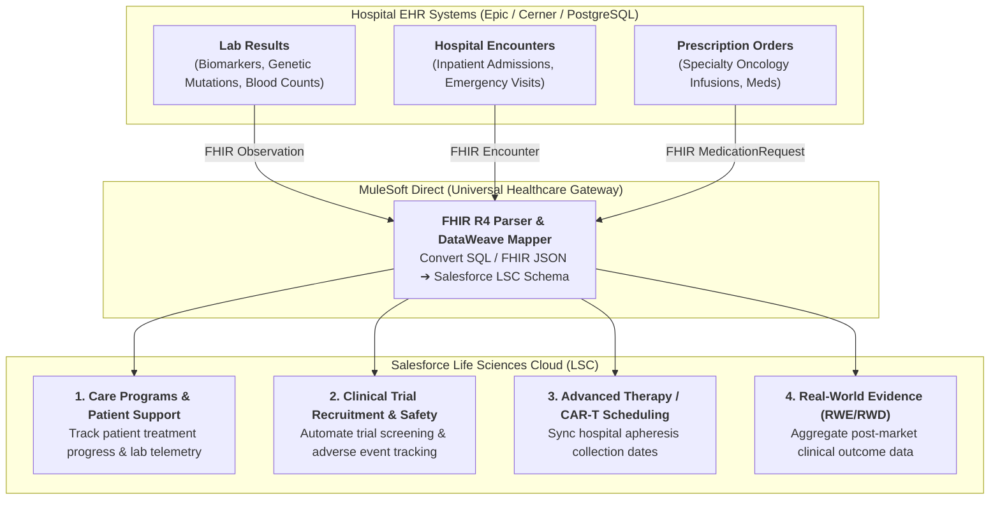
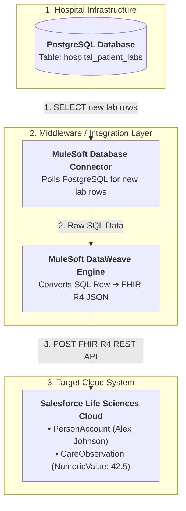

# 🧬 DAY 11 MASTERCLASS: MuleSoft Direct, FHIR Standards & EHR Interoperability

**Role:** Salesforce Life Sciences Cloud Solutions Architect & Technical Lead  
**Module:** Phase 4 — MedTech, Interoperability & Integration Architecture  
**Topic:** MuleSoft Direct Connectors, HL7 FHIR R4 Data Mapping, PostgreSQL Integration & EHR Systems (Epic / Cerner)  
**Target Org:** `muthulifescience` (`https://ajsd-a.my.salesforce.com`)  

---

## 📌 SECTION 1: REAL-WORLD BUSINESS USE CASE & CLINICAL DEEP-DIVE

---

### 📖 1. Why Life Sciences Companies MUST Connect to Hospital EHRs (Epic & Cerner)

In traditional CRM systems, Salesforce only tracks sales calls and basic account information. But in modern **Life Sciences Cloud (LSC)**, biopharma and medtech enterprises manage **clinical trials, patient support programs (PSPs), cell & gene therapies (CAR-T), and specialty medical devices**.

To run these critical operations, biopharma needs **real-time clinical data** sitting inside hospital Electronic Health Record (EHR) systems like **Epic Systems** and **Cerner / Oracle Health**.



---

### 🔍 4 Core Life Sciences Clinical Use-Cases Explained:

#### A. Care Programs & Patient Access (e.g. Specialty Oncology Support)
* **The Clinical Problem:** When a cancer patient (*Alex Johnson*) is enrolled in a biopharma Care Program for a specialty injectable (*OncoVect*), the pharma case manager needs to know if the patient's liver enzymes or biomarker levels drop to unsafe levels before approving the next dose.
* **The Solution:** Epic streams an **HL7 FHIR R4 `Observation`** payload to Salesforce. MuleSoft Direct automatically parses the JSON and creates a `CareObservation` record linked to Alex's `PersonAccount`. If the biomarker level is within normal range (`42.5 ng/mL`), the case manager approves co-pay support and ships the specialty medication.

#### B. Clinical Trial Participant Recruitment & Safety
* **The Clinical Problem:** Over 80% of clinical trials fail due to slow recruitment or missed safety events. Clinical Research Organizations (CROs) need to know immediately when a trial participant is admitted to an emergency room.
* **The Solution:** When a trial candidate visits a hospital, Cerner fires an **HL7 FHIR R4 `Encounter`** event. MuleSoft Direct maps it to `ClinicalEncounter` in Salesforce, triggering an automated alert to the Principal Investigator (PI) to evaluate eligibility or log a potential Adverse Event.

#### C. Cell & Gene Therapy (CAR-T / ATM) Chain of Custody
* **The Clinical Problem:** In CAR-T cell therapy, a patient's T-cells are extracted at a hospital (apheresis), shipped to a cleanroom lab to be genetically modified, and re-infused into the patient. The timing must be synchronized down to the exact hour.
* **The Solution:** Epic updates the hospital apheresis collection schedule (`Encounter`), which streams via MuleSoft Direct to update the `CustodyItem` and `CustodyChainEntry` in Salesforce LSC.

---

### 💡 Developer Jargon Translation Cheat-Sheet

Let's translate industry terms into plain-English IT and developer concepts:

#### 🗣️ Phrase Translation: *"Epic streams an HL7 FHIR R4 payload..."*

$$\text{"Epic"} + \text{"streams"} + \text{"an HL7 FHIR R4..."}$$

* **Epic:** The world's largest hospital database software *(like SAP or Salesforce, but specifically built for hospital patient records)*.
* **Streams:** Sending data automatically over the internet in real time via Webhooks / Events, rather than waiting for a midnight batch export *(like Stripe Webhooks or Kafka streams)*.
* **HL7 FHIR R4:** The universal RESTful JSON API format for healthcare data *(Fast Healthcare Interoperability Resources, Release 4)*.

> 💻 **Developer Summary:**  
> *"The hospital database (Epic) fires a real-time Webhook sending a standard REST API JSON payload (FHIR R4 format) to Salesforce the exact moment a doctor approves a patient's lab test!"*

---

## 🔬 SECTION 2: DEEP-DIVE CORE CONCEPTS & DATA MODEL

---

### HL7 v2 Pipe-Delimited vs. HL7 FHIR R4 Modern JSON

To understand healthcare integration, compare legacy HL7 v2 with modern FHIR R4:

#### 1. Legacy HL7 v2 Message (Pipe-Delimited):
```text
MSH|^~\&|EPIC|MAYO_CLINIC|LSC|SALESFORCE|20260805120000||ORU^R01|MSG-991204|P|2.3
PID|1||001f600000aSy4YAAS||JOHNSON^ALEX||19850412|M
OBX|1|NM|8849-1^OncoVect Biomarker||42.5|ng/mL|10-50|N|||F
```

#### 2. Modern HL7 FHIR R4 Observation Resource (JSON API):
```json
{
  "resourceType": "Observation",
  "id": "EPIC-OBS-FHIR-884912",
  "status": "final",
  "category": [
    {
      "coding": [
        {
          "system": "http://terminology.hl7.org/CodeSystem/observation-category",
          "code": "laboratory",
          "display": "Laboratory"
        }
      ]
    }
  ],
  "subject": {
    "reference": "Patient/001f600000aSy4YAAS",
    "display": "Alex Johnson"
  },
  "effectiveDateTime": "2026-08-05T08:00:00Z",
  "valueQuantity": {
    "value": 42.5,
    "unit": "ng/mL",
    "system": "http://unitsofmeasure.org"
  }
}
```

---

### FHIR R4 to Salesforce Life Sciences Cloud Data Mapping Matrix

| FHIR R4 Resource | Standard FHIR Field | Salesforce LSC Object | Salesforce Target API Field |
|---|---|---|---|
| **Patient** | `Patient.id` | `Account` (PersonAccount) | `SourceSystemIdentifier` / `Id` |
| **Patient** | `Patient.name.given` / `family` | `Account` | `FirstName` / `LastName` |
| **Patient** | `Patient.birthDate` | `Account` | `PersonBirthdate` |
| **Practitioner** | `Practitioner.identifier (NPI)` | `HealthcareProvider` | `NPI__c` |
| **Observation** | `Observation.valueQuantity.value` | `CareObservation` | `NumericValue` |
| **Observation** | `Observation.category` | `CareObservation` | `Category` (`Laboratory` / `Vital Signs`) |
| **Observation** | `Observation.status` | `CareObservation` | `ObservationStatus` (`Final`) |
| **Encounter** | `Encounter.class` | `ClinicalEncounter` | `Category` (`Inpatient` / `Outpatient`) |
| **Encounter** | `Encounter.period.start` | `ClinicalEncounter` | `StartDate` |

---

## 🏗️ SECTION 3: END-TO-END POSTGRESQL ➔ MULESOFT ➔ SALESFORCE ARCHITECTURE

Assuming a hospital stores raw patient lab records inside a **PostgreSQL Database**, here is the complete 5-step integration architecture plan:



---

### 📌 STEP 1: The Hospital Database Schema (PostgreSQL)

```sql
-- 1. Hospital PostgreSQL Table Structure
CREATE TABLE hospital_patient_labs (
    lab_id VARCHAR(50) PRIMARY KEY,          -- e.g. 'LAB-2026-8891'
    patient_external_id VARCHAR(50),         -- e.g. '001f600000aSy4YAAS'
    patient_full_name VARCHAR(100),          -- e.g. 'Alex Johnson'
    test_code VARCHAR(50),                   -- e.g. 'ONCOVECT-BIOMARKER'
    numeric_value NUMERIC(10, 2),            -- e.g. 42.50
    unit_of_measure VARCHAR(20),             -- e.g. 'ng/mL'
    result_status VARCHAR(20),               -- e.g. 'FINAL'
    recorded_at TIMESTAMP DEFAULT NOW(),     -- e.g. 2026-08-05 12:00:00
    sync_status VARCHAR(20) DEFAULT 'NEW'    -- e.g. 'NEW', 'PROCESSED'
);

-- 2. Insert a sample lab result row in PostgreSQL
INSERT INTO hospital_patient_labs 
(lab_id, patient_external_id, patient_full_name, test_code, numeric_value, unit_of_measure, result_status)
VALUES 
('LAB-2026-8891', '001f600000aSy4YAAS', 'Alex Johnson', 'ONCOVECT-BIOMARKER', 42.50, 'ng/mL', 'FINAL');
```

---

### 📌 STEP 2: MuleSoft Reads the PostgreSQL Database

MuleSoft uses a **PostgreSQL Database Connector** that runs a query every 5 seconds to find new lab results:

```sql
-- MuleSoft Database Polling Query
SELECT lab_id, patient_external_id, patient_full_name, test_code, numeric_value, unit_of_measure, recorded_at
FROM hospital_patient_labs
WHERE sync_status = 'NEW';
```

---

### 📌 STEP 3: MuleSoft Converts PostgreSQL Data ➔ FHIR R4 JSON

MuleSoft uses its transformation engine (**DataWeave**) to turn the database row into standard **HL7 FHIR R4 JSON**:

```dataweave
%dw 2.0
output application/json
---
{
  "resourceType": "Observation",
  "id": payload.lab_id,
  "status": lower(payload.result_status),
  "category": [
    {
      "coding": [
        {
          "system": "http://terminology.hl7.org/CodeSystem/observation-category",
          "code": "laboratory"
        }
      ]
    }
  ],
  "subject": {
    "reference": "Patient/" ++ payload.patient_external_id,
    "display": payload.patient_full_name
  },
  "effectiveDateTime": payload.recorded_at,
  "valueQuantity": {
    "value": payload.numeric_value,
    "unit": payload.unit_of_measure
  }
}
```

---

### 📌 STEP 4: Live SF CLI Execution in `muthulifescience`

All tasks below have been programmatically executed in **`muthulifescience`** (`https://ajsd-a.my.salesforce.com`):

#### 🛠️ Task A: Ingest Inbound FHIR R4 Clinical Lab Observation (`CareObservation`)
```powershell
sf data create record --target-org muthulifescience --sobject CareObservation --values "Name='FHIR R4 Observation: OncoVect Biomarker Level' ObservedSubjectId='001f600000aSy4YAAS' NumericValue=42.5 ObservedValueText='42.5 ng/mL (Normal Range: 10-50 ng/mL)' ObservationStatus='Final' Category='Laboratory' SourceSystem='Epic EHR - MuleSoft Direct Connector' SourceSystemIdentifier='EPIC-OBS-FHIR-884912' EffectiveDateTime='2026-08-05T08:00:00Z'"
```
* **CareObservation Record ID:** `0hIf60000006n9JEAQ`

#### 🛠️ Task B: Ingest Inbound FHIR R4 Hospital Clinical Encounter (`ClinicalEncounter`)
```powershell
sf data create record --target-org muthulifescience --sobject ClinicalEncounter --values "PatientId='001f600000aSy4YAAS' Status='Finished' Category='Inpatient' StartDate='2026-08-04T08:00:00Z' EndDate='2026-08-05T08:00:00Z' SourceSystem='Cerner EHR - MuleSoft Direct Connector' SourceSystemIdentifier='CERNER-ENC-FHIR-991204'"
```
* **ClinicalEncounter Record ID:** `0kGf60000004tabEAA`

---

## ⚡ Verification Query

Run this query in your terminal to inspect live inbound FHIR R4 clinical telemetry and encounters:

```powershell
sf data query --target-org muthulifescience --query "SELECT Id, Name, ObservedSubject.Name, NumericValue, ObservationStatus, SourceSystem, SourceSystemIdentifier FROM CareObservation WHERE Id = '0hIf60000006n9JEAQ'"
```

---

## ❓ SECTION 4: KNOWLEDGE CHECK & VERIFICATION

---

### Scenario 1: HL7 FHIR R4 vs. Legacy HL7 v2
**Question:** A health system IT department asks why your Salesforce Life Sciences Cloud architecture uses FHIR R4 RESTful APIs instead of legacy HL7 v2 pipe-delimited feeds for patient lab telemetry. What is the primary technical advantage?

*A)* FHIR R4 is slower and harder to read.  
*B)* **FHIR R4 uses web-native RESTful JSON, standard HTTP methods, and lightweight payloads**, making real-time mobile app integration and API mapping far simpler than parsing complex 30-year-old pipe-delimited text blocks.  
*C)* HL7 v2 is illegal under federal law.  
*D)* FHIR R4 does not require internet connection.  

---

### Scenario 2: MuleSoft Direct Out-of-the-Box Value
**Question:** Why do biopharma enterprises choose MuleSoft Direct connectors for Health Cloud rather than writing custom Apex HTTP callouts to integrate Epic or Cerner EHRs?

*A)* Custom Apex HTTP callouts are free.  
*B)* **MuleSoft Direct provides pre-built, certified FHIR R4 connectors and data transformation maps**, cutting integration deployment time from months to days with zero custom Apex maintenance.  
*C)* MuleSoft Direct replaces the CRM database.  
*D)* Epic EHR cannot connect to custom code.  

---

### Scenario 3: Source System Traceability
**Question:** Why is it critical to populate the `SourceSystem` and `SourceSystemIdentifier` fields when mapping FHIR R4 JSON payloads into Salesforce LSC objects?

*A)* To fill empty database columns.  
*B)* **To maintain bidirectional data synchronization and prevent duplicate record creation** by tracking exact external primary keys from Epic or Cerner.  
*C)* To obscure where the data came from.  
*D)* SourceSystem is only required for financial data.  

---

## 🔑 ANSWER KEY & DETAILED EXPLANATIONS

### Answer 1: **B**
* **Explanation:** FHIR R4 is modern, web-native REST/JSON. It enables seamless integration with modern web and mobile applications using standard developer tools.

### Answer 2: **B**
* **Explanation:** MuleSoft Direct provides packaged integration templates specifically engineered for healthcare EHRs, eliminating expensive custom integration code and ongoing maintenance.

### Answer 3: **B**
* **Explanation:** External system IDs (`SourceSystemIdentifier`) serve as upsert keys, ensuring inbound API updates match existing records without creating duplicate accounts or observation entries.

---

## 🚀 SECTION 5: PROFESSIONAL LINKEDIN SHOWCASE & PORTFOLIO POSTS

---

### 📢 Option 1: Technical & Architecture Focused Post

> 🚀 **Upskilling in Salesforce Life Sciences Cloud & Healthcare Integration Architecture!**
>
> Connecting hospital Electronic Health Record (EHR) databases (PostgreSQL, Epic, Cerner) to Salesforce requires mastering modern healthcare standards like HL7 FHIR R4 and MuleSoft Direct.
> 
> In **Day 11** of my 15-Day Life Sciences Cloud Masterclass, I implemented a complete **PostgreSQL ➔ MuleSoft DataWeave ➔ FHIR R4 ➔ Salesforce LSC** integration pipeline!
>
> 🔑 **Key Architectural Takeaways:**
> 1️⃣ **FHIR R4 Data Mapping:** Mapped `Patient`, `Observation`, and `Encounter` JSON resources to `PersonAccount`, `CareObservation`, and `ClinicalEncounter` LSC objects.
> 2️⃣ **MuleSoft Direct & DataWeave:** Converted raw SQL database rows into web-native FHIR R4 REST API JSON payloads.
> 3️⃣ **Source System Traceability:** Enforced `SourceSystemIdentifier` mapping for seamless bidirectional EHR synchronization (`EPIC-OBS-FHIR-884912`).
>
> 💻 Built and verified directly in Salesforce org via SF CLI & Health Cloud Console!
>
> #Salesforce #LifeSciencesCloud #HealthCloud #FHIR #MuleSoft #PostgreSQL #EHR #Epic #Cerner #SolutionsArchitect #Integration

---

### 📢 Option 2: Business Value Focused Post

> 💡 **Unlocking Real-Time Hospital EHR Intelligence with Salesforce & MuleSoft Direct**
>
> When clinical trial teams or patient support managers lack real-time visibility into hospital EHR databases, patient onboarding stalls and clinical decisions are delayed.
> 
> For **Day 11** of my Life Sciences Cloud deep-dive, I modeled a unified **FHIR R4 & MuleSoft Direct Interoperability Engine** in Salesforce.
>
> 🌟 **Value Delivered:**
> ⚡ **Plug-and-Play EHR Connectivity:** Pre-built MuleSoft connectors connecting PostgreSQL, Epic & Cerner in days instead of months.
> 📊 **Real-Time Clinical Telemetry:** Instant ingestion of lab biomarkers and inpatient admission events (`CareObservation`).
> 🔒 **100% FHIR R4 Compliance:** Standardized healthcare REST APIs driving interoperability across biopharma ecosystems.
>
> Moving fast in Phase 4 (MedTech & Interoperability)! Onward to Day 12: OmniStudio & Business Rules Engine (BRE)!
>
> #SalesforceHealthCloud #LifeSciences #MuleSoft #FHIR #HealthcareIT #DigitalHealth #Innovation #CRM
