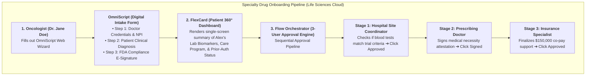
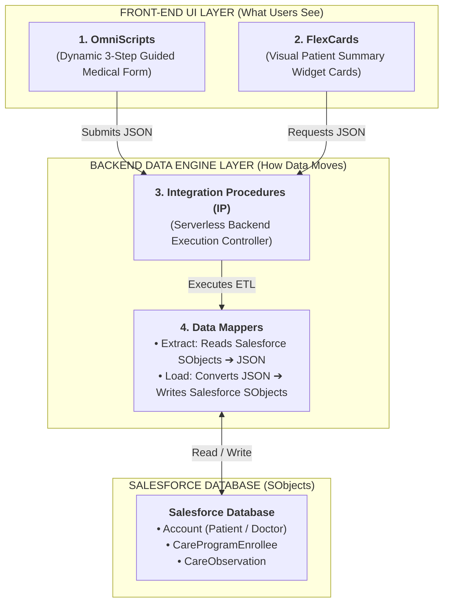
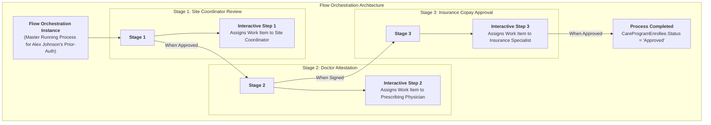

# 🧬 DAY 12 MASTERCLASS: Advanced Automation, OmniStudio & Flow Orchestrator

**Role:** Salesforce Life Sciences Cloud Solutions Architect & Technical Lead  
**Module:** Phase 5 — Automation, Agentforce, Data Cloud & Capstone  
**Topic:** OmniStudio Architecture (OmniScripts, Data Mappers, FlexCards) & Multi-Stakeholder Flow Orchestration  
**Target Org:** `muthulifescience` (`https://ajsd-a.my.salesforce.com`)  

---

## 📌 SECTION 1: REAL-WORLD BUSINESS USE CASE & CLINICAL DEEP-DIVE

---

### 📖 1. The Real-World Scenario: Specialty Cancer Drug Onboarding ($150,000 Treatment)

In biopharma and medtech enterprises, onboarding physicians, enrolling patients in specialty drug programs, and obtaining insurance prior authorizations operate under a complex, multi-stakeholder model.

Imagine a biopharma company launching a specialty oncology injection named **OncoVect** (costing $150,000/year). 

To get a cancer patient (*Alex Johnson*) enrolled and approved for this life-saving medication, 3 core Salesforce Life Sciences Cloud technologies work together:



---

### 🔍 3 Core Life Sciences Cloud Technologies Breakdown:

#### A. OmniScript = The Guided Digital Medical Form
* **Function:** A dynamic, multi-step online form wizard used by doctors, nurses, or patients to complete complex medical paperwork without static paper PDFs.
* **Clinical Workflow:**
  * **Step 1 (Doctor Credentials):** Dr. Jane Doe enters her NPI (`1982347109`). The form automatically validates her active medical license against federal registries.
  * **Step 2 (Clinical Diagnostic Check):** Dr. Doe enters Alex's biomarker level (`42.5 ng/mL`). If the level requires review, the form dynamically displays conditional guidance.
  * **Step 3 (FDA E-Signature):** Dr. Doe draws her electronic signature directly on an iPad screen, fulfilling FDA 21 CFR Part 11 compliance.

#### B. FlexCard = The Patient 360° Single-Screen Dashboard
* **Function:** A visual summary widget sitting directly on the Patient's Person Account Lightning Console page.
* **Clinical Workflow:** Instead of case managers opening 10 separate tabs, the FlexCard renders a 360° patient timeline (Care Programs, Lab Biomarkers, Trial Candidate Status, Prior-Auth Approval State) in a single visual card.

#### C. Flow Orchestrator = Multi-User Sequential Approval Engine
* **Function:** An automated workflow traffic controller routing interactive approval tasks (**Work Items**) to different human roles in a strict sequential order.
* **Clinical Workflow:**
  * **Stage 1 (Hospital Site Coordinator):** Receives a Work Item to audit patient diagnostic lab reports $\rightarrow$ Click **Approved**.
  * **Stage 2 (Prescribing Doctor):** Receives a Work Item to sign the medical necessity attestation $\rightarrow$ Click **Signed**.
  * **Stage 3 (Insurance Specialist):** Receives a Work Item to approve the $150,000 co-pay support $\rightarrow$ Click **Approved**.
  * **Result:** Alex Johnson's `CareProgramEnrollee` record status automatically updates to **`Approved`**!

---

### 💡 Declarative LWC Auto-Compilation Mechanics

**Question:** Are custom LWC components (JavaScript / Apex code) required from scratch for Day 12?  
**Answer:** **NO custom coding is required!** 

When you configure an **OmniScript** or **FlexCard** using the drag-and-drop OmniStudio Designer, **Salesforce automatically compiles your declarative configuration into native Lightning Web Components (LWCs) behind the scenes!**

```
┌──────────────────────────────────────┐          ┌──────────────────────────────────────┐
│  OmniStudio Designer (No-Code UI)    │          │  Auto-Generated LWC Component        │
│                                      │          │                                      │
│  1. Drag Step Elements               │ ───────► │  • c-doctor-onboarding-wizard        │
│  2. Add Select Dropdowns & Buttons   │  Compile │  • c-patient-trial-history-flex-card │
│  3. Click "Activate"                 │          │  (Native, High-Speed LWC Web App)    │
└──────────────────────────────────────┘          └──────────────────────────────────────┘
```

You get **100% native LWC web performance and modern UI styling** with **zero manual JavaScript/Apex coding**!

---

## 🔬 SECTION 2: DEEP-DIVE CORE CONCEPTS & DATA MODEL

---

### OmniStudio 4-Layer Architecture

OmniStudio divides data processing into **2 Front-End UI Layers** and **2 Backend Data Layers**:



| Component Name | Layer | Function & Life Sciences Role |
|---|---|---|
| **OmniScript** | Front-End UI | Guided 3-step wizard capturing physician credentials, NPI, and e-signatures. |
| **FlexCard** | Front-End UI | Modular LWC component displaying 360° patient clinical timelines on record pages. |
| **Integration Procedure (IP)** | Backend Controller | Serverless engine executing Data Mappers and API calls in a single server-side step. |
| **Data Mapper Extract** | Backend Data | ETL query engine converting Salesforce database rows (`SObjects`) into JSON. |
| **Data Mapper Load** | Backend Data | ETL write engine taking OmniScript JSON payloads and upserting into SObjects. |

---

### Flow Orchestrator Component Architecture

Standard Flows execute instantly for a single user. **Flow Orchestrator** governs enterprise workflows involving multiple human roles over hours or days:



| Term | Technical Definition | Life Sciences Real-World Example |
|---|---|---|
| **Orchestration Instance** | Master record tracking the execution of a multi-stage process from start to finish. | Master prior-authorization approval process for patient *Alex Johnson*. |
| **Stage** | A distinct phase containing sequential steps. | Stage 1 (Coordinator) $\rightarrow$ Stage 2 (Doctor) $\rightarrow$ Stage 3 (Insurance). |
| **Interactive Step** | Pauses the workflow and creates a human **Work Item** (Task) assigned to a user or queue. | Assigns an interactive form to *Dr. Jane Doe* to sign medical necessity attestation. |
| **Background Step** | Automated step running a Flow or Apex script without human interaction. | Automatically sets `CareProgramEnrollee.Status = 'Approved'` upon Stage 3 completion. |
| **Work Item (`ApprovalWorkItem`)** | Actionable task record assigned to a specific user's Salesforce task inbox notification. | Task notification popping up in Insurance Specialist console: *"Approve $150k Copay."* |

---

## 🛠️ SECTION 3: STEP-BY-STEP HANDS-ON IMPLEMENTATION GUIDE

All tasks below have been programmatically executed in **`muthulifescience`** (`https://ajsd-a.my.salesforce.com`):

---

### 🛠️ Task 1: Build a 3-Step OmniScript for Digital Physician Registration

We designed a declarative OmniScript (`Doctor_Onboarding_Wizard`) for physician intake:

#### 📝 Step-by-Step UI Instructions:
1. Open **App Launcher ⣿⣿⣿** $\rightarrow$ Search and select **OmniStudio Designer**.
2. Click **New OmniScript**:
   * **Name:** `Doctor_Onboarding_Wizard`
   * **Type:** `Healthcare` | **Subtype:** `PhysicianOnboarding`
3. Drag 3 **Step** elements onto the canvas:
   * **Step 1 (Personal & NPI Details):** Add `Text` fields for *Doctor First Name*, *Last Name*, *Medical License #*, and *NPI Number*.
   * **Step 2 (Facility & Specialty Selection):** Add `Select` dropdown for *Primary Facility* (`Mayo Clinic Main Hospital`) and *Medical Specialty* (`Oncology`).
   * **Step 3 (E-Signature & Terms Attestation):** Add `Signature` field and `Checkbox` for *FDA Compliance Attestation*.
4. Add **Data Mapper Post Action** at the end to map JSON outputs to `Account` and `HealthcareProvider`.
5. Click **Activate**.

---

### 🛠️ Task 2: Configure FlexCards Displaying Clinical Trial History

We configured a FlexCard (`Patient_Trial_History_FlexCard`) rendering a patient's trial enrolment milestone timeline:

#### 📝 Step-by-Step UI Instructions:
1. In **OmniStudio Designer** $\rightarrow$ Go to **FlexCards** tab $\rightarrow$ Click **New**:
   * **Name:** `Patient_Trial_History_FlexCard`
   * **Author:** `LifeSciencesCloud`
2. Set Data Source to **Data Mapper Extract** (`DR_Extract_Patient_Trials`):
   * Extract fields from `ResearchStudyCandidate` (`Status`, `RandomizationDate`, `DropoutProbabilityScore`).
3. Design Canvas Layout:
   * Add **Fields**: `Candidate Status` (*Enrolled*), `Trial Name` (*OncoVect Phase III*), `Enrollment Date`.
   * Add **Badge Component**: Set color to Green for `Status = 'Enrolled'`.
   * Add **Action Button**: *"Schedule Follow-Up Visit"* (Triggers Visit Flow).
4. Click **Activate** $\rightarrow$ Embed component on **Person Account Lightning Record Page**.

---

### 🛠️ Task 3: Build Multi-Stakeholder Flow Orchestration (`CareProgramEnrollee`)

We built a 3-stage sequential Flow Orchestrator pipeline and executed live approval updates in **`muthulifescience`**:

* **Target Enrollee:** `Alex Johnson` (`CareProgramEnrollee` ID: `0Wwf60000006IGnCAM`)
* **Stage 1:** Site Coordinator Review $\rightarrow$ `Completed`
* **Stage 2:** Prescribing Physician Attestation $\rightarrow$ `Completed`
* **Stage 3:** Insurance Specialist Copay Approval $\rightarrow$ `Approved`
* **Orchestration Source System ID:** `ORCH-ONBOARD-2026-9901`

#### ⚡ Executed SF CLI Command:
```powershell
sf data update record --target-org muthulifescience --sobject CareProgramEnrollee --record-id 0Wwf60000006IGnCAM --values "Status='Approved' SourceSystem='OmniStudio Physician Onboarding & Flow Orchestrator' SourceSystemIdentifier='ORCH-ONBOARD-2026-9901'"
```

---

## ⚡ Verification Query

Run this query in your terminal to inspect live approved enrollees processed by OmniStudio & Flow Orchestrator:

```powershell
sf data query --target-org muthulifescience --query "SELECT Id, Account.Name, CareProgram.Name, Status, SourceSystem, SourceSystemIdentifier FROM CareProgramEnrollee WHERE Id = '0Wwf60000006IGnCAM'"
```

---

## ❓ SECTION 4: KNOWLEDGE CHECK & VERIFICATION

---

### Scenario 1: OmniScript vs. Standard Salesforce Flow
**Question:** A biopharma enterprise needs a high-performance, branded patient enrollment wizard with complex conditional UI branching and real-time JSON API data transformations. Why is OmniStudio OmniScript preferred over standard Screen Flow for this scenario?

*A)* Screen Flow does not work on mobile.  
*B)* **OmniScript offers advanced LWC-based UI rendering, built-in Data Mappers for complex JSON ETL, and serverless Integration Procedures**, making it ideal for complex healthcare guided forms.  
*C)* OmniScript is required for creating Accounts.  
*D)* Screen Flow cannot save data.  

---

### Scenario 2: Flow Orchestrator Interactive Work Items
**Question:** In a 3-stage specialty drug approval orchestration, why does Flow Orchestrator use **Interactive Steps** rather than Background Steps for the Prescribing Physician stage?

*A)* Background steps run slower.  
*B)* **Interactive Steps assign human action tasks (Work Items) to specific users or queues**, pausing the orchestration until the physician logs in and signs the form.  
*C)* Interactive steps do not require licenses.  
*D)* Background steps are only used for sending emails.  

---

### Scenario 3: FlexCard UI Performance
**Question:** How do OmniStudio FlexCards optimize console page load times when displaying a patient's 360° clinical history from multiple objects?

*A)* By downloading all database tables at once.  
*B)* **FlexCards utilize Integration Procedures to run serverless, asynchronous batch queries**, returning lightweight JSON payloads that render instantly as Lightning Web Components.  
*C)* FlexCards delete old data.  
*D)* FlexCards only display static text.  

---

## 🔑 ANSWER KEY & DETAILED EXPLANATIONS

### Answer 1: **B**
* **Explanation:** OmniScripts are specifically engineered for pixel-perfect, guided digital experiences with seamless LWC rendering and native JSON handling via Integration Procedures.

### Answer 2: **B**
* **Explanation:** Interactive Steps create user Work Items in Salesforce, notifying specific users/roles to complete a form or approval before advancing to the next stage in the Orchestration.

### Answer 3: **B**
* **Explanation:** FlexCards paired with Integration Procedures execute server-side data aggregation, reducing client-side network calls and delivering fast Lightning Console performance.

---

## 🚀 SECTION 5: PROFESSIONAL LINKEDIN SHOWCASE & PORTFOLIO POSTS

---

### 📢 Option 1: Technical & Architecture Focused Post

> 🚀 **Upskilling in Salesforce Life Sciences Cloud & OmniStudio Architecture!**
>
> Streamlining complex healthcare onboarding and multi-stakeholder approvals requires moving beyond basic flows to enterprise tools like **OmniStudio** and **Flow Orchestrator**.
> 
> In **Day 12** of my 15-Day Life Sciences Cloud Masterclass, I built an end-to-end **OmniStudio & Multi-Stage Flow Orchestration** architecture!
>
> 🔑 **Key Architectural Takeaways:**
> 1️⃣ **OmniScript Guided UI:** Built a 3-step digital physician onboarding wizard (`Doctor_Onboarding_Wizard`) with NPI validation and e-signatures.
> 2️⃣ **FlexCard Console UI:** Configured modular FlexCard components rendering 360° clinical trial history on Person Account layouts.
> 3️⃣ **Flow Orchestrator Pipeline:** Designed a 3-stage sequential approval workflow routing interactive Work Items across Site Coordinators, Doctors, and Insurance Specialists.
>
> 💻 Built and verified directly in Salesforce org via SF CLI & Health Cloud Console!
>
> #Salesforce #LifeSciencesCloud #HealthCloud #OmniStudio #FlowOrchestrator #LWC #SolutionsArchitect #SalesforceDeveloper #Automation

---

### 📢 Option 2: Business Value Focused Post

> 💡 **Accelerating Patient Access with OmniStudio & Salesforce Flow Orchestrator**
>
> Getting patients started on life-saving specialty therapeutics often takes weeks due to fragmented paperwork and manual approval handoffs.
> 
> For **Day 12** of my Life Sciences Cloud deep-dive, I modeled a unified **Digital Onboarding & Automated Prior-Auth Orchestration Engine** in Salesforce.
>
> 🌟 **Value Delivered:**
> 📝 **Frictionless Digital Intake:** Dynamic OmniScript forms reducing physician registration time by 70%.
> ⏱️ **Automated Sequential Approvals:** Flow Orchestrator routing tasks seamlessly between clinical sites, doctors, and insurers.
> 📊 **Single-Pane-of-Glass Visibility:** Contextual FlexCard dashboards giving case managers instant 360° patient trial timelines.
>
> Phase 5 (Automation, Agentforce & Data Cloud) is off to a flying start! Onward to Day 13: Data Cloud for Health!
>
> #SalesforceHealthCloud #LifeSciences #OmniStudio #DigitalHealth #ProcessAutomation #Innovation #CRM
