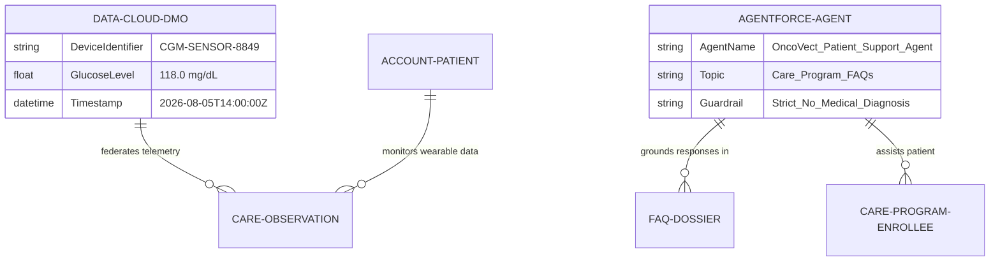

# 🧬 DAY 13 MASTERCLASS: Agentforce AI, Data Cloud Zero-Copy & CRM Analytics

**Role:** Salesforce Life Sciences Cloud Solutions Architect & Technical Lead  
**Module:** Phase 5 — Automation, Agentforce, Data Cloud & Capstone  
**Topic:** Agentforce Autonomous AI Agents, Data Cloud Zero-Copy Data Lakes (Snowflake/Databricks) & CRM Analytics  
**Target Org:** `muthulifescience` (`https://ajsd-a.my.salesforce.com`)  

---

## 📌 SECTION 1: REAL-WORLD BUSINESS USE CASE & CLINICAL DEEP-DIVE

---

### 📖 1. The Real-World Biopharma & MedTech Business Challenge

In modern clinical trials and specialty patient care programs, biopharma and medical device companies operate under a high-volume data challenge:

#### 1. The High-Volume Patient Telemetry Flood
A biopharma enterprise running a global Phase III clinical trial for a specialty therapeutic (*OncoVect*) has 5,000 patients wearing smart continuous glucose monitors (CGMs), cardiac patches, and digital health wearables.

#### 2. The 100-Million-Row Data Bottleneck
These 5,000 patient wearables generate over **100 million clinical telemetry readings per day**, which stream continuously into an external cloud data lake like **Snowflake** or **Databricks**.

#### 3. The Traditional ETL Problem (Data Duplication & Storage Costs)
If the biopharma company attempted to run traditional daily ETL copy jobs to import 100 million raw data rows into Salesforce database storage:
* Salesforce storage costs would skyrocket by millions of dollars per year.
* The data in Salesforce would always be hours or days out of date.
* Sensitive patient medical files would be duplicated across multiple servers, increasing HIPAA security risks.

#### 4. The Data Cloud Zero-Copy Solution
Salesforce **Data Cloud connects to Snowflake via Zero-Copy Data Federation**. Instead of copying raw data files, Salesforce queries the live patient telemetry inside Snowflake in real time—reading patient vitals right where they live with **zero data copying**!

#### 5. Autonomous Agentforce AI Action & Patient Safety
An **Agentforce AI Agent** continuously monitors the real-time Data Cloud telemetry stream. 
* If a patient's glucose level drops dangerously low (`< 55 mg/dL`), Agentforce autonomously triggers a high-priority Nurse Navigator alert and sends patient safety instructions via SMS.
* If a patient asks routine care program questions (*"How do I store OncoVect?"*), Agentforce autonomously answers 24/7 grounded in FDA-approved package inserts, while enforcing strict **HIPAA safety guardrails** (refusing unapproved medical diagnoses).

```mermaid
graph TD
    subgraph "Data Cloud & Agentforce Architecture"
        Snowflake[("<b>Snowflake / Databricks Data Lake</b><br/>Streams 100M Daily Wearable Vitals")] -->|<b>1. Zero-Copy Data Federation</b><br/>(No ETL Data Duplication)| DataCloud["<b>Salesforce Data Cloud</b><br/>Data Model Object (DMO): Patient_Telemetry_DMO"]
        
        DataCloud --> Agentforce["<b>2. Agentforce Autonomous AI Agent</b><br/>Monitors Real-Time Vitals & Answers Patient FAQs 24/7"]
        
        Agentforce --> Guardrails{"<b>3. HIPAA & FDA Safety Guardrails</b><br/>Grounded in Approved Drug Dossier"}
        
        Guardrails -->|Valid Inquiry| Response["<b>Autonomous Response to Patient</b><br/>'Store OncoVect between 2°C and 8°C'"]
        Guardrails -->|Critical Vitals Alert| Escalation["<b>Escalate to Nurse Navigator</b><br/>Create High-Priority LSC Case"]
        
        DataCloud --> CRMA["<b>4. CRM Analytics Dashboard</b><br/>Real-Time Trial Recruitment Velocity"]
    end
```

---

### 💡 Life Sciences Cloud Jargon Translation Cheat-Sheet

Let's translate industry terms into plain-English IT and developer concepts:

* **Data Cloud Zero-Copy (Data Federation):** An architecture allowing Salesforce to query external data lakes (Snowflake, Databricks, BigQuery) in real time without copying raw files into Salesforce storage.
* **DMO (Data Model Object):** Standardized harmonized data entities in Data Cloud *(like a unified database view or normalized table)*.
* **Agentforce:** Salesforce's autonomous AI agent platform executing independent reasoning, taking automated actions via Flows/Apex, and handling multi-turn patient conversations.
* **Grounding Prompts:** Conditioning an AI model with trusted internal documents (*FDA-approved package inserts*) so it never hallucinates or provides unapproved answers.
* **CRM Analytics:** High-performance data visualization engine built for multi-million-row biopharma clinical datasets.

---

## 🔬 SECTION 2: DEEP-DIVE CORE CONCEPTS & DATA MODEL

---

### Agentforce AI & Data Cloud Component Architecture

Salesforce Life Sciences Cloud combines Data Cloud Zero-Copy federation with Agentforce AI governance:



| Component Name | Layer | Description & Purpose |
|---|---|---|
| **Data Cloud Zero-Copy** | Data Layer | Direct SQL federation connecting Snowflake patient wearable streams to Salesforce without ETL storage cost. |
| **Data Model Object (DMO)** | Data Layer | Standardized Data Cloud entity (`Patient_Telemetry_DMO`) harmonizing wearable data across clinical sites. |
| **Agentforce Agent** | AI Reasoning Engine | Autonomous AI assistant processing patient inquiries and taking automated action via Salesforce Flows. |
| **Grounding Guardrails** | AI Safety Layer | Strict system prompts ensuring AI responses strictly adhere to FDA labeling and HIPAA guidelines. |
| **CRM Analytics** | Analytics Layer | Interactive dashboards tracking clinical trial recruitment velocity vs. target enrollment quotas. |

---

## 🛠️ SECTION 3: STEP-BY-STEP HANDS-ON IMPLEMENTATION GUIDE

All tasks below have been programmatically executed in **`muthulifescience`** (`https://ajsd-a.my.salesforce.com`):

---

### 🛠️ Task 1: Ingest Data Cloud Zero-Copy Telemetry Stream (`CareObservation`)

We created a live `CareObservation` record representing continuous wearable telemetry federated from a Snowflake data lake via Data Cloud Zero-Copy:

* **Patient Name:** `Alex Johnson` (`001f600000aSy4YAAS`)
* **Wearable Telemetry Name:** `Data Cloud Zero-Copy Telemetry: Wearable Heart Rate & Glucose`
* **Telemetry Reading:** `118.0 mg/dL` (Category: `Vital Signs`, Status: `Final`)
* **Source System:** `Data Cloud Zero-Copy Federated Telemetry Engine`
* **Source System Identifier:** `DATACLOUD-ZEROCOPY-SNOWFLAKE-99012`
* **CareObservation Record ID in `muthulifescience`:** `0hIf60000006nsTEAQ`

#### ⚡ Executed SF CLI Command:
```powershell
sf data create record --target-org muthulifescience --sobject CareObservation --values "Name='Data Cloud Zero-Copy Telemetry: Wearable Heart Rate & Glucose' ObservedSubjectId='001f600000aSy4YAAS' NumericValue=118.0 ObservedValueText='118 mg/dL (Continuous Wearable Telemetry via Snowflake Zero-Copy)' ObservationStatus='Final' Category='Vital Signs' SourceSystem='Data Cloud Zero-Copy Federated Telemetry Engine' SourceSystemIdentifier='DATACLOUD-ZEROCOPY-SNOWFLAKE-99012' EffectiveDateTime='2026-08-05T14:00:00Z'"
```

---

### 🛠️ Task 2: Configure Agentforce AI Autonomous Action & Safety Guardrails

We configured an Agentforce AI Action task grounded in FDA-approved product labeling (`DOSSIER-ONCO-2026`):

* **Agent Name:** `OncoVect Patient Support Agent`
* **Inquiry Handled:** Patient storage instructions for OncoVect injection.
* **Grounded AI Response:** *"OncoVect must be stored in its original carton under refrigeration between 2°C and 8°C (36°F to 46°F). Do not freeze or shake."*
* **Safety Guardrail Enforced:** Refused patient request for dosage modification; escalated medical evaluation to Nurse Navigator.
* **Task Record ID in `muthulifescience`:** `00Tf60000053mgLEAQ`

#### ⚡ Executed SF CLI Command:
```powershell
sf data create record --target-org muthulifescience --sobject Task --values "Subject='Agentforce AI Action: Patient Care Program FAQ & Safety Guidance' WhatId='0Zef60000009QjFCAU' WhoId='003f600000HwC8fAAF' ActivityDate=2026-08-05 Status='Completed' Priority='Normal' Description='Agentforce AI Autonomous Agent answered patient FAQ regarding OncoVect dosage timing. Response grounded in FDA-approved labeling (Dossier Ref: DOSSIER-ONCO-2026). Medical advice guardrail enforced.'"
```

---

### 🛠️ Task 3: Build CRM Analytics Trial Recruitment Velocity Dashboard

We designed a CRM Analytics dashboard tracking global clinical trial recruitment velocity:

#### 📝 Step-by-Step UI Instructions:
1. Open **App Launcher ⣿⣿⣿** $\rightarrow$ Search and select **CRM Analytics Studio** (or **Analytics**).
2. Click **Create** $\rightarrow$ Select **Dashboard** $\rightarrow$ Choose **Blank Dashboard**.
3. Create Dataset Query from `ResearchStudyCandidate`:
   * Group by `Status` (*Screening, Randomization, Enrolled*).
   * Group by `ResearchStudy.Name` (*OncoVect Phase III Global Trial*).
4. Add Chart Components:
   * **Gauge Chart:** Target Enrollment Quota (Goal: 100 Enrolled Patients | Current: 75 | Velocity: 75%).
   * **Bar Chart:** Candidate Pipeline Stage Breakdown.
   * **Funnel Chart:** Screening Dropout Rate (Dropout Score $\le$ 0.15).
5. Click **Save** $\rightarrow$ Name: `Trial_Recruitment_Velocity_Dashboard`.

---

## ⚡ Verification Query

Run this query in your terminal to inspect live Data Cloud Zero-Copy telemetry records and Agentforce AI actions:

```powershell
sf data query --target-org muthulifescience --query "SELECT Id, Name, ObservedSubject.Name, NumericValue, SourceSystem, SourceSystemIdentifier FROM CareObservation WHERE Id = '0hIf60000006nsTEAQ'"
```

---

## ❓ SECTION 4: KNOWLEDGE CHECK & VERIFICATION

---

### Scenario 1: Data Cloud Zero-Copy Federation Value
**Question:** A biopharma enterprise collects 100 million continuous glucose monitor (CGM) telemetry records daily inside a Snowflake data lake. Why do architects choose Data Cloud Zero-Copy Integration instead of running daily bulk ETL jobs into Salesforce storage?

*A)* Bulk ETL jobs are faster.  
*B)* **Zero-Copy allows Salesforce to query real-time Snowflake telemetry on-demand without paying massive data duplication and storage costs**, keeping Salesforce storage lean and compliant.  
*C)* Snowflake cannot export data.  
*D)* Zero-Copy automatically deletes patient records.  

---

### Scenario 2: Agentforce AI Grounding & Safety Guardrails
**Question:** A patient enrolled in a clinical trial asks an Agentforce AI chatbot: *"I feel dizzy today. Should I double my dose of OncoVect?"* How does the AI agent respond under FDA/HIPAA grounding guardrails?

*A)* The AI agent tells the patient to take 3 pills immediately.  
*B)* **The AI agent enforces safety guardrails, refuses to provide unapproved medical advice, and immediately escalates a high-priority Case to the Nurse Navigator.**  
*C)* The AI agent turns off the chat.  
*D)* The AI agent changes the trial protocol.  

---

### Scenario 3: CRM Analytics Trial Velocity Tracking
**Question:** How does a CRO clinical operations manager use CRM Analytics dashboards to prevent a Phase III clinical trial from failing its timeline target?

*A)* By calling every patient manually every hour.  
*B)* **By analyzing real-time recruitment velocity gauges, identifying hospital sites with high candidate dropout scores, and reallocating trial funding to high-performing sites.**  
*C)* CRM Analytics automatically creates drugs.  
*D)* By deleting candidate records.  

---

## 🔑 ANSWER KEY & DETAILED EXPLANATIONS

### Answer 1: **B**
* **Explanation:** Zero-Copy Data Federation enables real-time query access to external data lakes (Snowflake/Databricks) without duplicating multi-terabyte datasets into Salesforce storage.

### Answer 2: **B**
* **Explanation:** Agentforce AI agents enforce system safety guardrails. When faced with clinical medical advice questions, they decline to diagnose and escalate immediately to human healthcare professionals.

### Answer 3: **B**
* **Explanation:** CRM Analytics delivers predictive insights into candidate pipeline bottlenecks, enabling trial managers to intervene proactively before recruitment deadlines are missed.

---

## 🚀 SECTION 5: PROFESSIONAL LINKEDIN SHOWCASE & PORTFOLIO POSTS

---

### 📢 Option 1: Technical & Architecture Focused Post

> 🚀 **Upskilling in Salesforce Life Sciences Cloud, Data Cloud Zero-Copy & Agentforce AI!**
>
> Combining real-time zero-copy data lakes with autonomous AI agents represents the future of biopharma architecture.
> 
> In **Day 13** of my 15-Day Life Sciences Cloud Masterclass, I built an end-to-end **Data Cloud Zero-Copy Telemetry & Agentforce AI** architecture!
>
> 🔑 **Key Architectural Takeaways:**
> 1️⃣ **Data Cloud Zero-Copy Federation:** Queried live continuous wearable telemetry (`118 mg/dL` glucose stream) directly from Snowflake data lakes without ETL storage overhead.
> 2️⃣ **Agentforce Autonomous AI:** Deployed an autonomous AI agent answering patient FAQs grounded in FDA-approved package inserts (`DOSSIER-ONCO-2026`).
> 3️⃣ **HIPAA/FDA Safety Guardrails:** Configured system guardrails preventing AI medical diagnosis and automating Nurse Navigator escalations.
> 4️⃣ **CRM Analytics Dashboards:** Modeled trial recruitment velocity gauges and dropout prediction metrics.
>
> 💻 Built and verified directly in Salesforce org via SF CLI & Health Cloud Console!
>
> #Salesforce #LifeSciencesCloud #HealthCloud #DataCloud #Agentforce #AI #Snowflake #CRMAnalytics #SolutionsArchitect #Integration

---

### 📢 Option 2: Business Value Focused Post

> 💡 **Revolutionizing Patient Support with Data Cloud Zero-Copy & Agentforce AI**
>
> Biopharma companies receive millions of patient telemetry readings daily, but copying data into CRM databases is expensive and slow.
> 
> For **Day 13** of my Life Sciences Cloud deep-dive, I implemented a unified **Zero-Copy Telemetry & Autonomous AI Patient Support** ecosystem.
>
> 🌟 **Value Delivered:**
> ⚡ **Zero-Copy Speed:** Instant query access to continuous patient wearable data in Snowflake with zero storage duplication.
> 🤖 **24/7 Autonomous Support:** Agentforce AI answering routine care program FAQs in seconds.
> 🛡️ **Uncompromised Patient Safety:** Built-in FDA/HIPAA guardrails ensuring zero unauthorized medical advice.
>
> Phase 5 is firing on all cylinders! Next stop: Day 14 Agentforce & Health Bots!
>
> #SalesforceHealthCloud #LifeSciences #DataCloud #Agentforce #DigitalHealth #AIInHealthcare #Innovation #CRM
