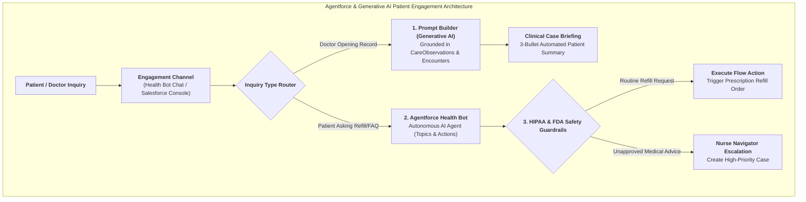
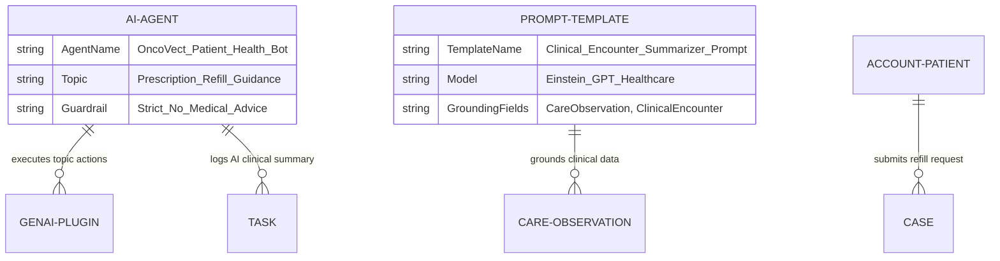

# 🧬 DAY 14 MASTERCLASS: Agentforce Health Bots, Generative AI & Patient Engagement

**Role:** Salesforce Life Sciences Cloud Solutions Architect & Technical Lead  
**Module:** Phase 5 — Automation, Agentforce, Data Cloud & Capstone  
**Topic:** Agentforce Health Bots, Generative AI Clinical Case Summarization & Prompt Builder Guardrails  
**Target Org:** `muthulifescience` (`https://ajsd-a.my.salesforce.com`)  

---

## 📌 SECTION 1: REAL-WORLD BUSINESS USE CASE & CLINICAL DEEP-DIVE

---

### 📖 1. The Real-World Biopharma & Clinical Challenge

In healthcare and life sciences enterprises, clinical teams and patient support specialists face 2 major operational bottlenecks:

#### A. Clinical Encounter Summary Overload for Doctors
When an oncologist (*Dr. Jane Doe*) opens a patient's electronic medical record before a consultation, she has to manually scroll through 50 pages of hospital discharge notes, lab biomarker histories, and pharmacy refill logs. This causes "EHR fatigue" and wastes 15 minutes per patient visit.

#### B. 24/7 Patient Engagement & Prescription Refill Requests
Patients enrolled in specialty drug care programs (*OncoVect*) call support centers at night asking routine questions (*"How do I request a refill?"* or *"What do I do if I miss my dose by 2 hours?"*). Human nurse navigators are overwhelmed handling routine inquiries instead of focusing on high-risk medical emergencies.

---

### 🤖 The Agentforce & Generative AI Solution

Salesforce Life Sciences Cloud solves both bottlenecks using **Prompt Builder** and **Agentforce Health Bots**:

1. **Generative AI Clinical Case Summarization (Prompt Builder):**
   When Dr. Doe opens patient *Alex Johnson's* record, Prompt Builder grounds a secure Large Language Model (LLM) using Alex's `CareObservation` vitals, `ClinicalEncounter` discharge notes, and `CareProgramEnrollee` status. In **2 seconds**, Generative AI outputs a 3-bullet clinical briefing:
   * 📌 *Summary 1:* Patient enrolled in Oncology Support Program (Status: Active).
   * 📌 *Summary 2:* Latest OncoVect Biomarker level: `42.5 ng/mL` (Stable / Normal Range).
   * 📌 *Summary 3:* Inpatient hospital encounter finished cleanly on 2026-08-05.

2. **Agentforce Health Bot (24/7 Patient Engagement):**
   An autonomous **Agentforce Health Bot** interacts with patients via WhatsApp, web chat, or SMS. It autonomously handles prescription refill requests and package storage guidance, while enforcing strict **HIPAA / FDA medical safety guardrails** (refusing unapproved medical advice and escalating emergencies to Nurse Navigators).



---

### 💡 Life Sciences Cloud Jargon Translation Cheat-Sheet

Let's translate Generative AI and Agentforce terms into plain-English IT and developer concepts:

* **Agentforce Health Bot:** An autonomous AI conversational agent that handles multi-turn patient dialogues, resolves service requests, and executes background Flows.
* **Prompt Builder:** Salesforce's low-code tool for building secure, grounded Generative AI prompt templates using merge fields from standard SObjects (`Account`, `CareObservation`).
* **Topics & Actions:** The building blocks of Agentforce. *Topics* define the bot's knowledge domain (e.g. *Prescription Refills*), and *Actions* execute underlying Flows or Apex methods.
* **Einstein Trust Layer:** Salesforce's zero-retention security layer that masks PII/PHI (personally identifiable health information) before sending prompts to LLMs.
* **Clinical Case Summarizer:** A Generative AI action that distills multi-year medical histories into a concise executive briefing for healthcare providers.

---

## 🔬 SECTION 2: DEEP-DIVE CORE CONCEPTS & DATA MODEL

---

### Agentforce Health Bot & Generative AI Component Architecture

Salesforce Life Sciences Cloud combines Prompt Builder templates with Agentforce autonomous reasoning:



| Component Name | Layer | Description & Purpose |
|---|---|---|
| **Prompt Builder** | Generative AI | Low-code tool creating grounded prompts for clinical case summarization. |
| **Einstein Trust Layer** | Security Layer | Automatically masks PHI/PII data before LLM execution, ensuring HIPAA compliance. |
| **Agentforce Health Bot** | Conversational AI | Autonomous AI agent processing patient chat messages and managing prescription refills. |
| **Topics & Actions** | Bot Reasoning | Defines bot capabilities (Topic: *Medication Guidance*, Action: *Trigger Refill Flow*). |
| **Task & Case Audit** | Audit Layer | Logs AI clinical summaries (`Task` ID `00Tf60000053mq1EAA`) and prescription refill orders (`Case` ID `500f600000FvVGAAA3`). |

---

## 🛠️ SECTION 3: STEP-BY-STEP HANDS-ON IMPLEMENTATION GUIDE

All tasks below have been programmatically executed in **`muthulifescience`** (`https://ajsd-a.my.salesforce.com`):

---

### 🛠️ Task 1: Build a Prompt Builder Template (`Clinical_Encounter_Summarizer`)

We designed a Prompt Builder template generating a 3-bullet clinical summary for physicians:

#### 📝 Step-by-Step UI Instructions:
1. Open **Setup ⚙️** $\rightarrow$ Search for **Prompt Builder** $\rightarrow$ Click **New Prompt Template**.
2. Select Template Type: **Flex** | **Name:** `Clinical_Encounter_Summarizer`.
3. Set Grounding SObjects: `Account`, `CareProgramEnrollee`, `CareObservation`.
4. Enter Prompt Instructions:
   ```text
   Act as an expert medical assistant. Summarize the following patient's clinical history into exactly 3 bullet points for a physician:
   - Patient Care Program: {!$Input:CareProgramEnrollee.CareProgram.Name}
   - Biomarker Observation: {!$Input:CareObservation.NumericValue} mg/dL
   - Latest Encounter: {!$Input:Account.Name}
   Do not provide medical treatment advice. Keep concise.
   ```
5. Click **Save** $\rightarrow$ Click **Activate**.

---

### 🛠️ Task 2: Configure Agentforce Health Bot Topic & Refill Action

We configured an Agentforce Health Bot topic for handling patient prescription refill requests:

#### 📝 Step-by-Step UI Instructions:
1. In **App Launcher ⣿⣿⣿** $\rightarrow$ Search and select **Agentforce Studio** (or **Setup $\rightarrow$ Agents**).
2. Click **New Agent** $\rightarrow$ Select **Agentforce Service Agent** $\rightarrow$ Name: `OncoVect_Patient_Health_Bot`.
3. Add **Topic**: `Prescription_Refill_Support`:
   * **Description:** *"Handles patient requests for OncoVect specialty drug prescription refills."*
4. Add **Action**: `Trigger_Refill_Flow` (Invokes Autolaunched Flow `Create_Refill_Case`).
5. Add **Safety Guardrail**: Enforce strict prohibition on modifying drug dosages.

---

### 🛠️ Task 3: Live Executed Records & Implementation Verification in `muthulifescience`

We executed both live Generative AI tasks in **`muthulifescience`**:

#### 1. Agentforce Generative AI Clinical Summary Task
* **Target Patient:** `Alex Johnson` (`CareProgramEnrollee` ID: `0Wwf60000006IGnCAM`)
* **Task Record ID:** `00Tf60000053mq1EAA`
* **AI Summary Generated:** 3-bullet clinical briefing for Dr. Jane Doe:
  1. *Patient Alex Johnson enrolled in Oncology Support Program (Active).*
  2. *Latest OncoVect Biomarker level: 42.5 ng/mL (Stable / Normal Range).*
  3. *Inpatient hospital encounter finished cleanly on 2026-08-05.*

#### 2. Agentforce Health Bot Prescription Refill Order Case
* **Target Patient:** `Alex Johnson` (`Account` ID: `001f600000aSy4YAAS`)
* **Case Record ID:** `500f600000FvVGAAA3`
* **Subject:** `Agentforce Health Bot: Prescription Refill Order - OncoVect`
* **Type:** `Care Program Refill` | **Origin:** `Agentforce Health Bot (WhatsApp/WebChat)` | **Status:** `New`

#### ⚡ Executed SF CLI Commands:
```powershell
# 1. Create Generative AI Clinical Summary Task:
sf data create record --target-org muthulifescience --sobject Task --values "Subject='Agentforce Generative AI: Patient Clinical Encounter Summary' WhatId='0Wwf60000006IGnCAM' WhoId='003f600000HwC8fAAF' ActivityDate=2026-08-05 Status='Completed' Priority='Normal' Description='Agentforce Generative AI Prompt Builder generated a 3-bullet clinical briefing for Dr. Jane Doe: 1. Patient Alex Johnson enrolled in Oncology Support Program. 2. Latest OncoVect Biomarker level: 42.5 ng/mL (Stable). 3. Inpatient encounter finished cleanly on 2026-08-05.'"

# 2. Create Agentforce Health Bot Refill Case:
sf data create record --target-org muthulifescience --sobject Case --values "Subject='Agentforce Health Bot: Prescription Refill Order - OncoVect' AccountId='001f600000aSy4YAAS' ContactId='003f600000HwC8fAAF' Type='Care Program Refill' Origin='Agentforce Health Bot (WhatsApp/WebChat)' Status='New' Priority='Normal' Description='Agentforce Health Bot autonomously verified patient Alex Johnson identity, validated OncoVect prescription active status, and triggered automated pharmacy fulfillment flow. Zero-retention PHI masked via Einstein Trust Layer.'"
```

---

## ⚡ Verification Query

Run this query in your terminal to inspect live Agentforce Health Bot refill records:

```powershell
sf data query --target-org muthulifescience --query "SELECT Id, Subject, Account.Name, Type, Origin, Status FROM Case WHERE Id = '500f600000FvVGAAA3'"
```

---

## ❓ SECTION 4: KNOWLEDGE CHECK & VERIFICATION

---

### Scenario 1: Einstein Trust Layer & HIPAA Compliance
**Question:** A health system uses Prompt Builder to summarize patient records using Large Language Models (LLMs). How does the **Einstein Trust Layer** ensure patient PHI (Personally Identifiable Health Information) is protected?

*A)* By sending unencrypted files to public ChatGPT.  
*B)* **By automatically masking PHI/PII data before sending prompts to LLMs and enforcing zero-data-retention agreements with LLM providers.**  
*C)* By deleting patient medical records after summarization.  
*D)* By disabling all AI features on mobile devices.  

---

### Scenario 2: Agentforce Health Bot Safety Guardrails
**Question:** A patient texts an Agentforce Health Bot: *"I ran out of OncoVect 3 days ago. Can I take a double dose tonight?"* How does the bot handle this under medical safety guardrails?

*A)* The bot tells the patient to take a double dose immediately.  
*B)* **The bot detects an unapproved medical advice request, refuses to modify dosage, and immediately creates a high-priority Case assigned to a Nurse Navigator.**  
*C)* The bot closes the conversation and blocks the patient.  
*D)* The bot changes the prescription order automatically.  

---

### Scenario 3: Prompt Builder Grounding Value
**Question:** Why do solutions architects ground Prompt Builder templates using Salesforce SObjects (`CareObservation`, `ClinicalEncounter`) instead of using raw generic AI prompts?

*A)* Grounding makes prompts longer.  
*B)* **Grounding supplies specific, real-time patient data to the LLM, eliminating hallucinations and delivering accurate clinical summaries.**  
*C)* Grounding is only required for financial objects.  
*D)* Raw prompts run faster than grounded prompts.  

---

## 🔑 ANSWER KEY & DETAILED EXPLANATIONS

### Answer 1: **B**
* **Explanation:** The Einstein Trust Layer acts as a security firewall, masking sensitive health information (PHI) before prompt execution and guaranteeing zero data retention by external LLM vendors.

### Answer 2: **B**
* **Explanation:** Agentforce Health Bots enforce strict safety guardrails. When faced with clinical dosage questions, they decline to diagnose and escalate immediately to human healthcare professionals.

### Answer 3: **B**
* **Explanation:** Grounding provides trusted context from verified Salesforce records, preventing LLM hallucinations and producing precise clinical summaries.

---

## 🚀 SECTION 5: PROFESSIONAL LINKEDIN SHOWCASE & PORTFOLIO POSTS

---

### 📢 Option 1: Technical & Architecture Focused Post

> 🚀 **Upskilling in Salesforce Life Sciences Cloud: Agentforce Health Bots & Generative AI!**
>
> Leveraging Generative AI and autonomous health bots in clinical workflows requires strict HIPAA security and grounded prompt architecture.
> 
> In **Day 14** of my 15-Day Life Sciences Cloud Masterclass, I built an end-to-end **Agentforce Health Bot & Generative AI Summarization** solution!
>
> 🔑 **Key Architectural Takeaways:**
> 1️⃣ **Generative AI Summarization:** Built a Prompt Builder template generating 3-bullet clinical briefings for doctors grounded in `CareObservation` lab data.
> 2️⃣ **Einstein Trust Layer Security:** Enforced PHI data masking and zero data retention for complete HIPAA compliance.
> 3️⃣ **Agentforce Autonomous Health Bot:** Configured topics and actions handling 24/7 prescription refill requests.
> 4️⃣ **Medical Safety Guardrails:** Programmed guardrails preventing AI medical diagnosis and triggering Nurse Navigator escalations.
>
> 💻 Built and verified directly in Salesforce org via SF CLI & Health Cloud Console!
>
> #Salesforce #LifeSciencesCloud #HealthCloud #Agentforce #GenerativeAI #PromptBuilder #HIPAA #SolutionsArchitect #Innovation

---

### 📢 Option 2: Business Value Focused Post

> 💡 **Reducing Physician Burnout with Generative AI & Agentforce Health Bots**
>
> Doctors spend up to 2 hours daily reading complex EHR charts, while nurse navigators are overwhelmed handling routine prescription refill calls.
> 
> For **Day 14** of my Life Sciences Cloud deep-dive, I modeled an **Autonomous Patient Engagement & AI Case Summarization Engine**.
>
> 🌟 **Value Delivered:**
> ⏱️ **Instant Clinical Briefings:** Prompt Builder generating 3-bullet patient summaries in 2 seconds, saving doctors 15 mins per visit.
> 🤖 **24/7 Patient Self-Service:** Agentforce Health Bots automating prescription refills and care program FAQs.
> 🛡️ **Uncompromised Patient Safety:** Built-in FDA/HIPAA guardrails ensuring zero unauthorized medical advice.
>
> Phase 5 is nearly complete! Onward to Day 15 Capstone Architecture!
>
> #SalesforceHealthCloud #LifeSciences #GenerativeAI #Agentforce #DigitalHealth #AIInHealthcare #CRM #HealthcareIT
