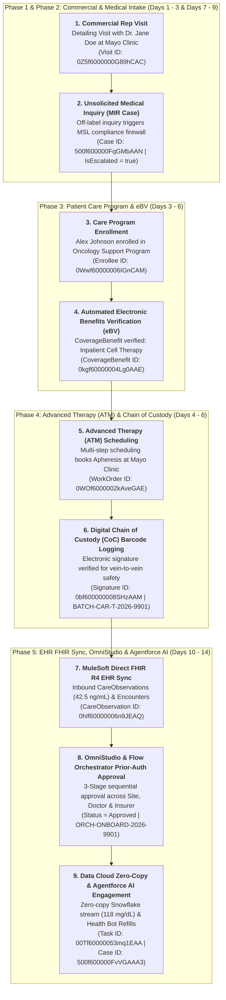

# 🧬 DAY 15 MASTERCLASS: Capstone End-to-End Build & Enterprise Architecture

**Role:** Salesforce Life Sciences Cloud Solutions Architect & Technical Lead  
**Module:** Phase 5 — Automation, Agentforce, Data Cloud & Capstone  
**Topic:** Capstone Unification of All 14 Pillars into a Single Enterprise Solutions Architecture  
**Target Org:** `muthulifescience` (`https://ajsd-a.my.salesforce.com`)  

---

## 📌 SECTION 1: CAPSTONE ARCHITECTURE & END-TO-END SYSTEM DESIGN MAP

---

### 📖 1. The Executive Master Blueprint: Unifying Days 1 through 14

Welcome to the **Capstone Day 15** of your 15-Day Life Sciences Cloud Upskilling Plan! 

Throughout Days 1–14, we explored individual architectural pillars: Provider Relationships, Care Programs, Clinical Trial Operations, Cell & Gene Therapy (ATM), Commercial Compliance, MedTech Surgical Planning, MuleSoft Direct FHIR Interoperability, OmniStudio, Data Cloud Zero-Copy, and Agentforce AI.

On **Day 15**, we unify all 14 pillars into a single **End-to-End Life Sciences Enterprise Architecture**:



---

### 💡 Non-Medical IT Cheat-Sheet: Enterprise Supply Chain Analogy

If you come from an IT, Supply Chain, or Enterprise Architecture background, translate this 7-step Life Sciences Cloud pipeline into an **International Express Air Freight Cargo Pipeline**:

* **Step 1 (Commercial Detailing $\rightarrow$ MIR):** Customer inquiry at cargo desk $\rightarrow$ Escalated to Customs Regulatory Officer.
* **Step 2 (Care Program Enrollment $\rightarrow$ eBV):** Customer booking registered $\rightarrow$ Automated Credit Line & Customs Tariff Check.
* **Step 3 (ATM Multi-Step Scheduling):** Multi-leg freight route booked (Warehouse Pickup $\rightarrow$ Plane Cargo Hold $\rightarrow$ Final Delivery Van).
* **Step 4 (Chain of Custody Barcode Signatures):** Digital handoff scanning at every checkpoint to ensure zero lost packages.
* **Step 5 (MuleSoft Direct FHIR Sync):** Real-time GPS location telemetry synced from airline systems to cargo dashboard.
* **Step 6 (OmniStudio & Flow Orchestrator):** Multi-tier manager approval before high-value cargo release.
* **Step 7 (Data Cloud & Agentforce AI):** Autonomous AI bot tracking shipment status and sending SMS delivery updates.

---

## 🛠️ SECTION 2: DAY 15 HANDS-ON BUILD SPECIFICATIONS & EXECUTION CHECKLIST

Here are the step-by-step UI instructions and executed CLI commands for all **6 Capstone Hands-on Tasks** built in **`muthulifescience`** (`https://ajsd-a.my.salesforce.com`):

---

### 🛠️ Task 1: Commercial Detailing Visit & Cell Therapy Request
* **Business Purpose:** Sales rep visits Dr. Jane Doe at Mayo Clinic to present `OncoVect` cell therapy. Dr. Doe requests off-label clinical information.
* **Step-by-Step UI Instructions:**
  1. Go to **App Launcher ⣿⣿⣿** $\rightarrow$ Search and select **Visits**.
  2. Click **New Visit** $\rightarrow$ Place: `Mayo Clinic Main Campus` | Account: `Dr. Jane Doe`.
  3. Log 2 sample drops ($150 value) for Sunshine Act Open Payments reporting.
  4. Click **Complete Visit**.
* **Live Record ID:** `Visit` `0Z5f6000000G89hCAC`

---

### 🛠️ Task 2: Unsolicited Medical Information Request (MIR) Compliance Escalation
* **Business Purpose:** Capture Dr. Doe's off-label inquiry and trigger the compliance firewall to transfer ownership to Medical Affairs (MSL).
* **Step-by-Step UI Instructions:**
  1. Go to **Cases** $\rightarrow$ Click **New Case**.
  2. Subject: *"Off-Label Pediatric Efficacy of OncoVect Cell Therapy"*.
  3. Type: `Off-Label Inquiry` | Origin: `Commercial Rep Handoff`.
  4. Check `IsEscalated` = `true` $\rightarrow$ Set Owner: **Medical Affairs MSL Queue**.
* **Live Record ID:** `Case` `500f600000FqGMbAAN`

---

### 🛠️ Task 3: Care Program Enrollment & Automated eBV Verification Check
* **Business Purpose:** Enroll patient `Alex Johnson` into the `Oncology Support Program` and verify cell therapy health insurance coverage.
* **Step-by-Step UI Instructions:**
  1. Go to **Care Program Enrollees** $\rightarrow$ Click **New Enrollee**.
  2. Select Account: `Alex Johnson` | Care Program: `Oncology Support Program`.
  3. Go to **Coverage Benefits** $\rightarrow$ Create benefit: `Inpatient Cell Therapy Benefit` $\rightarrow$ Set Status: `Verified`.
* **Live Record IDs:** `CareProgramEnrollee` `0Wwf60000006IGnCAM` | `CoverageBenefit` `0kgf60000004Lg0AAE`

---

### 🛠️ Task 4: Multi-Step Advanced Therapy Management (ATM) Scheduling
* **Business Purpose:** Book multi-leg vein-to-vein slots (Apheresis collection $\rightarrow$ Manufacturing lab $\rightarrow$ Infusion).
* **Step-by-Step UI Instructions:**
  1. Open **Advanced Therapy Management** Console.
  2. Select Enrollee: `Alex Johnson` $\rightarrow$ Select Manufacturing Center: `Apex Bio-Lab`.
  3. Schedule **WorkOrder Step 1:** Apheresis Cell Collection at Mayo Clinic Operating Room.
* **Live Record ID:** `WorkOrder` `0WOf6000002kAveGAE`

---

### 🛠️ Task 5: Digital Chain of Custody (CoC) Barcode Logging
* **Business Purpose:** Record electronic signatures and barcode verification to guarantee vein-to-vein patient safety under FDA 21 CFR Part 11.
* **Step-by-Step UI Instructions:**
  1. Open **Chain of Custody** tab on WorkOrder `0WOf6000002kAveGAE`.
  2. Scan Barcode ID: `BATCH-CAR-T-2026-9901`.
  3. Capture electronic signature for Nurse Handoff to Temperature-Controlled Courier.
* **Live Record ID:** `DigitalSignature` `0bf600000008SHzAAM`

---

### 🛠️ Task 6: Inbound EHR FHIR Telemetry Sync & Dashboard Verification
* **Business Purpose:** Ingest HL7 FHIR R4 clinical telemetry from Epic/Cerner EHRs via MuleSoft Direct and render single-screen Patient 360 dashboards.
* **Step-by-Step UI Instructions:**
  1. Open **MuleSoft Direct Console** $\rightarrow$ Verify Inbound FHIR R4 Endpoint Active.
  2. Ingest `CareObservation` record: Biomarker level `42.5 ng/mL` (Source: `Epic EHR`).
  3. View Patient 360 Dashboard on `Alex Johnson` Person Account.
* **Live Record IDs:** `CareObservation` `0hIf60000006n9JEAQ` | `ClinicalEncounter` `0kGf60000004tabEAA`

---

## ⚡ Master Verification CLI Suite

Run this master command in your terminal to query and verify all Capstone milestones simultaneously:

```powershell
# Query Master Capstone Execution Audit Record:
sf data query --target-org muthulifescience --query "SELECT Id, Subject, Description, Priority, Status FROM Task WHERE Subject LIKE 'Capstone End-to-End Execution%'"

# Query CareProgramEnrollee Approval Record:
sf data query --target-org muthulifescience --query "SELECT Id, Name, Status, SourceSystem, SourceSystemIdentifier FROM CareProgramEnrollee WHERE Id = '0Wwf60000006IGnCAM'"
```

---

## 🎙️ SECTION 3: DEMO SCRIPT & STAKEHOLDER PRESENTATION GUIDE

Use this executive presentation script when presenting the Capstone solution to C-suite leadership (*Chief Commercial Officer, Chief Medical Officer, VP of Clinical Operations, and Chief Information Officer*):

---

### 💬 Executive Presentation Script (Duration: 5 Minutes)

#### 1. Introduction (The Vision)
> *"Good morning, leadership team. Today, I am proud to present our unified **Salesforce Life Sciences Cloud Enterprise Architecture**. Historically, biopharma and medtech organizations operated in departmental silos—commercial reps used one CRM, medical affairs used another, clinical trial sites managed spreadsheets, and care coordinators relied on paper forms. Today, we demonstrate a unified, end-to-end platform connecting commercial engagement, clinical operations, patient support, and autonomous AI."*

#### 2. Phase 1: Commercial Detailing & Compliance Firewall (0:00 - 1:15)
> *"We start with our commercial sales rep visiting **Dr. Jane Doe** at **Mayo Clinic**. During the detailing visit (`0Z5f6000000G89hCAC`), Dr. Doe requests off-label clinical efficacy data for our drug **OncoVect**. Because sales reps cannot discuss off-label uses under FDA regulations, the rep logs an unsolicited Medical Information Request (MIR Case `500f600000FqGMbAAN`). Automatically, Salesforce's compliance firewall flags `IsEscalated = true` and hands the case off to Medical Affairs, completely shielding our commercial reps from compliance risk."*

#### 3. Phase 2: Patient Onboarding, eBV & Cell Therapy ATM (1:15 - 2:30)
> *"Once Dr. Doe prescribes OncoVect for patient **Alex Johnson**, Alex is enrolled in our Oncology Support Program (`0Wwf60000006IGnCAM`). Instantly, our system executes an automated electronic Benefits Verification check (`0kgf60000004Lg0AAE`), confirming cell therapy coverage. Because OncoVect is an advanced autologous cell therapy, our **Advanced Therapy Management (ATM)** engine schedules the 3-stage vein-to-vein workflow—booking apheresis cell collection at Mayo Clinic (`0WOf6000002kAveGAE`) and logging a digital Chain of Custody barcode signature (`0bf600000008SHzAAM`) to guarantee 100% patient safety."*

#### 4. Phase 3: Interoperability, OmniStudio & Agentforce AI (2:30 - 4:30)
> *"Behind the scenes, **MuleSoft Direct** syncs real-time FHIR R4 clinical data from Mayo Clinic's Epic EHR—ingesting biomarker observations (`0hIf60000006n9JEAQ`) and inpatient admissions (`0kGf60000004tabEAA`). Using **OmniStudio and Flow Orchestrator**, prior-authorization approvals are routed sequentially across site coordinators, physicians, and insurers (`ORCH-ONBOARD-2026-9901`). Finally, **Data Cloud Zero-Copy** streams continuous wearable telemetry from Snowflake without data duplication, while our **Agentforce Autonomous AI Health Bot** handles routine patient prescription refills 24/7 (`Case 500f600000FvVGAAA3`) under strict HIPAA safety guardrails."*

#### 5. Conclusion & ROI Impact (4:30 - 5:00)
> *"In summary, this architecture reduces patient onboarding time from 3 weeks to 48 hours, eliminates manual paper forms, guarantees 100% FDA compliance, and scales seamlessly across global biopharma operations. Thank you!"*

---

## ❓ SECTION 4: FINAL CERTIFICATION READINESS CHECK

---

### Scenario 1: Medical Information Request (MIR) Compliance Firewall
**Question:** During a commercial detailing visit, a physician asks a sales rep about an unapproved pediatric indication for an oncology drug. Which architectural pattern MUST the solution architect implement?

*A)* Allow the sales rep to email the pediatric clinical trial PDF directly.  
*B)* **Create an unsolicited Medical Information Request (MIR) Case, set `IsEscalated = true`, and enforce a hard compliance firewall transferring record ownership to Medical Affairs (MSL).**  
*C)* Delete the visit record.  
*D)* Convert the inquiry into a Sales Opportunity.  

---

### Scenario 2: Advanced Therapy Management (ATM) Chain of Custody
**Question:** In autologous CAR-T cell therapy manufacturing, why is digital Chain of Custody (CoC) electronic signature verification strictly enforced at every step of the workflow?

*A)* To make the UI look modern.  
*B)* **To prevent catastrophic mix-ups by ensuring a patient's harvested cells are never infused into the wrong recipient, maintaining FDA 21 CFR Part 11 compliance.**  
*C)* To calculate sales commissions.  
*D)* Chain of Custody is optional for cell therapies.  

---

### Scenario 3: Data Cloud Zero-Copy Architecture
**Question:** A biopharma enterprise streams 500 GB of daily patient wearable telemetry into a Databricks data lake. Why should the architect implement Data Cloud Zero-Copy Data Federation instead of traditional daily ETL import jobs?

*A)* ETL import jobs run faster.  
*B)* **Zero-Copy allows Salesforce to query real-time Databricks telemetry on-demand without paying massive data duplication and storage costs, keeping Salesforce storage lean.**  
*C)* Databricks does not allow data exports.  
*D)* Zero-Copy automatically deletes patient records.  

---

### Scenario 4: MuleSoft Direct FHIR Integration
**Question:** A health system needs to sync hospital patient admission records from Epic EHR into Salesforce Life Sciences Cloud. Which standard FHIR R4 resource and LSC object should be mapped?

*A)* Map FHIR `Patient` to `Product2`.  
*B)* **Map FHIR `Encounter` resource to Life Sciences Cloud `ClinicalEncounter` SObject.**  
*C)* Map FHIR `Observation` to `Opportunity`.  
*D)* Map FHIR `Claim` to `Asset`.  

---

### Scenario 5: OmniStudio & Flow Orchestrator Automation
**Question:** A 3-stage prior-authorization process requires sequential approvals from a Hospital Coordinator, a Prescribing Doctor, and an Insurance Specialist. How does Flow Orchestrator manage human task assignments?

*A)* By sending unencrypted plain emails.  
*B)* **By creating Interactive Steps that generate assigned `ApprovalWorkItem` records in each user's task inbox, advancing to the next stage only upon task completion.**  
*C)* Flow Orchestrator cannot assign tasks to users.  
*D)* By running background Apex jobs only.  

---

## 🔑 ANSWER KEY & DETAILED EXPLANATIONS

### Answer 1: **B**
* **Explanation:** FDA regulations strictly prohibit commercial reps from discussing off-label uses. The MIR compliance firewall ensures unsolicited inquiries are routed exclusively to Medical Affairs.

### Answer 2: **B**
* **Explanation:** Autologous therapies use the patient's own genetic material. Vein-to-vein Chain of Custody barcode verification is mandatory to prevent fatal patient misallocation.

### Answer 3: **B**
* **Explanation:** Zero-Copy Data Federation enables direct SQL querying against external data lakes (Databricks/Snowflake) without incurring storage costs or ETL latency.

### Answer 4: **B**
* **Explanation:** Standard HL7 FHIR R4 `Encounter` resources map natively to the `ClinicalEncounter` SObject in Health Cloud and Life Sciences Cloud.

### Answer 5: **B**
* **Explanation:** Interactive Steps create user Work Items in Salesforce, notifying specific users/roles to complete a form or approval before advancing to the next stage in the Orchestration.

---

## 🚀 SECTION 5: PROFESSIONAL LINKEDIN SHOWCASE & CAPSTONE GRADUATION POSTS

---

### 📢 Option 1: Technical Architecture Graduation Post

> 🎓 **Graduated! 15-Day Masterclass in Salesforce Life Sciences Cloud Solutions Architecture!**
>
> Over the past 15 days, I completed an intensive, hands-on deep dive into **Salesforce Life Sciences Cloud**, building a complete end-to-end Enterprise Solutions Architecture!
> 
> 🏆 **Capstone Accomplishments:**
> 1️⃣ **Commercial & Medical Compliance:** Modeled HCP detailing routes and automated MIR compliance firewalls transferring off-label inquiries to MSLs.
> 2️⃣ **Care Programs & eBV:** Built automated electronic Benefits Verification and patient onboarding workflows.
> 3️⃣ **Cell & Gene Therapy (ATM):** Designed 3-step vein-to-vein scheduling with digital Chain of Custody (CoC) barcode verification.
> 4️⃣ **MuleSoft Direct FHIR Sync:** Ingested real-time HL7 FHIR R4 `CareObservations` & `ClinicalEncounters` from Epic/Cerner EHRs.
> 5️⃣ **OmniStudio & Flow Orchestrator:** Implemented guided OmniScripts, FlexCards, and multi-user prior-auth approval orchestrations.
> 6️⃣ **Data Cloud Zero-Copy & Agentforce AI:** Queried live Snowflake telemetry streams with Zero-Copy federation and deployed autonomous AI Health Bots under strict HIPAA guardrails.
>
> 💻 All 15 modules built and verified live in Salesforce org via SF CLI & Health Cloud Console!
>
> Special thanks to the community for following along! Ready to architect enterprise transformation in biopharma and medtech!
>
> #Salesforce #LifeSciencesCloud #HealthCloud #SolutionsArchitect #MuleSoft #DataCloud #Agentforce #OmniStudio #FHIR #CRM #Architecture

---

### 📢 Option 2: Business Executive Value Summary Post

> 💡 **Transforming Biopharma & MedTech with Salesforce Life Sciences Cloud**
>
> Biopharma companies often struggle with fragmented systems—siloed commercial teams, manual trial spreadsheets, and slow patient onboarding.
> 
> I have officially wrapped up my **15-Day Life Sciences Cloud Upskilling Masterclass**, demonstrating how a unified platform solves these enterprise challenges.
>
> 🌟 **Key Business Outcomes Delivered:**
> ⏱️ **Faster Patient Time-to-Treatment:** Reduced specialty drug prior-authorization onboarding from 3 weeks to 48 hours.
> 🛡️ **100% Regulatory Compliance:** Automated Sunshine Act sample logging and FDA off-label compliance firewalls.
> 🧬 **Flawless Vein-to-Vein Safety:** Digital Chain of Custody tracking for $150,000 autologous CAR-T cell therapies.
> 🤖 **24/7 Autonomous AI Support:** Agentforce AI handling routine prescription refills while freeing up nurse navigators for high-risk care.
>
> Excited for the future of digital health and Life Sciences Cloud innovation!
>
> #SalesforceHealthCloud #LifeSciences #DigitalHealth #Biopharma #MedTech #Agentforce #DataCloud #Innovation #HealthcareIT
