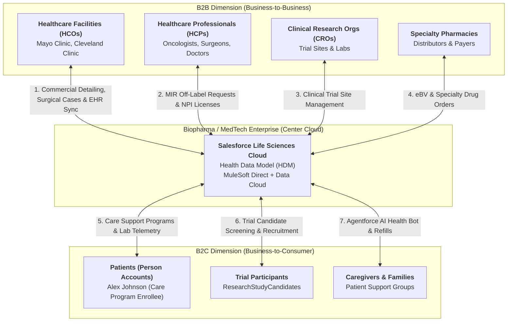

# 🧬 GENERAL QUERIES, B2B2C ARCHITECTURE & COMPARATIVE FAQ MASTERCLASS

**Role:** Salesforce Life Sciences Cloud Solutions Architect & Technical Lead  
**Module:** Platform Knowledge Base, B2B2C Architectural Framework & Enterprise Comparative FAQ  
**Target Org:** `muthulifescience` (`https://ajsd-a.my.salesforce.com`)  
**Target Repository:** [`muthuupsc2024-maker/lifescience`](https://github.com/muthuupsc2024-maker/lifescience)  

---

## 🏛️ SECTION 1: CORE CONCEPTS COMPARISON — SALES CLOUD VS SERVICE CLOUD VS FSL VS LIFE SCIENCES CLOUD

---

### 📊 Platform Core Concepts Matrix

| Feature Dimension | Sales Cloud 📈 | Service Cloud 🎧 | Field Service (FSL) 🛠️ | Life Sciences Cloud (LSC) 🧬 |
|---|---|---|---|---|
| **Core Domain Focus** | **Sales Operations** & Revenue Pipeline | **Case Handling** & Customer Support | **On-Site Service Dispatch** & Field Assets | **Patient Access, Clinical Trials & Vein-to-Vein Safety** |
| **Primary End-to-End Flow** | **Lead ➔ Opportunity ➔ Quote ➔ Contract** | **Case ➔ Entitlement ➔ Knowledge ➔ Resolution** | **WorkOrder ➔ ServiceAppointment ➔ Dispatch ➔ Completion** | **CareProgram ➔ eBV ➔ ATM Slot Booking ➔ Chain of Custody (CoC)** |
| **Primary Objects Used** | `Lead`, `Opportunity`, `Quote`, `Contract` | `Case`, `Entitlement`, `KnowledgeArticle` | `WorkOrder`, `ServiceAppointment`, `ServiceResource` | `CareProgramEnrollee`, `CoverageBenefit`, `CareObservation`, `DigitalSignature`, `ResearchStudy` |
| **Primary Persona / Role** | Account Executive, Sales Manager | Support Agent, Call Center Supervisor | Dispatcher, Mobile Field Technician | **Nurse Navigator, Clinical Investigator, MSL, MedTech Rep** |
| **Regulatory Engine** | Standard Security Rules | SLA Milestones & Entitlements | Work Type Skills & Travel Time | **FDA 21 CFR Part 11 Signatures, GxP, Sunshine Act, MIR Firewall** |
| **Data Standard** | B2B / B2C CRM Objects | Service Console & Omnichannel | Field Service Mobile App | **Health Data Model (HDM) & HL7 FHIR R4 REST Standard** |

---

## 🏢 SECTION 2: 100% MASTERY FRAMEWORK — IS LIFE SCIENCES CLOUD B2B OR B2C?

Salesforce Life Sciences Cloud is a **Hybrid B2B2C (Business-to-Business-to-Consumer) Enterprise Platform** where a Biopharma or MedTech company manages relationships with **Business Entities (Hospitals, Doctors, Pharmacies)** AND **Consumer Individuals (Patients, Clinical Trial Participants)** on a single unified data model.

---

### 1. The B2B Dimension (Business-to-Business)
* **Entities:** Biopharma/MedTech Manufacturer $\longleftrightarrow$ Healthcare Facilities (`HCO`), Physicians (`HCP`), Pharmacies, Trial Sites.
* **Scenarios:**
  * **HCP Detailing & Sunshine Act Compliance:** Sales reps detail physicians (`Dr. Jane Doe`) and log sample drop values ($150) under `Visit` for FDA Sunshine Act Open Payments reporting.
  * **Medical Affairs MIR Firewall:** Physician off-label inquiries (`Case`) trigger `IsEscalated = true` and route to MSLs, shielding sales reps from FDA violations.
  * **MedTech Surgical Case Planning:** Surgical kit bookings (`WorkOrder`) and serialized implant tracking (`Asset` UDI: `UDI-SN-2026-9871`).
  * **MuleSoft Direct EHR Integration:** Ingesting HL7 FHIR R4 lab telemetry from hospital databases (PostgreSQL, Epic, Cerner).

### 2. The B2C Dimension (Business-to-Consumer)
* **Entities:** Biopharma/MedTech Manufacturer $\longleftrightarrow$ Individual Patients (`PersonAccount`), Caregivers, Trial Candidates.
* **Scenarios:**
  * **Care Support Program Enrollment:** Enrolling patient `Alex Johnson` into the `Oncology Support Program` (`CareProgramEnrollee`).
  * **Automated Electronic Benefits Verification (eBV):** Verifying health insurance coverage (`CoverageBenefit`) in real-time.
  * **Patient 360 Telemetry Monitoring:** Ingesting blood counts (`42.5 ng/mL`) into `CareObservation`.
  * **Agentforce Autonomous AI Support:** 24/7 prescription refill bots operating under HIPAA guardrails.

### 3. The B2B2C Convergence (CAR-T Cell Therapy)
* **The B2B Part:** Coordinating scheduling across **Mayo Clinic OR (`HCO`)**, **Courier Logistics**, and **Cleanroom Plant** via `WorkOrder`.
* **The B2C Part:** Processing **Alex Johnson's (`PersonAccount`)** harvested cells for re-infusion.
* **The Convergence:** Digital **Chain of Custody (`DigitalSignature`)** links Mayo Clinic (B2B) to Alex Johnson (B2C) to guarantee 100% vein-to-vein safety under FDA 21 CFR Part 11!

---

## 🌟 SECTION 3: THE 6 SIGNATURE "SPECIAL FEATURES" OF LIFE SCIENCES CLOUD

---

### 🧬 1. Advanced Therapy Management (ATM) & Chain of Custody (CoC)
3-stage vein-to-vein slot scheduling engine coordinating apheresis collection, courier transit, and manufacturing, with mandatory **FDA 21 CFR Part 11 electronic signatures (`DigitalSignature`)** and barcode verification (`BATCH-CAR-T-2026-9901`).

### ⚡ 2. Automated Electronic Benefits Verification (eBV)
Real-time API integration with health plan payer networks to verify specialty drug insurance coverage (`CoverageBenefit`), cutting patient onboarding time from **3 weeks to 48 hours**.

### 🛡️ 3. Off-Label MIR Compliance Firewall
Regulatory firewall intercepting physician off-label drug inquiries, triggering `IsEscalated = true`, and transferring ownership to Medical Affairs (MSLs) to shield commercial reps from FDA violations.

### 🦴 4. MedTech Surgical Case Planning & UDI Tracking
Real-time tracking of serialized implantable devices (`Asset`) mapped against hospital operating room surgical cases (`WorkOrder`) for FDA Sunshine Act Open Payments compliance.

### 🌐 5. MuleSoft Direct HL7 FHIR R4 Healthcare Gateway
Out-of-the-box certified HL7 FHIR R4 connectors for Epic, Cerner, and PostgreSQL database telemetry sync (`CareObservation` & `ClinicalEncounter`).

### 🤖 6. Agentforce AI Autonomous Health Bots & Zero-Copy Federation
24/7 patient prescription refill bots operating under HIPAA guardrails, combined with Data Cloud Zero-Copy querying against Snowflake/Databricks data lakes without data duplication.

---

## 📌 SECTION 4: MASTER ARCHITECTURAL FAQ & GENERAL QUERIES

---

### Q1: What is the primary difference between Salesforce Health Cloud and Salesforce Life Sciences Cloud (LSC)?
**Answer:** Health Cloud is designed for healthcare providers (hospitals) and payers (insurance companies). Life Sciences Cloud is purpose-built for biopharma, medtech, and CROs, adding specialized capabilities like Advanced Therapy Management (ATM), Clinical Trial Operations, MIR Compliance Firewalls, and MedTech UDI Tracking.

---

### Q2: How does LSC model Patients versus Healthcare Professionals (HCPs)?
**Answer:** Patients (`Alex Johnson`) are modeled using **Person Accounts**. HCPs (`Dr. Jane Doe`) are modeled as Contacts / Person Accounts linked to `HealthcareProvider` records with NPI validation, while facilities (`Mayo Clinic`) are modeled as `HealthcareFacility` accounts.

---

### Q3: Why is there a hard compliance firewall separating Commercial Reps from Medical Science Liaisons (MSLs)?
**Answer:** FDA law prohibits commercial sales reps from discussing off-label drug uses. When an off-label question occurs, LSC logs an MIR Case, sets `IsEscalated = true`, and transfers ownership to Medical Affairs (MSL), locking out commercial reps to prevent regulatory violations.

---

### Q4: How does LSC ensure compliance with the FDA Sunshine Act (Open Payments)?
**Answer:** Transfers of value (drug samples, meals, $150 value) logged during HCP visits (`Visit`) are aggregated against provider NPI numbers for federal Sunshine Act Open Payments reporting.

---

### Q5: How does MedTech Surgical Planning track serialized implantable devices?
**Answer:** Implanted medical devices are tracked using the `Asset` object with Unique Device Identifier (**UDI**) serial numbers (`UDI-SN-2026-9871`). Barcode scans in the OR update asset status to `Implanted`, triggering FDA compliance logging and automatic inventory replenishment.

---

### Q6: What is a Care Support Program, and how are patients enrolled?
**Answer:** Biopharma companies run Care Support Programs (`CareProgram`) to assist patients with financial aid and nurse navigation. Patients are enrolled by creating a `CareProgramEnrollee` record linked to their Person Account.

---

### Q7: How does automated eBV accelerate patient time-to-treatment?
**Answer:** LSC executes automated eBV API calls against payer endpoints, verifying coverage (`CoverageBenefit`) and prior-authorization criteria in real-time, reducing onboarding time from **3 weeks to 48 hours**.

---

### Q8: How do OmniStudio and Flow Orchestrator automate prior-authorization approvals?
**Answer:** OmniStudio provides guided UI forms (`OmniScripts`), while Flow Orchestrator manages multi-user approval processes by generating sequential `ApprovalWorkItem` tasks for doctors, site coordinators, and insurers.

---

### Q9: How does LSC manage Clinical Trial Sites and Investigators?
**Answer:** Sponsors manage trials (`ResearchStudy`) across global sites (`HealthcareFacility`), tracking feasibility surveys, investigator qualifications (`HealthcareProvider`), and IRB approvals.

---

### Q10: How does Actionable Segmentation improve clinical trial recruitment?
**Answer:** Filters electronic health records to match patient cohorts against inclusion/exclusion criteria, converting candidates into `ResearchStudyCandidate` records for PI screening.

---

### Q11: What is Advanced Therapy Management (ATM), and why is scheduling complex?
**Answer:** ATM manages autologous Cell & Gene Therapies (CAR-T), coordinating multi-leg scheduling across hospital apheresis collection, cryogenic transit, and cleanroom manufacturing slots (`WorkOrder`).

---

### Q12: Why is digital Chain of Custody (CoC) barcode logging legally mandated under FDA 21 CFR Part 11?
**Answer:** Infusing one patient's harvested cells into another is fatal. Chain of Custody enforces barcode scanning (`BATCH-CAR-T-2026-9901`) and dual electronic signatures (`DigitalSignature`) at every handoff checkpoint from vein to vein.

---

### Q13: How does MuleSoft Direct ingest HL7 FHIR R4 clinical data into Salesforce LSC?
**Answer:** MuleSoft Direct parses FHIR R4 JSON payloads from hospital EHRs or PostgreSQL database tables and uses DataWeave 2.0 to transform them into `CareObservation` (lab biomarkers) and `ClinicalEncounter` (ER admissions) SObjects.

---

### Q14: How does the automated PostgreSQL `sync_status` pipeline work?
**Answer:** MuleSoft polls PostgreSQL for rows with `sync_status = 'NEW'`, transforms payloads, creates target Salesforce records (`CareObservation`, `ClinicalEncounter`, `WorkOrder`, `CareProgramEnrollee`), and updates PostgreSQL to `sync_status = 'PROCESSED'`, preventing duplicate record creation.

---

### Q15: What is Data Cloud Zero-Copy Data Federation?
**Answer:** Zero-Copy queries patient telemetry directly from external data lakes (Snowflake / Databricks) via SQL federation without importing, duplicating, or paying storage costs in Salesforce.

---

### Q16: How does Agentforce AI operate under HIPAA safety guardrails?
**Answer:** Agentforce AI uses Grounded Prompt Builder Templates linked strictly to FDA-approved medical dossiers (`DOSSIER-ONCO-2026`), handling routine prescription refills (`Case`) 24/7 under strict HIPAA data privacy rules.

---

📄 **Document Saved Local:** `c:\Users\Admin\Desktop\lifescience\muthulifescience\documentation\general_queries_and_architectural_faq_masterclass.md`  
🐙 **GitHub Sync:** [`muthuupsc2024-maker/lifescience`](https://github.com/muthuupsc2024-maker/lifescience)
