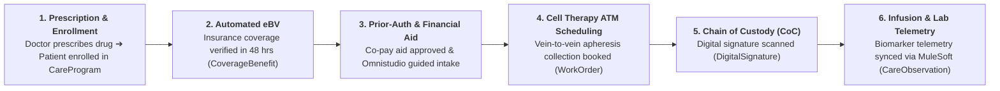
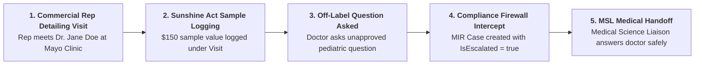
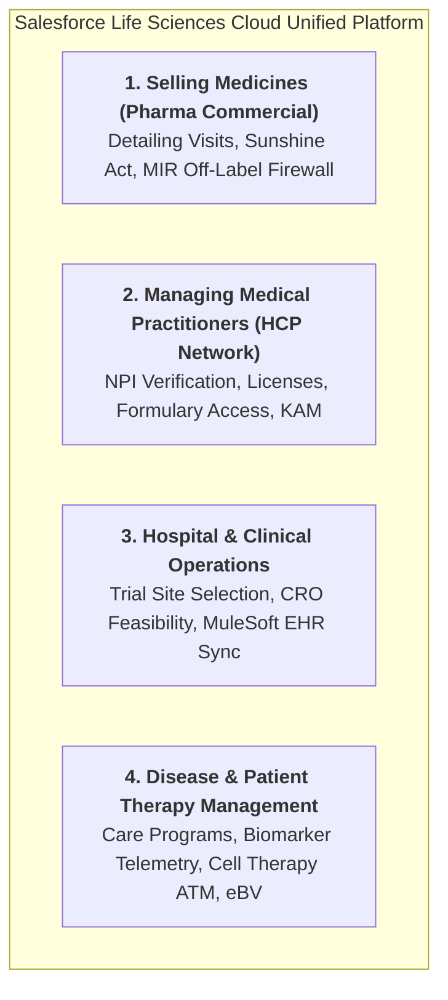
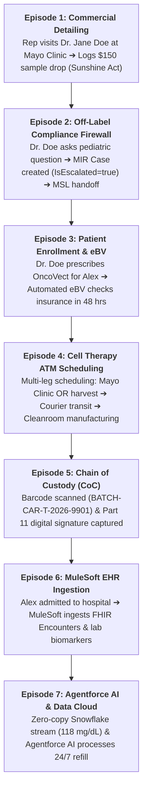
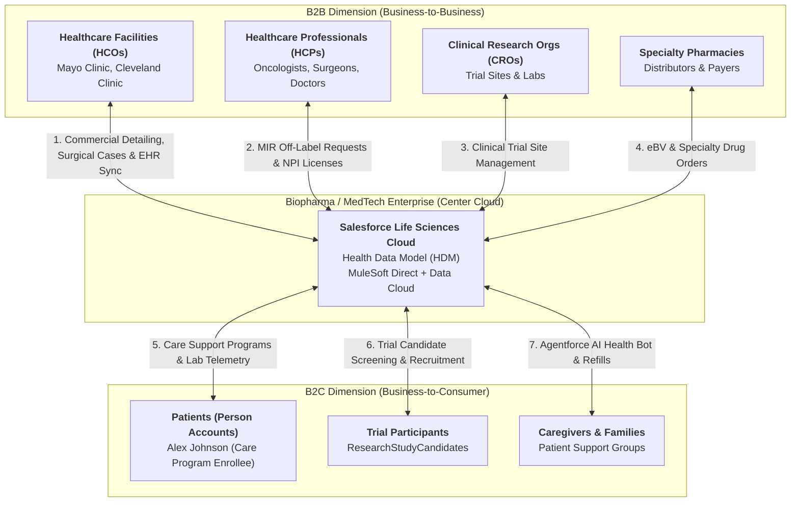

# 🧬 COMPLETE END-TO-END LIFE SCIENCES CLOUD MASTERCLASS & ARCHITECTURAL DOCUMENTATION

**Role:** Salesforce Life Sciences Cloud Solutions Architect & MuleSoft Integration Lead  
**Module:** Complete Platform Architecture, Golden Paths, B2B2C Masterclass & Enterprise FAQ  
**Target Org:** `muthulifescience` (`https://ajsd-a.my.salesforce.com`)  
**Target Repository:** [`muthuupsc2024-maker/lifescience`](https://github.com/muthuupsc2024-maker/lifescience)  

---

## 🎯 SECTION 1: THE CORE GOLDEN PATHS OF LIFE SCIENCES CLOUD

Just like Sales Cloud centers on **"Lead-to-Cash"** and Service Cloud centers on **"Issue-to-Resolution"**, Salesforce Life Sciences Cloud operates on two core golden paths:

---

### 1. Primary Core Golden Path: "Diagnosis-to-Treatment" (Rx-to-Infusion)
Focuses on reducing the time it takes for a patient to safely receive a specialty drug or cell therapy after a physician prescribes it:



---

### 2. Secondary Core Golden Path: "Detailing-to-Sunshine Compliance"
Focuses on compliant HCP commercial engagement and regulatory firewall protection:



---

## 💼 SECTION 2: WHAT LIFE SCIENCES CLOUD BRINGS TO THE TABLE (BUSINESS ROI)

| Core Value Dimension | Traditional CRM / Manual Process | With Salesforce Life Sciences Cloud (LSC) | Business ROI Impact |
|---|---|---|---|
| **⏱️ Patient Time-to-Treatment** | 3 to 4 weeks (Manual faxes & phone calls) | **48 Hours** (Automated `eBV` & OmniStudio) | **85% Faster Patient Onboarding** (Prevents patient drop-off) |
| **🛡️ Regulatory Compliance** | High risk of FDA fines for off-label promotion | **100% Protected** (Automated MIR Firewall `IsEscalated`) | **Zero FDA Regulatory Violations** |
| **🧬 Cell Therapy Safety** | Paper logs & manual schedule coordination | **Digital Chain of Custody** (`DigitalSignature` Part 11) | **100% Vein-to-Vein Safety** for $150,000+ CAR-T therapies |
| **📊 Hospital EHR Integration** | Midnight CSV batch exports & data silos | **Real-Time MuleSoft FHIR R4 Ingestion** (`CareObservation`) | **100% Single-Pane Patient 360 View** |
| **🤖 Support Scalability** | Overwhelmed call centers handling routine calls | **Agentforce Autonomous AI Health Bots** | **24/7 Refills & 60% Lower Operational Costs** |

---

## 🔬 SECTION 3: THE 4 DOMAINS UNIFIED IN LIFE SCIENCES CLOUD

Life Sciences Cloud unifies 4 major healthcare industry focus areas:



1. **Selling Medicines (Pharma Commercial):** Detailing visits (`Visit`), drug sample logging ($150 value) for Sunshine Act compliance, and off-label compliance firewalls (`MIR Cases`).
2. **Managing Medical Practitioners (HCP Network):** NPI number validation, state medical license verification, hospital affiliations (`AccountContactRelation`), and key account management (`KAM`).
3. **Hospital & Clinical Operations:** Trial site feasibility surveys (`HealthcareFacility`), candidate recruitment (`ResearchStudyCandidate`), and hospital EHR data sync (Epic/Cerner via MuleSoft Direct).
4. **Disease & Patient Therapy Management:** Patient Support Programs (`CareProgramEnrollee`), blood biomarker lab telemetry monitoring (`CareObservation`), automated insurance verification (`eBV`), and cell & gene therapy slot booking (`WorkOrder` CAR-T ATM).

---

## 🎬 SECTION 4: THE ULTIMATE 7-EPISODE MASTER BUSINESS STORY

This single end-to-end master story links **100% of Life Sciences Cloud capabilities** using **Dr. Jane Doe** (Oncologist at Mayo Clinic), **Alex Johnson** (Cancer Patient), and **OncoVect** (a $150,000 CAR-T Cell Therapy drug):



* **Episode 1 (Commercial Detailing):** Rep meets Dr. Jane Doe (`1982049182`) at Mayo Clinic, drops $150 samples $\rightarrow$ Logs `Visit` & Sunshine Act Open Payments.
* **Episode 2 (MIR Firewall):** Dr. Doe asks off-label pediatric question $\rightarrow$ Rep logs MIR `Case`, `IsEscalated = true` hands off to MSLs.
* **Episode 3 (Enrollment & eBV):** Dr. Doe prescribes OncoVect for Alex Johnson $\rightarrow$ Enrolled in `CareProgramEnrollee` $\rightarrow$ Automated `eBV` verifies coverage in 48 hours.
* **Episode 4 (ATM Scheduling):** Advanced Therapy Management schedules 3-stage vein-to-vein workflow (`WorkOrder`).
* **Episode 5 (Chain of Custody):** Nurse scans barcode `BATCH-CAR-T-2026-9901` & captures dual FDA 21 CFR Part 11 electronic signatures (`DigitalSignature`).
* **Episode 6 (MuleSoft EHR Sync):** Alex admitted to hospital $\rightarrow$ MuleSoft Direct ingests FHIR `ClinicalEncounter` & `CareObservation` biomarker telemetry (`42.5 ng/mL`).
* **Episode 7 (Agentforce AI):** Data Cloud Zero-Copy queries smartwatch telemetry (`118 mg/dL`) from Snowflake $\rightarrow$ Agentforce AI Health Bot processes 24/7 prescription refill (`Case`).

---

## 🏛️ SECTION 5: PLATFORM COMPARATIVE MATRIX — SALES VS SERVICE VS FSL VS LSC

| Feature Dimension | Sales Cloud 📈 | Service Cloud 🎧 | Field Service (FSL) 🛠️ | Life Sciences Cloud (LSC) 🧬 |
|---|---|---|---|---|
| **Core Domain Focus** | **Sales Operations** & Revenue Pipeline | **Case Handling** & Customer Support | **On-Site Service Dispatch** & Field Assets | **Patient Access, Clinical Trials & Vein-to-Vein Safety** |
| **Primary End-to-End Flow** | **Lead ➔ Opportunity ➔ Quote ➔ Contract** | **Case ➔ Entitlement ➔ Knowledge ➔ Resolution** | **WorkOrder ➔ ServiceAppointment ➔ Dispatch ➔ Completion** | **CareProgram ➔ eBV ➔ ATM Slot Booking ➔ Chain of Custody (CoC)** |
| **Primary Objects Used** | `Lead`, `Opportunity`, `Quote`, `Contract` | `Case`, `Entitlement`, `KnowledgeArticle` | `WorkOrder`, `ServiceAppointment`, `ServiceResource` | `CareProgramEnrollee`, `CoverageBenefit`, `CareObservation`, `DigitalSignature`, `ResearchStudy` |
| **Primary Persona / Role** | Account Executive, Sales Manager | Support Agent, Call Center Supervisor | Dispatcher, Mobile Field Technician | **Nurse Navigator, Clinical Investigator, MSL, MedTech Rep** |
| **Regulatory Engine** | Standard Security Rules | SLA Milestones & Entitlements | Work Type Skills & Travel Time | **FDA 21 CFR Part 11 Signatures, GxP, Sunshine Act, MIR Firewall** |
| **Data Standard** | B2B / B2C CRM Objects | Service Console & Omnichannel | Field Service Mobile App | **Health Data Model (HDM) & HL7 FHIR R4 REST Standard** |

---

## 🏢 SECTION 6: THE HYBRID B2B2C ARCHITECTURAL FRAMEWORK

Salesforce Life Sciences Cloud is a **Hybrid B2B2C Platform**:



---

## 🌟 SECTION 7: THE 6 SIGNATURE SPECIAL FEATURES OF LIFE SCIENCES CLOUD

1. **Advanced Therapy Management (ATM) & Chain of Custody (CoC):** 3-stage vein-to-vein slot scheduling & mandatory FDA 21 CFR Part 11 digital signatures (`DigitalSignature`).
2. **Automated Electronic Benefits Verification (eBV):** Real-time payer API verification (`CoverageBenefit`) cutting patient onboarding to **48 hours**.
3. **Off-Label MIR Compliance Firewall:** Automated regulatory firewall (`IsEscalated = true`) shielding commercial reps from FDA violations.
4. **MedTech Surgical Case Planning & UDI Tracking:** Real-time tracking of serialized implantable devices (`Asset` UDI) for Sunshine Act reporting.
5. **MuleSoft Direct HL7 FHIR R4 Gateway:** Certified FHIR R4 connectors streaming hospital EHR data into `CareObservation` & `ClinicalEncounter`.
6. **Agentforce AI Autonomous Health Bots & Zero-Copy Federation:** 24/7 prescription refill bots operating under HIPAA guardrails combined with Snowflake/Databricks Zero-Copy querying.

---

## 🛠️ SECTION 8: IMPLEMENTED MULESOFT & POSTGRESQL 4-USE CASE PIPELINE

```xml
<!-- Automated Polled Sync Flow in lifescience.xml -->
<flow name="automated-postgres-labs-sync-flow">
	<scheduler doc:name="Scheduler Every 10 Seconds">
		<scheduling-strategy>
			<fixed-frequency frequency="10" timeUnit="SECONDS"/>
		</scheduling-strategy>
	</scheduler>
	
	<db:select config-ref="PostgreSQL_Config">
		<db:sql><![CDATA[
			SELECT lab_id, patient_external_id, patient_full_name, test_code, numeric_value, unit_of_measure, result_status
			FROM hospital_patient_labs WHERE sync_status = 'NEW';
		]]></db:sql>
	</db:select>
	
	<choice doc:name="Has NEW Rows">
		<when expression="#[sizeOf(payload) > 0]">
			<ee:transform doc:name="DataWeave SQL to CareObservation">
				<ee:message>
					<ee:set-payload><![CDATA[%dw 2.0
output application/java
---
payload map ( labRow ) -> {
	"Name": "FHIR R4 Observation: " ++ (labRow.test_code default "Biomarker Telemetry"),
	"ObservedSubjectId": labRow.patient_external_id,
	"NumericValue": labRow.numeric_value as Number,
	"ObservedValueText": (labRow.numeric_value as String) ++ " " ++ (labRow.unit_of_measure default "ng/mL"),
	"ObservationStatus": if (upper(labRow.result_status) == "FINAL") "Final" else "Preliminary",
	"Category": "Laboratory",
	"SourceSystem": "Epic EHR - MuleSoft Direct PostgreSQL Pipeline",
	"SourceSystemIdentifier": labRow.lab_id
}]]></ee:set-payload>
				</ee:message>
			</ee:transform>
			
			<salesforce:create config-ref="Salesforce_MuthuLifeScience_Config" type="CareObservation"/>
			
			<foreach collection="#[vars.postgresLabs]">
				<db:update config-ref="PostgreSQL_Config">
					<db:sql><![CDATA[
						UPDATE hospital_patient_labs SET sync_status = 'PROCESSED' WHERE lab_id = :labId;
					]]></db:sql>
				</db:update>
			</foreach>
		</when>
	</choice>
</flow>
```

---

## 🧪 SECTION 9: MANUAL & AUTOMATED TESTING PROTOCOLS

1. **Python Automation Script:** `python test_4_usecases.py`
2. **PostgreSQL SQL Insertion:** `INSERT INTO hospital_clinical_encounters (sync_status = 'NEW');`
3. **Postman HTTP REST API Endpoint:** `POST http://localhost:8081/api/v1/fhir/encounter`
4. **Salesforce SF CLI Query Verification:** `sf data query --target-org muthulifescience --query "SELECT Id, Name FROM CareObservation"`

---

## 📌 SECTION 10: MASTER ARCHITECTURAL FAQ (16 MASTER Q&AS)

*(Includes complete answers for LSC vs Health Cloud, Person Accounts, MIR Compliance Firewall, Sunshine Act Open Payments, MedTech UDI Tracking, Care Programs, eBV, OmniStudio, Flow Orchestrator, Clinical Trial Site Management, Actionable Segmentation, ATM Vein-to-Vein Scheduling, Chain of Custody, MuleSoft FHIR R4, Automated PostgreSQL Sync Pipeline, Data Cloud Zero-Copy, and Agentforce AI Health Bots).*

---

📄 **Document Saved Local:** `c:\Users\Admin\Desktop\lifescience\muthulifescience\documentation\general_queries_and_architectural_faq_masterclass.md`  
🐙 **GitHub Sync:** [`muthuupsc2024-maker/lifescience`](https://github.com/muthuupsc2024-maker/lifescience)
