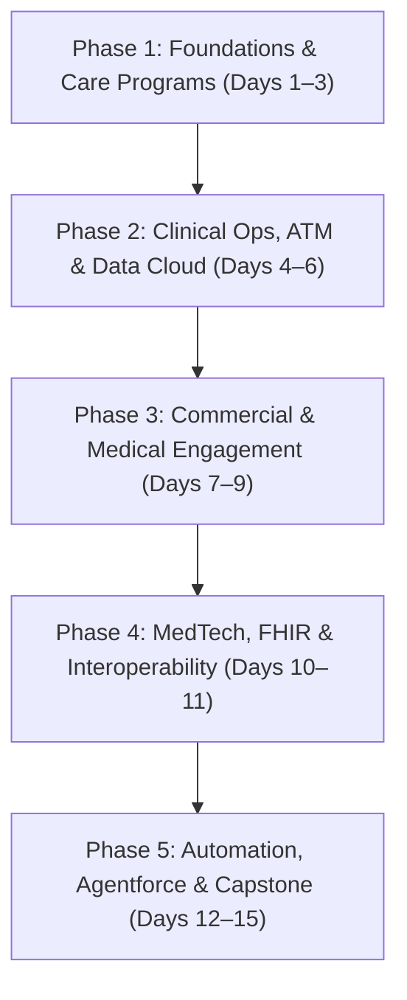

# 🧬 Salesforce Life Sciences Cloud (LSC) & Data Cloud 15-Day Master Learning Plan

This document provides complete, structured documentation for the **15-Day Life Sciences Cloud & Data Cloud Learning Plan** uploaded in `life science cloud.xlsx`.

---

## 🎯 Program Overview & Curriculum Roadmap

The 15-day learning journey is divided into **5 strategic phases**, taking you from foundational data models and care programs to clinical operations, commercial compliance, MedTech FHIR interoperability, and AI Agentforce integration with Data Cloud.

---

## 🗓️ Phase 1: Foundations, Core Health & Care Programs

### Day 1: Life Sciences Cloud Architecture & Data Models
* **Core Concepts:**
  * Life Sciences Cloud (LSC) architecture & FHIR-aligned data model.
  * Key Industry Personas: CRA (Clinical Research Associate), Site Coordinator, MSL (Medical Science Liaison), Medical Rep, Care Coordinator.
  * Essential Objects: `Account` (HCO), `Person Account` (HCP / Patient), `CareProgram`, `CareProgramCandidate`.
* **Hands-on Exercises:**
  1. Enable Life Sciences Cloud in your Developer/Enterprise Org.
  2. Map Person Account model for HCPs and Patients in Schema Builder.
  3. Configure Account Record Types (*Hospitals/HCOs vs. Specialty Clinics*).
  4. Build an end-to-end Person Account record with clinical identifiers.
* **References:**
  * [Salesforce Help: Life Sciences Overview](https://help.salesforce.com)
  * [Trailhead: Life Sciences Cloud Basics](https://trailhead.salesforce.com)

---

### Day 2: Provider Relationships & Network Management
* **Core Concepts:**
  * Provider Data Model: `HealthcareProvider`, `HealthcareFacility`, `ProviderSpecialty`, `FacilityNetwork`, `License/Accreditation`.
  * Account Hierarchy & Provider Search engine setup.
* **Hands-on Exercises:**
  1. Create 3 Healthcare Facilities.
  2. Register 5 Healthcare Providers (HCPs) with specialties & NPI numbers.
  3. Map provider facility affiliations and practitioner roles.
  4. Configure and test the Provider Search engine.
* **References:**
  * [Salesforce Help: Provider Data Model](https://help.salesforce.com)
  * [Trailhead: Provider Relationship Management](https://trailhead.salesforce.com)

---

### Day 3: Care Programs, Onboarding & Electronic Benefits Verification (eBV)
* **Core Concepts:**
  * `CareProgram`, `CareProgramEnrollee`, `CareProgramProduct`.
  * Patient consent models & electronic Benefits Verification (eBV) data model (`CareBenefitVerifyRequest`, `CoverageBenefit`), co-pay support.
* **Hands-on Exercises:**
  1. Build a 'Patient Support Program' Care Program.
  2. Link products and configure patient electronic consent capture.
  3. Configure an eBV request flow using standard Benefits Verification objects.
  4. Test real-time eligibility check simulation.
* **References:**
  * [Salesforce Help: Care Program Management](https://help.salesforce.com)
  * [Salesforce Help: Connect to Benefits Verification Service](https://help.salesforce.com)

---

## 🔬 Phase 2: Clinical Operations, Advanced Therapy Management & Data Cloud

### Day 4: Clinical Trial Site & Investigator Management
* **Core Concepts:**
  * `ClinicalStudy`, `ClinicalStudySite`, `ResearchStudyCandidate`, `Investigator`.
  * Feasibility Assessments & Protocol Management.
* **Hands-on Exercises:**
  1. Create a `ClinicalStudy` record with study phases (Phase I–III).
  2. Assign 3 Clinical Study Sites (Research Hospitals).
  3. Link Principal Investigators (HCPs) to study sites.
  4. Build a custom Flow to track site feasibility scoring.
* **References:**
  * [Salesforce Help: Clinical Trial Management](https://help.salesforce.com)
  * [Trailhead: Clinical Operations Overview](https://trailhead.salesforce.com)

---

### Day 5: Participant Recruitment & Actionable Segmentation
* **Core Concepts:**
  * Actionable Lists, Candidate Screening, Participant Recruitment.
  * Eligibility Criteria & Actionable Segmentation for Clinical Trials.
* **Hands-on Exercises:**
  1. Build an Actionable List for trial candidates based on diagnosis.
  2. Configure a candidate screening questionnaire flow.
  3. Execute participant recruitment status transitions (*Screened → Eligible → Enrolled*).
* **References:**
  * [Salesforce Help: Participant Recruitment](https://help.salesforce.com)
  * [Trailhead: Actionable Segmentation](https://trailhead.salesforce.com)

---

### Day 6: Advanced Therapy Management (ATM) & Chain of Custody
* **Core Concepts:**
  * Cell & Gene Therapy (CGT) workflows.
  * Multi-Step Scheduling (*Apheresis → Manufacturing → Infusion*).
  * Chain of Custody (`CustodyItem`, `CustodyChainEntry`) & Electronic Signatures.
* **Hands-on Exercises:**
  1. Configure Advanced Therapy Management multi-step scheduling.
  2. Set up Service Territory relationships for apheresis and manufacturing sites.
  3. Execute a Chain of Custody workflow requiring electronic signature verification at each custody transfer point.
* **References:**
  * [Salesforce Help: Advanced Therapy Management](https://help.salesforce.com)
  * [Developer Guide: ATM Data Model](https://developer.salesforce.com)

---

## 💼 Phase 3: Commercial, Medical Engagement & Compliance

### Day 7: Commercial Engagement, Call Planning & Multi-Country Compliance
* **Core Concepts:**
  * Life Sciences Customer Engagement App.
  * Territory Management, Call Planning, HCP Interactions, Sample Management.
  * Multi-country sample compliance & Sunshine Act tracking.
* **Hands-on Exercises:**
  1. Set up Commercial Territory Hierarchy (*Region → Territory → Rep*).
  2. Plan a multi-stop HCP Visit Route for a Medical Sales Rep.
  3. Log an HCP Call with sample distribution details.
  4. Build aggregate financial reporting for Physician Payments Sunshine Act compliance.
* **References:**
  * [Salesforce Help: Customer Engagement](https://help.salesforce.com)
  * [Trailhead: Commercial Operations](https://trailhead.salesforce.com)

---

### Day 8: Medical Information Requests (MIR) & Inquiries
* **Core Concepts:**
  * `MedicalInquiry` object & MIR lifecycle.
  * Medical Science Liaison (MSL) routing rules.
  * Adverse Event (AE) intake vs. Medical Inquiry governance.
* **Hands-on Exercises:**
  1. Build an automated intake Flow for HCP Medical Inquiries.
  2. Configure escalation routing to assign complex queries to MSLs.
  3. Create standard response templates for medical queries.
  4. Test logging an off-label query with regulatory compliance restrictions.
* **References:**
  * [Salesforce Help: Medical Inquiries](https://help.salesforce.com)
  * [Trailhead: Medical Affairs Management](https://trailhead.salesforce.com)

---

### Day 9: Key Account Management (KAM) & Account Plans
* **Core Concepts:**
  * Key Account Management (KAM), `AccountPlan`, `AccountPlanProduct`, `AccountPlanStakeholder`.
  * Strategic Objectives & Action Plans.
* **Hands-on Exercises:**
  1. Build an Account Plan for a major Hospital System.
  2. Map key Stakeholders (Chief Medical Officer, Procurement) to the plan.
  3. Create Action Plans with associated task items and target completion dates.
* **References:**
  * [Salesforce Help: Key Account Management](https://help.salesforce.com)
  * [Trailhead: Key Account Management in LSC](https://trailhead.salesforce.com)

---

## 🏥 Phase 4: MedTech, Interoperability & Integration Architecture

### Day 10: MedTech Commercial & Surgical Planning
* **Core Concepts:**
  * Medical Device Serial Tracking, Consignment Inventory.
  * Advanced Field Service integration for MedTech, Operating Room (OR) Surgical Cases.
* **Hands-on Exercises:**
  1. Set up Medical Device Serial Number Tracking.
  2. Build a Surgical Case record linking Surgeon, Hospital, and required Implant Kits.
  3. Create inventory transfer records for consignment stock.
* **References:**
  * [Salesforce Help: MedTech Management](https://help.salesforce.com)
  * [Trailhead: MedTech Solutions](https://trailhead.salesforce.com)

---

### Day 11: MuleSoft Direct, FHIR Standards & EHR Interoperability
* **Core Concepts:**
  * MuleSoft Direct connectors for Healthcare.
  * FHIR R4 standard alignment & HL7 v2/v3 message structures.
  * Connecting EHR systems (Epic, Cerner) to Life Sciences Cloud.
* **Hands-on Exercises:**
  1. Map standard LSC fields to FHIR R4 Patient/Observation resources.
  2. Configure a MuleSoft Direct connector endpoint for inbound clinical data.
  3. Build a Flow handling inbound FHIR payload processing into LSC records.
* **References:**
  * [Salesforce Help: MuleSoft Direct for Health](https://help.salesforce.com)
  * [Developer Guide: FHIR Alignment](https://developer.salesforce.com)

---

## ⚡ Phase 5: Automation, Agentforce, Data Cloud & Capstone

### Day 12: Advanced Automation & OmniStudio
* **Core Concepts:**
  * Flow Orchestration for multi-stakeholder approvals.
  * OmniStudio (OmniScripts, DataRaptors/Data Mappers, FlexCards) for guided clinical & healthcare forms.
* **Hands-on Exercises:**
  1. Build an OmniScript for HCP digital onboarding.
  2. Build a Flow Orchestrator process involving Patient, Doctor, and Insurance Approval.
  3. Deploy FlexCards displaying patient trial history in the console.
* **References:**
  * [Salesforce Help: OmniStudio for Health](https://help.salesforce.com)
  * [Trailhead: OmniStudio Basics](https://trailhead.salesforce.com)

---

### Day 13: Agentforce, Data Cloud & Analytics
* **Core Concepts:**
  * Agentforce AI for Life Sciences.
  * Data Cloud Zero-Copy Integration for real-time telemetry.
  * Patient FAQs & CRM Analytics for Life Sciences.
* **Hands-on Exercises:**
  1. Configure Data Cloud Zero-Copy data ingestion for patient telemetry.
  2. Set up an Agentforce AI action for answering patient FAQs.
  3. Build a Trial Recruitment & Commercial Analytics Dashboard.
* **References:**
  * [Salesforce Help: Agentforce Life Sciences](https://help.salesforce.com)
  * [Salesforce Help: Data Cloud Zero-Copy](https://help.salesforce.com)

---

### Day 14: Security, Permission Sets & Governance
* **Core Concepts:**
  * LSC Permission Sets (`Clinical Admin`, `Commercial Rep`, `MSL`, `Patient Coordinator`).
  * Field-Level Security for Protected Health Information (PHI / HIPAA compliance) & Audit Trails.
* **Hands-on Exercises:**
  1. Configure Permission Sets for MSLs vs. Commercial Sales Reps.
  2. Enforce Field-Level Security to mask sensitive PHI.
  3. Audit Sharing Rules across different clinical study sites.
* **References:**
  * [Salesforce Help: Life Sciences Security](https://help.salesforce.com)
  * [Trailhead: Health Data Security & Privacy](https://trailhead.salesforce.com)

---

### Day 15: Capstone End-to-End Build & Demo
* **Core Concepts:**
  * Full integration of all 5 pillars:
    `Commercial HCP Visit` → `Medical Inquiry` → `Cell/Gene Therapy ATM Orchestration with Chain of Custody` → `eBV Check` → `EHR FHIR Integration Sync`.
* **Hands-on Exercises:**
  * **Capstone Project:** Build an End-to-End Cell & Gene Therapy & Support Ecosystem:
    1. HCP logs request for Cell Therapy.
    2. Real-time eBV verification is completed.
    3. Multi-step ATM scheduling books Apheresis & Manufacturing.
    4. Chain of Custody is logged with e-signatures.
    5. Inbound FHIR telemetry is synced into Data Cloud & LSC.
  * **Final Deliverable:** Full End-to-End Live Demo & Architecture Review.
* **References:**
  * [Salesforce Help: Life Sciences Guide](https://help.salesforce.com)
  * [Trailhead: Life Sciences Cloud Superbadge](https://trailhead.salesforce.com)

---

## 📌 Summary Table

| Phase | Days | Focus Area | Primary Salesforce Features |
|---|---|---|---|
| **Phase 1** | Days 1–3 | Foundations, Core Health & Care Programs | Person Accounts, Provider Search, Care Programs, eBV |
| **Phase 2** | Days 4–6 | Clinical Ops, ATM & Data Cloud | Clinical Studies, Participant Recruitment, Advanced Therapy Management, Chain of Custody |
| **Phase 3** | Days 7–9 | Commercial, Medical & Compliance | Commercial Territory, Medical Inquiries (MIR), Sunshine Act, Key Account Management |
| **Phase 4** | Days 10–11 | MedTech, Interoperability & Integration | Surgical Planning, Device Tracking, MuleSoft Direct, FHIR R4 Alignment |
| **Phase 5** | Days 12–15 | Automation, Agentforce, Security & Capstone | OmniStudio, Agentforce AI, Data Cloud Zero-Copy, PHI Security, E2E CGT Capstone |
