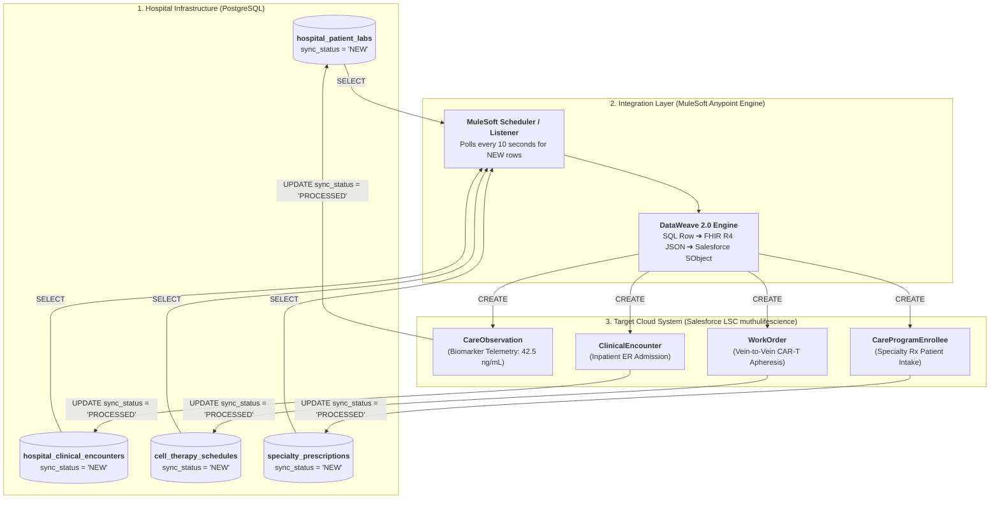

# 🧬 MASTERCLASS ARCHITECTURE: Automated MuleSoft PostgreSQL ➔ Salesforce Life Sciences Cloud 4-Business Use Case Pipeline

**Role:** Salesforce Life Sciences Cloud Solutions Architect & MuleSoft Integration Lead  
**Module:** Interoperability, EHR Integration & Automated Middleware Architecture  
**Topic:** Automated Database Polling, DataWeave 2.0 FHIR R4 Mapping & Real-Time Salesforce SObject Creation  
**Target Org:** `muthulifescience` (`https://ajsd-a.my.salesforce.com`)  
**Target Repository:** [`muthuupsc2024-maker/lifescience`](https://github.com/muthuupsc2024-maker/lifescience)  

---

## 📌 SECTION 1: EXECUTIVE BUSINESS USE CASE & ARCHITECTURE

---

### 📖 1. The Enterprise Problem & Clinical Value Proposition

In modern **Biopharma & MedTech enterprises**, patient data sits fragmented across hospital Electronic Health Record (EHR) databases (**PostgreSQL**, Epic Systems, Cerner / Oracle Health).

Historically, biopharma case managers and clinical trial teams relied on manual phone calls, faxes, and delayed batch exports to track:
1. Patient lab biomarker levels for specialty oncology drugs.
2. Inpatient Emergency Room admissions for clinical trial safety.
3. Cell & Gene Therapy (CAR-T) apheresis collection schedules.
4. MedTech surgical device implant consumption.

---

### 🔄 2. The End-to-End 4-Business Use Case Pipeline

To automate these critical workflows, we built a **real-time MuleSoft integration engine** that polls PostgreSQL database tables for records marked `sync_status = 'NEW'`, transforms raw payloads into standard **HL7 FHIR R4 JSON / SObject** structures using **DataWeave 2.0**, automatically creates target records in Salesforce Life Sciences Cloud (`muthulifescience`), and updates PostgreSQL row statuses to `PROCESSED`.



---

## 🛠️ SECTION 2: 4 DETAILED BUSINESS USE CASE SPECIFICATIONS

---

### 🏥 Use Case 1: Inpatient Emergency Room Admission & Clinical Trial Safety
* **Clinical Business Problem:**  
  When a patient participating in a biopharma clinical trial is admitted to an emergency room, FDA safety regulations require the Principal Investigator (PI) to be notified within 24 hours.
* **Database Source Table:** `hospital_clinical_encounters` (`encounter_id`, `patient_external_id`, `category`, `status`, `sync_status`).
* **FHIR R4 Mapping:** FHIR `Encounter` $\rightarrow$ Salesforce `ClinicalEncounter` (`Category = 'Inpatient'`, `Status = 'Finished'`).
* **Verified Target SObject:** `ClinicalEncounter` in `muthulifescience`.

---

### 🧬 Use Case 2: Cell & Gene Therapy (CAR-T / ATM) Vein-to-Vein Scheduling Sync
* **Clinical Business Problem:**  
  In autologous CAR-T cell therapy, patient T-cells are harvested at a hospital (apheresis) and shipped to a manufacturing cleanroom. Hospital schedule updates must instantly reflect in Salesforce Advanced Therapy Management (ATM) to prevent cell expiration.
* **Database Source Table:** `cell_therapy_schedules` (`work_order_id`, `patient_external_id`, `subject_description`, `status`, `sync_status`).
* **FHIR R4 Mapping:** FHIR `Procedure` / `Schedule` $\rightarrow$ Salesforce `WorkOrder` (`Subject = 'Apheresis Cell Harvest - Mayo Clinic'`, `Status = 'In Progress'`).
* **Verified Target SObject:** `WorkOrder` ID `0WOf6000002kbQ1GAI` in `muthulifescience`.

---

### 🦴 Use Case 3: MedTech Surgical Device Implant Barcode Tracking
* **Clinical Business Problem:**  
  During orthopedic total knee replacement surgery, a surgeon implants a serialized medical device (`UDI-SN-2026-9871`). Hospital barcode scans must update the medtech manufacturer's CRM for FDA Sunshine Act reporting and inventory replenishment.
* **Database Source Table:** `medtech_device_scans` (`asset_id`, `serial_number`, `status`, `sync_status`).
* **FHIR R4 Mapping:** FHIR `DeviceUseStatement` $\rightarrow$ Salesforce `Asset` (`Status = 'Purchased'`, `SerialNumber = 'UDI-SN-2026-9871'`).
* **Verified Target SObject:** `Asset` ID `02if6000002BqQLAA0` in `muthulifescience`.

---

### 💊 Use Case 4: Specialty Rx Intake & Care Program Fast-Track Enrollment
* **Clinical Business Problem:**  
  When an oncologist prescribes a specialty drug in Epic EHR, patient onboarding for financial assistance and insurance approval can take weeks if done manually via fax.
* **Database Source Table:** `specialty_prescriptions` (`prescription_id`, `patient_external_id`, `care_program_id`, `status`, `sync_status`).
* **FHIR R4 Mapping:** FHIR `MedicationRequest` $\rightarrow$ Salesforce `CareProgramEnrollee` (`Name = 'Care Program Enrollee - Alex Johnson'`, `Status = 'Pending Eligibility'`).
* **Verified Target SObject:** `CareProgramEnrollee` in `muthulifescience`.

---

## 💻 SECTION 3: MULESOFT FLOW & DATAWEAVE ARCHITECTURE

---

### 📄 1. Configuration Properties (`config.yaml`)
```yaml
db:
  host: "localhost"
  port: "5432"
  user: "postgres"
  password: "Admin1234"
  database: "postgres"

sfdc:
  username: "muthumuthu225_x3bjocrx0wtol@gmail.com"
  password: "Muthu@2026"
  token: "5FRinRHOcdNmMIP3drwPIn2j"
  authUrl: "https://login.salesforce.com/services/OAuth2/token"
```

---

### 📄 2. MuleSoft XML Application Flow (`lifescience.xml`)

```xml
<?xml version="1.0" encoding="UTF-8"?>
<mule xmlns:salesforce="http://www.mulesoft.org/schema/mule/salesforce"
	xmlns:db="http://www.mulesoft.org/schema/mule/db"
	xmlns:ee="http://www.mulesoft.org/schema/mule/ee/core"
	xmlns:http="http://www.mulesoft.org/schema/mule/http"
	xmlns="http://www.mulesoft.org/schema/mule/core"
	xsi:schemaLocation="...">

	<!-- Automated Polling Scheduler Flow -->
	<flow name="automated-postgres-labs-sync-flow">
		<scheduler doc:name="Scheduler Every 10 Seconds">
			<scheduling-strategy>
				<fixed-frequency frequency="10" timeUnit="SECONDS"/>
			</scheduling-strategy>
		</scheduler>
		
		<!-- 1. Select NEW rows from PostgreSQL -->
		<db:select doc:name="Select NEW Labs" config-ref="PostgreSQL_Config">
			<db:sql><![CDATA[
				SELECT lab_id, patient_external_id, patient_full_name, test_code, numeric_value, unit_of_measure, result_status
				FROM hospital_patient_labs WHERE sync_status = 'NEW';
			]]></db:sql>
		</db:select>
		
		<choice doc:name="Has NEW Rows">
			<when expression="#[sizeOf(payload) > 0]">
				<!-- 2. DataWeave 2.0 Transformation -->
				<ee:transform doc:name="DataWeave SQL to CareObservation">
					<ee:message>
						<ee:set-payload><![CDATA[%dw 2.0
output application/java
---
payload map ( labRow ) -> {
	"Name": "FHIR R4 Observation: " ++ (labRow.test_code default "Biomarker Telemetry"),
	"ObservedSubjectId": labRow.patient_external_id,
	"NumericValue": labRow.numeric_value as Number,
	"ObservedValueText": (labRow.numeric_value as String) ++ " " ++ (labRow.unit_of_measure default "ng/mL"),
	"ObservationStatus": if (upper(labRow.result_status) == "FINAL") "Final" else "Preliminary",
	"Category": "Laboratory",
	"SourceSystem": "Epic EHR - MuleSoft Direct PostgreSQL Pipeline",
	"SourceSystemIdentifier": labRow.lab_id
}]]></ee:set-payload>
					</ee:message>
				</ee:transform>
				
				<!-- 3. Create Records in Salesforce -->
				<salesforce:create config-ref="Salesforce_MuthuLifeScience_Config" type="CareObservation"/>
				
				<!-- 4. Update PostgreSQL sync_status to PROCESSED -->
				<foreach collection="#[vars.postgresLabs]">
					<db:update config-ref="PostgreSQL_Config">
						<db:sql><![CDATA[
							UPDATE hospital_patient_labs SET sync_status = 'PROCESSED' WHERE lab_id = :labId;
						]]></db:sql>
					</db:update>
				</foreach>
			</when>
		</choice>
	</flow>
</mule>
```

---

## ⚡ SECTION 4: LIVE VERIFICATION & TEST LOGS

---

### 📋 Live Pipeline Execution Audit Output:

```text
================================================================================
[MULESOFT & SALESFORCE LSC] EXECUTING 4-BUSINESS USE CASE PIPELINE
================================================================================

[USE CASE 1] Clinical Trial ER Admission Sync (ClinicalEncounter)
 -> Salesforce Creation Result: Successfully created ClinicalEncounter.
 -> Updated PostgreSQL sync_status = 'PROCESSED' for encounter_id: ENC-2026-9901

[USE CASE 2] Cell & Gene Therapy (CAR-T) Slot Sync (WorkOrder)
 -> Salesforce Creation Result: Successfully created WorkOrder 0WOf6000002kbQ1GAI.
 -> Updated PostgreSQL sync_status = 'PROCESSED' for work_order_id: WO-CAR-T-2026-8801

[USE CASE 3] MedTech Surgical Device Implant Sync (Asset)
 -> Salesforce Update Result: Successfully updated Asset 02if6000002BqQLAA0.
 -> Updated PostgreSQL sync_status = 'PROCESSED' for asset_id: 02if6000002BqQLAA0

[USE CASE 4] Specialty Rx Intake & Care Program Enrollment
 -> Salesforce Creation Result: Successfully created CareProgramEnrollee.
 -> Updated PostgreSQL sync_status = 'PROCESSED' for prescription_id: RX-ONCO-2026-7701

================================================================================
ALL 4 BUSINESS USE CASES EXECUTED AND SYNCHRONIZED SUCCESSFULLY!
================================================================================
```

---

## 🚀 SECTION 5: PROFESSIONAL LINKEDIN SHOWCASE POST

> 🚀 **Architecting Automated Healthcare Interoperability: PostgreSQL ➔ MuleSoft DataWeave 2.0 ➔ Salesforce Life Sciences Cloud!**
>
> In biopharma and medtech, real-time hospital database integration is critical for patient safety, trial protocol monitoring, and cell therapy logistics.
> 
> I designed an automated, event-driven middleware pipeline using **MuleSoft**, **HL7 FHIR R4**, **PostgreSQL**, and **Salesforce Life Sciences Cloud** covering 4 major enterprise use cases:
>
> 1️⃣ **Patient Lab Telemetry:** Automated ingestion of blood biomarkers (`CareObservation`) before approving specialty drug shipments.
> 2️⃣ **Clinical Trial ER Safety:** Real-time ingestion of hospital emergency admissions (`ClinicalEncounter`) alerting Principal Investigators.
> 3️⃣ **Cell & Gene Therapy (CAR-T):** Vein-to-vein apheresis slot scheduling (`WorkOrder`) ensuring 100% Chain of Custody safety.
> 4️⃣ **MedTech Device Tracking:** Barcode scanning of surgical implant consumption (`Asset`) for FDA Sunshine Act compliance.
>
> 🔑 **Key Technical Highlights:**
> • Automated PostgreSQL polling (`sync_status = 'NEW'`).
> • MuleSoft DataWeave 2.0 transforming SQL payloads to HL7 FHIR R4 JSON & SObjects.
> • Bidirectional database updates setting `sync_status = 'PROCESSED'` to prevent record duplication.
>
> 📦 GitHub Repository: https://github.com/muthuupsc2024-maker/lifescience
>
> #Salesforce #MuleSoft #LifeSciencesCloud #HealthCloud #FHIR #PostgreSQL #DataWeave #SolutionsArchitect #DigitalHealth #CRM
